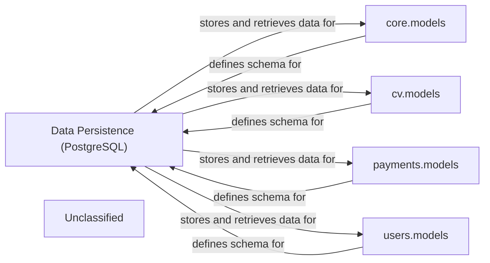

## Details

The application's data persistence layer is anchored by Data Persistence (PostgreSQL), serving as the central repository for all structured information. This database interacts directly with several Django model components: core.models, cv.models, payments.models, and users.models. Each of these model components is responsible for defining the specific database schema for its respective domain (core application entities, CV data, payment information, and user profiles). These Django models, inheriting from django.db.models.Model, translate application-level data structures into relational database tables and manage the interactions for data storage and retrieval within PostgreSQL. This clear separation of concerns ensures modularity and maintainability of the data layer.

### Data Persistence (PostgreSQL) [[Expand]](./Data_Persistence_PostgreSQL_.md)
The foundational relational database responsible for the durable storage and retrieval of all structured application data. It serves as the single source of truth for user profiles, CVs, subscription details, and payment records.

**Related Classes/Methods**:

- <a href="https://github.com/CVImprover/cvimprover-api/blob/maincore/models.py" target="_blank" rel="noopener noreferrer">`core.models`</a>
- <a href="https://github.com/CVImprover/cvimprover-api/blob/maincv/models.py" target="_blank" rel="noopener noreferrer">`cv.models`</a>
- `users.models`

### core.models
Defines the database schema (tables, fields, relationships) for core application entities that are not specific to other domains. These models are translated by the Django ORM into SQL commands for interaction with PostgreSQL.

**Related Classes/Methods**:

- <a href="https://github.com/CVImprover/cvimprover-api/blob/maincore/models.py" target="_blank" rel="noopener noreferrer">`django.db.models.Model`</a>

### cv.models
Encapsulates the data structures and relationships for all CV-related information, including CV documents, sections, and individual entries. These Django models dictate how CV data is stored in PostgreSQL.

**Related Classes/Methods**:

- <a href="https://github.com/CVImprover/cvimprover-api/blob/maincv/models.py" target="_blank" rel="noopener noreferrer">`django.db.models.Model`</a>

### payments.models
Manages the data models for financial transactions, subscriptions, and payment methods. It defines the schema for storing payment-related events and user subscription statuses within PostgreSQL.

**Related Classes/Methods**:

- `django.db.models.Model`

### users.models
Defines the data models for user authentication, profiles, and associated metadata. These models establish the schema for user accounts and their attributes in PostgreSQL.

**Related Classes/Methods**:

- `django.db.models.Model`

### Unclassified
Component for all unclassified files and utility functions (Utility functions/External Libraries/Dependencies)

**Related Classes/Methods**: _None_

### [FAQ](https://github.com/CodeBoarding/GeneratedOnBoardings/tree/main?tab=readme-ov-file#faq)