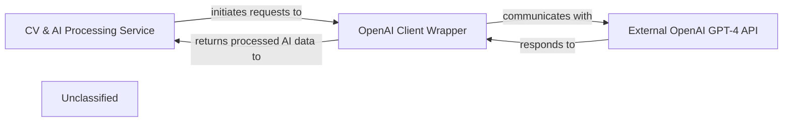

## Details

The system's AI-driven CV processing is centered around the `CV & AI Processing Service`, primarily implemented within `cv.views.AIResponseViewSet`. This service orchestrates the entire workflow, from extracting information from user-uploaded CVs to generating AI-enhanced responses. It directly interacts with the `OpenAI Client Wrapper`, which encapsulates the communication logic with the `External OpenAI GPT-4 API`. The `OpenAI Client Wrapper` handles the technical details of API calls, ensuring that the core processing service remains focused on business logic. The `External OpenAI GPT-4 API` provides the actual AI intelligence, receiving prompts from the `OpenAI Client Wrapper` and returning generated content. This architecture ensures a clear separation of concerns, with the core application logic managing the user experience and data flow, while a dedicated internal component handles the complexities of integrating with the external AI service.

### CV & AI Processing Service [[Expand]](./CV_AI_Processing_Service.md)
This core application service is responsible for handling user requests related to CV processing. It prepares the necessary data for AI analysis, orchestrates the calls to the OpenAI API, and integrates the AI-generated responses back into the CV processing workflow. It represents the business logic layer that leverages AI capabilities, including PDF extraction, prompt generation, and AI response handling.

**Related Classes/Methods**:

- <a href="https://github.com/CVImprover/cvimprover-api/blob/maincv/views.py#L30-L122" target="_blank" rel="noopener noreferrer">`cv.views.AIResponseViewSet`:30-122</a>

### OpenAI Client Wrapper
This component acts as an internal client or wrapper for the external OpenAI API. It handles the direct communication with the OpenAI service, including formatting requests, managing API keys, and parsing responses. This component abstracts the specifics of the OpenAI API from the core business logic.

**Related Classes/Methods**:

- `openai.OpenAI`:1-10

### External OpenAI GPT-4 API [[Expand]](./External_OpenAI_GPT_4_API.md)
A third-party, external AI service that provides advanced text generation and processing capabilities. It is the ultimate source of the AI intelligence used by the application for tasks such as content generation, summarization, or analysis related to CVs.

**Related Classes/Methods**:

### Unclassified
Component for all unclassified files and utility functions (Utility functions/External Libraries/Dependencies)

**Related Classes/Methods**: _None_

### [FAQ](https://github.com/CodeBoarding/GeneratedOnBoardings/tree/main?tab=readme-ov-file#faq)