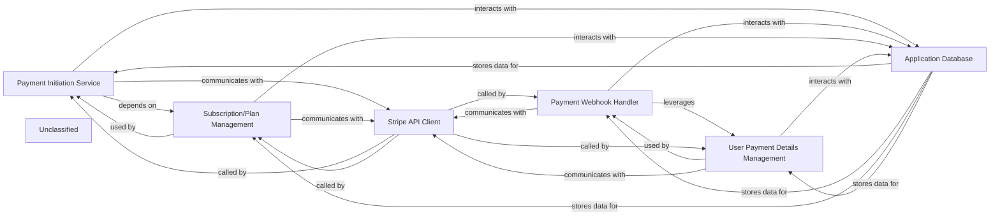

## Details

This subsystem manages the entire payment and subscription lifecycle, primarily integrating with Stripe. The Payment Initiation Service handles user-initiated checkout flows, creating Stripe sessions and directing users for payment. The Payment Webhook Handler asynchronously processes real-time updates from Stripe, ensuring the application's internal state reflects the latest payment and subscription statuses. Subscription/Plan Management and User Payment Details Management components are responsible for handling the serialization, deserialization, and retrieval of plan and user-specific payment information, respectively, often interacting with the Stripe API for current data. All direct interactions with the external Stripe platform are abstracted by the Stripe API Client, while the Application Database serves as the persistent storage for all related user and subscription data.

### Payment Initiation Service
Handles the creation of Stripe Checkout Sessions, preparing necessary data (e.g., plan details, user information) and communicating with the Stripe API to generate a unique checkout URL for users.

**Related Classes/Methods**:

- <a href="https://github.com/CVImprover/cvimprover-api/blob/maincore/views.py#L42-L108" target="_blank" rel="noopener noreferrer">`core.views.CreateCheckoutSessionView`:42-108</a>

### Payment Webhook Handler
Serves as the application's endpoint for receiving and processing real-time event notifications (webhooks) from Stripe. It validates webhook signatures and updates the application's internal state based on payment and subscription lifecycle events (e.g., checkout.session.completed, invoice.paid).

**Related Classes/Methods**:

- <a href="https://github.com/CVImprover/cvimprover-api/blob/maincore/views.py#L115-L206" target="_blank" rel="noopener noreferrer">`core.views.StripeWebhookView`:115-206</a>

### Subscription/Plan Management
Manages the serialization and deserialization of Plan objects, which define the different subscription tiers or product offerings available for purchase via Stripe. It also retrieves pricing details from Stripe.

**Related Classes/Methods**:

- <a href="https://github.com/CVImprover/cvimprover-api/blob/maincore/serializers.py#L12-L56" target="_blank" rel="noopener noreferrer">`core.serializers.PlanSerializer`:12-56</a>

### User Payment Details Management
Handles the serialization and deserialization of custom user details, specifically those related to payment information, subscription status, and linking Stripe customer IDs with internal user accounts. It also retrieves subscription details from Stripe.

**Related Classes/Methods**:

- <a href="https://github.com/CVImprover/cvimprover-api/blob/maincore/serializers.py#L61-L117" target="_blank" rel="noopener noreferrer">`core.serializers.CustomUserDetailsSerializer`:61-117</a>

### Stripe API Client
Encapsulates all direct programmatic interactions with the external Stripe platform, abstracting the underlying API calls for creating checkout sessions, retrieving payment details, and managing subscriptions.

**Related Classes/Methods**:

- <a href="https://github.com/CVImprover/cvimprover-api/blob/main." target="_blank" rel="noopener noreferrer">`stripe.checkout.Session.create`</a>
- <a href="https://github.com/CVImprover/cvimprover-api/blob/main." target="_blank" rel="noopener noreferrer">`stripe.Webhook.construct_event`</a>
- <a href="https://github.com/CVImprover/cvimprover-api/blob/main." target="_blank" rel="noopener noreferrer">`stripe.Subscription.retrieve`</a>
- <a href="https://github.com/CVImprover/cvimprover-api/blob/main." target="_blank" rel="noopener noreferrer">`stripe.Price.retrieve`</a>

### Application Database
Stores all persistent application data related to users, subscription states, payment records, and other relevant information necessary for managing the payment lifecycle.

**Related Classes/Methods**:

- <a href="https://github.com/CVImprover/cvimprover-api/blob/main." target="_blank" rel="noopener noreferrer">`core.models.Plan.objects.get`</a>
- <a href="https://github.com/CVImprover/cvimprover-api/blob/main." target="_blank" rel="noopener noreferrer">`core.models.User.objects.get`</a>
- <a href="https://github.com/CVImprover/cvimprover-api/blob/main." target="_blank" rel="noopener noreferrer">`core.models.Plan.objects.filter`</a>

### Unclassified
Component for all unclassified files and utility functions (Utility functions/External Libraries/Dependencies)

**Related Classes/Methods**: _None_

### [FAQ](https://github.com/CodeBoarding/GeneratedOnBoardings/tree/main?tab=readme-ov-file#faq)