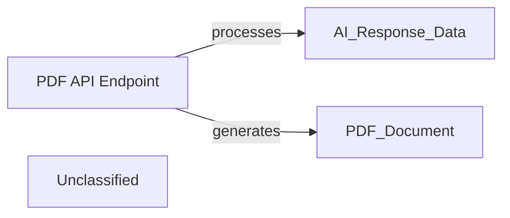

## Details

The PDF generation subsystem is primarily driven by the PDF API Endpoint, specifically the generate_pdf action within the AIResponseViewSet. This endpoint is responsible for the entire lifecycle of PDF creation, from receiving the request and processing AI-generated text to converting it into a formatted PDF and storing it. The system directly uses markdown2 for HTML conversion and WeasyPrint for PDF rendering, without relying on separate asynchronous tasks or dedicated service layers for these operations. This design centralizes the PDF generation logic within the API's viewset, providing a direct and synchronous flow for document creation.

### PDF API Endpoint
This component serves as the external interface for PDF generation. It receives requests to convert AI responses into PDF documents. It directly orchestrates the conversion of markdown to HTML, generates the PDF using WeasyPrint, and stores the resulting PDF, making it available via a URL.

**Related Classes/Methods**:

- <a href="https://github.com/CVImprover/cvimprover-api/blob/maincv/views.py" target="_blank" rel="noopener noreferrer">`cv.views.AIResponseViewSet.generate_pdf`</a>

### Unclassified
Component for all unclassified files and utility functions (Utility functions/External Libraries/Dependencies)

**Related Classes/Methods**: _None_

### [FAQ](https://github.com/CodeBoarding/GeneratedOnBoardings/tree/main?tab=readme-ov-file#faq)