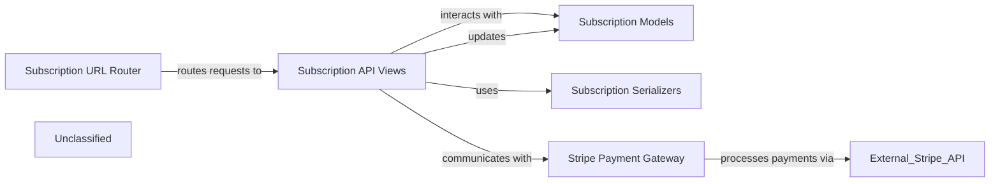

## Details

The Subscription Management Subsystem provides a robust set of functionalities for handling user subscriptions and integrating with the Stripe payment gateway. The Subscription URL Router acts as the entry point, directing all subscription-related API requests to the Subscription API Views. These views are responsible for orchestrating the business logic, utilizing Subscription Serializers for data validation and formatting, and interacting with Subscription Models for persistent storage. For all payment-related operations, the Subscription API Views communicate with the Stripe Payment Gateway, which encapsulates direct interactions with the external Stripe API. Importantly, Subscription API Views also process Stripe webhooks, ensuring that asynchronous payment events are correctly handled and subsequently update the Subscription Models to reflect the latest subscription status. This architecture ensures a clear separation of concerns, with dedicated components for routing, API logic, data serialization, payment processing, and data persistence.

### Subscription Models
Defines the data models for managing subscription plans, user subscriptions, and payment transactions. It handles the persistence of critical information such as plan details, user subscription status, and payment records within the PostgreSQL database.

**Related Classes/Methods**:

- <a href="https://github.com/CVImprover/cvimprover-api/blob/maincore/models.py" target="_blank" rel="noopener noreferrer">`core.models`</a>

### Subscription API Views
Implements the RESTful API endpoints for the subsystem. It handles incoming HTTP requests for creating, retrieving, updating, and cancelling subscriptions, and processes Stripe webhooks for asynchronous payment event notifications. It orchestrates business logic by interacting with models and the Stripe integration.

**Related Classes/Methods**:

- <a href="https://github.com/CVImprover/cvimprover-api/blob/maincore/views.py" target="_blank" rel="noopener noreferrer">`core.views`</a>

### Subscription Serializers
Manages the serialization and deserialization of subscription and payment-related data for API communication. It ensures that data exchanged via the API adheres to defined formats, validating incoming data and formatting outgoing responses.

**Related Classes/Methods**:

- <a href="https://github.com/CVImprover/cvimprover-api/blob/maincore/serializers.py" target="_blank" rel="noopener noreferrer">`core.serializers`</a>

### Stripe Payment Gateway
Encapsulates all direct interactions with the external Stripe API. This includes functionalities like creating Stripe customers, managing subscriptions, processing payment intents, and handling secure API key management. It acts as a dedicated, isolated layer for payment processing.

**Related Classes/Methods**:

- <a href="https://github.com/CVImprover/cvimprover-api/blob/maincore/views.py" target="_blank" rel="noopener noreferrer">`core.views`</a>

### Subscription URL Router
Defines the URL routing for all API endpoints exposed by the Subscription API Views. It maps specific URL patterns to the corresponding view functions, making the subsystem's functionalities accessible via defined HTTP paths.

**Related Classes/Methods**:

- <a href="https://github.com/CVImprover/cvimprover-api/blob/maincore/urls.py" target="_blank" rel="noopener noreferrer">`core.urls`</a>

### Unclassified
Component for all unclassified files and utility functions (Utility functions/External Libraries/Dependencies)

**Related Classes/Methods**: _None_

### [FAQ](https://github.com/CodeBoarding/GeneratedOnBoardings/tree/main?tab=readme-ov-file#faq)