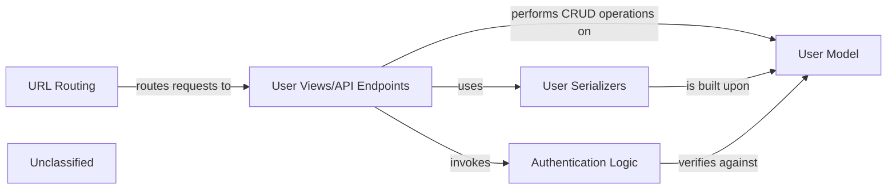

## Details

The user management subsystem is centered around the `User Model`, which serves as the authoritative source for user data. `User Serializers` facilitate the conversion of this data for API consumption and validation. `User Views/API Endpoints` expose the core functionalities for user interaction, handling requests for registration, login, and profile management. These endpoints are made accessible through `URL Routing` and are secured by `Authentication Logic`, which ensures that only authorized users can access protected resources. This architecture promotes a clear separation of concerns, with each component playing a distinct role in managing user-related operations.

### User Model
Defines the fundamental data structure for all users, encompassing authentication credentials (e.g., username, password hash), core profile information (e.g., email), and potentially links to subscription or payment-related identifiers. It serves as the persistent data store for user entities.

**Related Classes/Methods**:

- <a href="https://github.com/CVImprover/cvimprover-api/blob/maincore/models.py#L5-L30" target="_blank" rel="noopener noreferrer">`core.models.User`:5-30</a>

### User Serializers
Handles the conversion of `User` model instances into JSON format for API responses and the validation/deserialization of incoming JSON data from API requests into Python objects. This component is crucial for data integrity and proper formatting during user registration, login, and profile updates.

**Related Classes/Methods**:

- <a href="https://github.com/CVImprover/cvimprover-api/blob/maincore/serializers.py#L61-L117" target="_blank" rel="noopener noreferrer">`core.serializers.CustomUserDetailsSerializer`:61-117</a>
- <a href="https://github.com/CVImprover/cvimprover-api/blob/maincore/serializers.py#L12-L56" target="_blank" rel="noopener noreferrer">`core.serializers.PlanSerializer`:12-56</a>

### User Views/API Endpoints
Implements the core API logic for all user-related operations. These views receive HTTP requests, orchestrate interactions with `User Serializers` for data processing, perform CRUD operations on the `User Model`, and integrate with `Authentication Logic` for secure access. Examples include endpoints for user registration, login, profile retrieval, and updates.

**Related Classes/Methods**:

- <a href="https://github.com/CVImprover/cvimprover-api/blob/maincore/views.py" target="_blank" rel="noopener noreferrer">`core.views.UserViewSet`</a>

### URL Routing
Defines the URL patterns that map incoming HTTP requests to the appropriate `User Views/API Endpoints`. It acts as the initial entry point for all user-related API interactions, directing requests to their designated handlers.

**Related Classes/Methods**:

- <a href="https://github.com/CVImprover/cvimprover-api/blob/maincore/urls.py" target="_blank" rel="noopener noreferrer">`core.urls`</a>

### Authentication Logic
Manages the secure authentication process, including user login, generation and validation of authentication tokens (e.g., JWT or session tokens), and enforcing access control to protected resources. This component integrates with Django's authentication system and Django REST Framework's authentication classes to secure API endpoints.

**Related Classes/Methods**:

- `dj_rest_auth.jwt_auth.JWTAuthentication`
- `dj_rest_auth.views.LoginView`

### Unclassified
Component for all unclassified files and utility functions (Utility functions/External Libraries/Dependencies)

**Related Classes/Methods**: _None_

### [FAQ](https://github.com/CodeBoarding/GeneratedOnBoardings/tree/main?tab=readme-ov-file#faq)