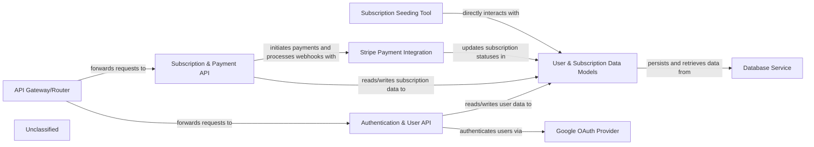

## Details

The system is structured around a core set of APIs for user authentication, profile management, and subscription handling. The `API Gateway/Router` directs incoming requests to either the `Authentication & User API` or the `Subscription & Payment API`. Both APIs interact with the `User & Subscription Data Models` for data persistence, which in turn relies on the `Database Service`. User authentication can be performed directly or through the `Google OAuth Provider`. The `Subscription & Payment API` integrates with `Stripe Payment Integration` for processing payments and managing subscriptions, with Stripe webhooks updating the `User & Subscription Data Models`. A `Subscription Seeding Tool` is available for initial population of subscription plans.

### User & Subscription Data Models
Defines the foundational data structures for users, user profiles, authentication tokens (JWT), various subscription plans, and payment-related information. It establishes relationships between users and their active subscriptions.

**Related Classes/Methods**:

- <a href="https://github.com/CVImprover/cvimprover-api/blob/maincore/models.py#L5-L30" target="_blank" rel="noopener noreferrer">`core.models.User`:5-30</a>
- <a href="https://github.com/CVImprover/cvimprover-api/blob/maincore/models.py#L32-L44" target="_blank" rel="noopener noreferrer">`core.models.Plan`:32-44</a>

### Authentication & User API
Provides RESTful API endpoints for user registration, login (supporting JWT and Google OAuth), password management, and CRUD operations for user profiles. It leverages dj_rest_auth and allauth for robust authentication flows.

**Related Classes/Methods**:

- <a href="https://github.com/CVImprover/cvimprover-api/blob/maincore/views.py#L35-L37" target="_blank" rel="noopener noreferrer">`core.views.CustomUserDetailsView`:35-37</a>
- <a href="https://github.com/CVImprover/cvimprover-api/blob/maincore/views.py#L39-L40" target="_blank" rel="noopener noreferrer">`core.views.GoogleLogin`:39-40</a>
- <a href="https://github.com/CVImprover/cvimprover-api/blob/maincore/serializers.py#L61-L117" target="_blank" rel="noopener noreferrer">`core.serializers.CustomUserDetailsSerializer`:61-117</a>
- <a href="https://github.com/CVImprover/cvimprover-api/blob/maincore/views.py" target="_blank" rel="noopener noreferrer">`dj_rest_auth.views.UserDetailsView`</a>
- <a href="https://github.com/CVImprover/cvimprover-api/blob/maincore/views.py" target="_blank" rel="noopener noreferrer">`allauth.socialaccount.providers.google.views.GoogleOAuth2Adapter`</a>

### Subscription & Payment API
Manages API endpoints for displaying available subscription plans, initiating new subscriptions, handling plan upgrades/downgrades, and processing subscription cancellations. It also includes webhook handlers for Stripe events.

**Related Classes/Methods**:

- <a href="https://github.com/CVImprover/cvimprover-api/blob/maincore/views.py#L42-L108" target="_blank" rel="noopener noreferrer">`core.views.CreateCheckoutSessionView`:42-108</a>
- <a href="https://github.com/CVImprover/cvimprover-api/blob/maincore/views.py#L115-L206" target="_blank" rel="noopener noreferrer">`core.views.StripeWebhookView`:115-206</a>
- <a href="https://github.com/CVImprover/cvimprover-api/blob/maincore/views.py#L210-L261" target="_blank" rel="noopener noreferrer">`core.views.PlanListView`:210-261</a>
- <a href="https://github.com/CVImprover/cvimprover-api/blob/maincore/views.py#L263-L278" target="_blank" rel="noopener noreferrer">`core.views.CreateBillingPortalSessionView`:263-278</a>
- <a href="https://github.com/CVImprover/cvimprover-api/blob/maincore/views.py#L281-L380" target="_blank" rel="noopener noreferrer">`core.views.VerifyCheckoutSessionView`:281-380</a>
- <a href="https://github.com/CVImprover/cvimprover-api/blob/maincore/serializers.py#L12-L56" target="_blank" rel="noopener noreferrer">`core.serializers.PlanSerializer`:12-56</a>

### API Gateway/Router [[Expand]](./API_Gateway_Router.md)
Serves as the entry point for all incoming requests to the user and subscription management functionalities, mapping specific URL patterns to the appropriate view functions within the Authentication & User API and Subscription & Payment API.

**Related Classes/Methods**:

- <a href="https://github.com/CVImprover/cvimprover-api/blob/maincore/urls.py" target="_blank" rel="noopener noreferrer">`core.urls.urlpatterns`</a>

### Stripe Payment Integration
Handles direct communication with the Stripe API for processing payments, creating customer records, managing subscriptions, and securely receiving and processing payment-related webhooks.

**Related Classes/Methods**:

- <a href="https://github.com/CVImprover/cvimprover-api/blob/maincore/views.py" target="_blank" rel="noopener noreferrer">`stripe`</a>
- <a href="https://github.com/CVImprover/cvimprover-api/blob/maincore/views.py#L42-L108" target="_blank" rel="noopener noreferrer">`core.views.CreateCheckoutSessionView`:42-108</a>
- <a href="https://github.com/CVImprover/cvimprover-api/blob/maincore/views.py#L115-L206" target="_blank" rel="noopener noreferrer">`core.views.StripeWebhookView`:115-206</a>
- <a href="https://github.com/CVImprover/cvimprover-api/blob/maincore/serializers.py" target="_blank" rel="noopener noreferrer">`core.serializers.PlanSerializer.get_price_details`</a>
- <a href="https://github.com/CVImprover/cvimprover-api/blob/maincore/serializers.py" target="_blank" rel="noopener noreferrer">`core.serializers.CustomUserDetailsSerializer._get_subscription_info`</a>

### Google OAuth Provider
Manages the secure integration with Google's OAuth 2.0 service, enabling users to authenticate and register using their Google accounts.

**Related Classes/Methods**:

- <a href="https://github.com/CVImprover/cvimprover-api/blob/maincore/views.py" target="_blank" rel="noopener noreferrer">`allauth.socialaccount.providers.google.views.GoogleOAuth2Adapter`</a>
- <a href="https://github.com/CVImprover/cvimprover-api/blob/maincore/views.py#L39-L40" target="_blank" rel="noopener noreferrer">`core.views.GoogleLogin`:39-40</a>
- <a href="https://github.com/CVImprover/cvimprover-api/blob/maincvimprover/settings.py" target="_blank" rel="noopener noreferrer">`cvimprover.settings.SOCIALACCOUNT_PROVIDERS`</a>

### Database Service
Provides the underlying persistent storage and retrieval mechanisms for all user, profile, authentication, and subscription-related data defined by the User & Subscription Data Models.

**Related Classes/Methods**:

- <a href="https://github.com/CVImprover/cvimprover-api/blob/maincore/models.py" target="_blank" rel="noopener noreferrer">`django.db.models.Model`</a>

### Subscription Seeding Tool
A Django management command designed for initial setup, populating the database with predefined subscription plans to ensure the system has a baseline of available offerings.

**Related Classes/Methods**:

- <a href="https://github.com/CVImprover/cvimprover-api/blob/maincore/management/commands/seed_plans.py#L4-L10" target="_blank" rel="noopener noreferrer">`core.management.commands.seed_plans.Command`:4-10</a>
- <a href="https://github.com/CVImprover/cvimprover-api/blob/maincore/seeders.py#L3-L43" target="_blank" rel="noopener noreferrer">`core.seeders.seed_plans`:3-43</a>

### Unclassified
Component for all unclassified files and utility functions (Utility functions/External Libraries/Dependencies)

**Related Classes/Methods**: _None_

### [FAQ](https://github.com/CodeBoarding/GeneratedOnBoardings/tree/main?tab=readme-ov-file#faq)