```mermaid
graph LR
    API_Gateway_Core_Services["API Gateway & Core Services"]
    User_Authentication_Management["User & Authentication Management"]
    CV_Processing_AI_Integration["CV Processing & AI Integration"]
    Subscription_Payment_Gateway["Subscription & Payment Gateway"]
    Asynchronous_Task_System["Asynchronous Task System"]
    Data_Persistence_PostgreSQL_["Data Persistence (PostgreSQL)"]
    Unclassified["Unclassified"]
    API_Gateway_Core_Services -- "Forwards authentication requests and user-related API calls" --> User_Authentication_Management
    User_Authentication_Management -- "Responds to authentication requests and user-related API calls" --> API_Gateway_Core_Services
    API_Gateway_Core_Services -- "Routes CV upload and management requests" --> CV_Processing_AI_Integration
    CV_Processing_AI_Integration -- "Receives CV upload and management requests from" --> API_Gateway_Core_Services
    API_Gateway_Core_Services -- "Manages subscription and payment requests" --> Subscription_Payment_Gateway
    Subscription_Payment_Gateway -- "Notifies of payment events (e.g., webhooks)" --> API_Gateway_Core_Services
    User_Authentication_Management -- "Stores and retrieves user profiles and authentication data" --> Data_Persistence_PostgreSQL_
    Data_Persistence_PostgreSQL_ -- "Provides user profiles and authentication data to" --> User_Authentication_Management
    CV_Processing_AI_Integration -- "Enqueues tasks for AI analysis and PDF generation" --> Asynchronous_Task_System
    CV_Processing_AI_Integration -- "Stores and retrieves CV documents and processing metadata" --> Data_Persistence_PostgreSQL_
    Data_Persistence_PostgreSQL_ -- "Provides CV documents and processing metadata to" --> CV_Processing_AI_Integration
    Subscription_Payment_Gateway -- "Records subscription details and payment transactions" --> Data_Persistence_PostgreSQL_
    Data_Persistence_PostgreSQL_ -- "Provides subscription details and payment transactions to" --> Subscription_Payment_Gateway
    Asynchronous_Task_System -- "Executes AI analysis and PDF generation tasks, updating CV status" --> CV_Processing_AI_Integration
    Asynchronous_Task_System -- "Stores task results and updates related data" --> Data_Persistence_PostgreSQL_
    Data_Persistence_PostgreSQL_ -- "Provides task results and related data to" --> Asynchronous_Task_System
    click API_Gateway_Core_Services href "https://github.com/CodeBoarding/GeneratedOnBoardings/blob/main/cvimprover-api/API_Gateway_Core_Services.md" "Details"
    click User_Authentication_Management href "https://github.com/CodeBoarding/GeneratedOnBoardings/blob/main/cvimprover-api/User_Authentication_Management.md" "Details"
    click CV_Processing_AI_Integration href "https://github.com/CodeBoarding/GeneratedOnBoardings/blob/main/cvimprover-api/CV_Processing_AI_Integration.md" "Details"
    click Subscription_Payment_Gateway href "https://github.com/CodeBoarding/GeneratedOnBoardings/blob/main/cvimprover-api/Subscription_Payment_Gateway.md" "Details"
    click Asynchronous_Task_System href "https://github.com/CodeBoarding/GeneratedOnBoardings/blob/main/cvimprover-api/Asynchronous_Task_System.md" "Details"
    click Data_Persistence_PostgreSQL_ href "https://github.com/CodeBoarding/GeneratedOnBoardings/blob/main/cvimprover-api/Data_Persistence_PostgreSQL_.md" "Details"
```

## Details

The `cvimprover-api` project is structured around a set of interconnected components designed to handle CV processing, AI integration, user management, and subscriptions. The `API Gateway & Core Services` acts as the central entry point, routing all incoming requests to the appropriate internal services. User authentication and profile management are handled by the `User & Authentication Management` component, which securely interacts with the `Data Persistence (PostgreSQL)` layer for storing user data.

For CV-related functionalities, the `CV Processing & AI Integration` component manages document uploads and triggers AI analysis. Long-running or resource-intensive tasks, such as AI processing and PDF generation, are offloaded to the `Asynchronous Task System`, which utilizes Celery and Redis to ensure efficient background execution. This system also interacts with `Data Persistence (PostgreSQL)` to store task results and update CV statuses.

Subscription plans and payment processing are managed by the `Subscription & Payment Gateway`, which integrates with external payment providers and records transaction details in `Data Persistence (PostgreSQL)`. This component also provides asynchronous notifications to the `API Gateway & Core Services` regarding payment events. All structured data across these components is persistently stored and retrieved from the `Data Persistence (PostgreSQL)` database, forming the backbone of the application's data management.

### API Gateway & Core Services [[Expand]](./API_Gateway_Core_Services.md)
The entry point for all external requests, handling routing, initial authentication, and serving core API endpoints. It acts as the orchestrator for user-facing interactions.

**Related Classes/Methods**:

- `cvimprover_api.urls`
- <a href="https://github.com/CVImprover/cvimprover-api/blob/maincore/views.py" target="_blank" rel="noopener noreferrer">`core.views`</a>
- <a href="https://github.com/CVImprover/cvimprover-api/blob/maincore/serializers.py" target="_blank" rel="noopener noreferrer">`core.serializers`</a>
- <a href="https://github.com/CVImprover/cvimprover-api/blob/maincore/models.py" target="_blank" rel="noopener noreferrer">`core.models`</a>

### User & Authentication Management [[Expand]](./User_Authentication_Management.md)
Manages user registration, login, authentication tokens, and user profiles, ensuring secure access to the application.

**Related Classes/Methods**:

- `users.models`
- <a href="https://github.com/CVImprover/cvimprover-api/blob/maincore/serializers.py#L12-L117" target="_blank" rel="noopener noreferrer">`users.serializers`:12-117</a>
- `users.views`
- `users.urls`

### CV Processing & AI Integration [[Expand]](./CV_Processing_AI_Integration.md)
Handles the upload, storage, and processing of CV documents, including triggering AI analysis and content generation.

**Related Classes/Methods**:

- <a href="https://github.com/CVImprover/cvimprover-api/blob/maincv/models.py" target="_blank" rel="noopener noreferrer">`cv.models`</a>
- <a href="https://github.com/CVImprover/cvimprover-api/blob/maincv/serializers.py" target="_blank" rel="noopener noreferrer">`cv.serializers`</a>
- <a href="https://github.com/CVImprover/cvimprover-api/blob/maincv/views.py" target="_blank" rel="noopener noreferrer">`cv.views`</a>
- <a href="https://github.com/CVImprover/cvimprover-api/blob/maincv/urls.py" target="_blank" rel="noopener noreferrer">`cv.urls`</a>

### Subscription & Payment Gateway [[Expand]](./Subscription_Payment_Gateway.md)
Manages subscription plans, pricing, and integrates with external payment providers (e.g., Stripe) for secure transaction processing.

**Related Classes/Methods**:

- `payments.models`
- `payments.views`
- `payments.urls`

### Asynchronous Task System [[Expand]](./Asynchronous_Task_System.md)
Provides infrastructure for offloading long-running tasks, utilizing Celery for task queuing and workers, and Redis as the message broker.

**Related Classes/Methods**:

- `cvimprover_api.celery`:1-10

### Data Persistence (PostgreSQL) [[Expand]](./Data_Persistence_PostgreSQL_.md)
The primary relational database for storing all structured application data, including user, CV, subscription, and payment information.

**Related Classes/Methods**:

- <a href="https://github.com/CVImprover/cvimprover-api/blob/maincore/models.py" target="_blank" rel="noopener noreferrer">`core.models`</a>
- <a href="https://github.com/CVImprover/cvimprover-api/blob/maincv/models.py" target="_blank" rel="noopener noreferrer">`cv.models`</a>
- `payments.models`
- `users.models`

### Unclassified
Component for all unclassified files and utility functions (Utility functions/External Libraries/Dependencies)

**Related Classes/Methods**: _None_

### [FAQ](https://github.com/CodeBoarding/GeneratedOnBoardings/tree/main?tab=readme-ov-file#faq)