```mermaid
graph LR
    API_Gateway_Core_Application["API Gateway / Core Application"]
    Authentication_User_Service["Authentication & User Service"]
    Subscription_Payment_Service["Subscription & Payment Service"]
    CV_AI_Processing_Service["CV & AI Processing Service"]
    Asynchronous_Task_Processor_Celery_["Asynchronous Task Processor (Celery)"]
    Database_Service_PostgreSQL_["Database Service (PostgreSQL)"]
    Caching_Service_Redis_["Caching Service (Redis)"]
    External_Stripe_API["External Stripe API"]
    External_OpenAI_GPT_4_API["External OpenAI GPT-4 API"]
    Unclassified["Unclassified"]
    API_Gateway_Core_Application -- "Routes API requests to" --> Authentication_User_Service
    API_Gateway_Core_Application -- "Routes API requests to" --> Subscription_Payment_Service
    API_Gateway_Core_Application -- "Routes API requests to" --> CV_AI_Processing_Service
    API_Gateway_Core_Application -- "Initiates background tasks in" --> Asynchronous_Task_Processor_Celery_
    Authentication_User_Service -- "Reads/Writes user data to" --> Database_Service_PostgreSQL_
    Authentication_User_Service -- "Manages sessions with" --> Caching_Service_Redis_
    Subscription_Payment_Service -- "Manages subscription data in" --> Database_Service_PostgreSQL_
    Subscription_Payment_Service -- "Interacts with" --> External_Stripe_API
    CV_AI_Processing_Service -- "Reads/Writes CV data to" --> Database_Service_PostgreSQL_
    CV_AI_Processing_Service -- "Submits processing jobs to" --> Asynchronous_Task_Processor_Celery_
    Asynchronous_Task_Processor_Celery_ -- "Communicates with" --> External_OpenAI_GPT_4_API
    Asynchronous_Task_Processor_Celery_ -- "Executes tasks for" --> CV_AI_Processing_Service
    click API_Gateway_Core_Application href "https://github.com/CodeBoarding/GeneratedOnBoardings/blob/main/cvimprover-api/API_Gateway_Core_Application.md" "Details"
    click Authentication_User_Service href "https://github.com/CodeBoarding/GeneratedOnBoardings/blob/main/cvimprover-api/Authentication_User_Service.md" "Details"
    click Subscription_Payment_Service href "https://github.com/CodeBoarding/GeneratedOnBoardings/blob/main/cvimprover-api/Subscription_Payment_Service.md" "Details"
    click CV_AI_Processing_Service href "https://github.com/CodeBoarding/GeneratedOnBoardings/blob/main/cvimprover-api/CV_AI_Processing_Service.md" "Details"
    click Asynchronous_Task_Processor_Celery_ href "https://github.com/CodeBoarding/GeneratedOnBoardings/blob/main/cvimprover-api/Asynchronous_Task_Processor_Celery_.md" "Details"
    click Caching_Service_Redis_ href "https://github.com/CodeBoarding/GeneratedOnBoardings/blob/main/cvimprover-api/Caching_Service_Redis_.md" "Details"
    click External_Stripe_API href "https://github.com/CodeBoarding/GeneratedOnBoardings/blob/main/cvimprover-api/External_Stripe_API.md" "Details"
    click External_OpenAI_GPT_4_API href "https://github.com/CodeBoarding/GeneratedOnBoardings/blob/main/cvimprover-api/External_OpenAI_GPT_4_API.md" "Details"
```

## Details

The CVImprover API is structured around a Django REST Framework core, functioning as an API Gateway / Core Application that efficiently routes all incoming requests. This central component orchestrates interactions with several specialized services: an Authentication & User Service for managing user identities and access, and a Subscription & Payment Service which seamlessly integrates with the External Stripe API to handle all billing and subscription logic. The application's core value proposition is delivered by the CV & AI Processing Service, which is responsible for managing CV data, applying AI-driven content improvements, and generating polished PDF documents. To maintain API responsiveness, long-running or resource-intensive operations from these services are delegated to an Asynchronous Task Processor (Celery). This processor utilizes the Caching Service (Redis) as its message broker and backend, and interacts with the External OpenAI GPT-4 API for advanced AI capabilities. All application data is persistently stored and managed by the Database Service (PostgreSQL), with Redis also providing crucial caching for enhanced performance.

### API Gateway / Core Application [[Expand]](./API_Gateway_Core_Application.md)
The central entry point for all API requests, handling URL routing, global settings, and orchestrating interactions between various services.

**Related Classes/Methods**:

- <a href="https://github.com/CVImprover/cvimprover-api/blob/maincvimprover/urls.py" target="_blank" rel="noopener noreferrer">`cvimprover.urls`</a>
- <a href="https://github.com/CVImprover/cvimprover-api/blob/maincvimprover/settings.py" target="_blank" rel="noopener noreferrer">`cvimprover.settings`</a>
- <a href="https://github.com/CVImprover/cvimprover-api/blob/maincvimprover/celery.py" target="_blank" rel="noopener noreferrer">`cvimprover.celery`</a>

### Authentication & User Service [[Expand]](./Authentication_User_Service.md)
Manages user registration, login, authentication (JWT, Google OAuth), and user profile data.

**Related Classes/Methods**:

- <a href="https://github.com/CVImprover/cvimprover-api/blob/maincore/models.py" target="_blank" rel="noopener noreferrer">`core.models`</a>
- <a href="https://github.com/CVImprover/cvimprover-api/blob/maincore/views.py" target="_blank" rel="noopener noreferrer">`core.views`</a>
- <a href="https://github.com/CVImprover/cvimprover-api/blob/maincore/serializers.py" target="_blank" rel="noopener noreferrer">`core.serializers`</a>

### Subscription & Payment Service [[Expand]](./Subscription_Payment_Service.md)
Handles subscription plans, integrates with Stripe for payment processing, and manages user subscription statuses.

**Related Classes/Methods**:

- <a href="https://github.com/CVImprover/cvimprover-api/blob/maincore/models.py" target="_blank" rel="noopener noreferrer">`core.models`</a>
- <a href="https://github.com/CVImprover/cvimprover-api/blob/maincore/views.py" target="_blank" rel="noopener noreferrer">`core.views`</a>
- <a href="https://github.com/CVImprover/cvimprover-api/blob/maincore/serializers.py" target="_blank" rel="noopener noreferrer">`core.serializers`</a>

### CV & AI Processing Service [[Expand]](./CV_AI_Processing_Service.md)
Manages the lifecycle of CVs, including storage, orchestrates AI model interactions for content improvements, and handles PDF generation for improved CVs.

**Related Classes/Methods**:

- <a href="https://github.com/CVImprover/cvimprover-api/blob/maincv/models.py" target="_blank" rel="noopener noreferrer">`cv.models`</a>
- <a href="https://github.com/CVImprover/cvimprover-api/blob/maincv/views.py" target="_blank" rel="noopener noreferrer">`cv.views`</a>
- <a href="https://github.com/CVImprover/cvimprover-api/blob/maincv/serializers.py" target="_blank" rel="noopener noreferrer">`cv.serializers`</a>

### Asynchronous Task Processor (Celery) [[Expand]](./Asynchronous_Task_Processor_Celery_.md)
A dedicated system (Celery with Redis) for offloading long-running or resource-intensive tasks like AI processing and PDF generation, ensuring API responsiveness.

**Related Classes/Methods**:

- <a href="https://github.com/CVImprover/cvimprover-api/blob/maincvimprover/celery.py" target="_blank" rel="noopener noreferrer">`cvimprover.celery`</a>
- <a href="https://github.com/CVImprover/cvimprover-api/blob/maincore/views.py" target="_blank" rel="noopener noreferrer">`Tasks defined in core.views`</a>
- <a href="https://github.com/CVImprover/cvimprover-api/blob/maincv/views.py" target="_blank" rel="noopener noreferrer">`Tasks defined in cv.views`</a>

### Database Service (PostgreSQL)
Persistent storage for all application data.

**Related Classes/Methods**:

- <a href="https://github.com/CVImprover/cvimprover-api/blob/maincvimprover/settings.py" target="_blank" rel="noopener noreferrer">`Configuration in cvimprover.settings`</a>

### Caching Service (Redis) [[Expand]](./Caching_Service_Redis_.md)
Provides fast data retrieval, session management, and acts as a message broker for Celery.

**Related Classes/Methods**:

- <a href="https://github.com/CVImprover/cvimprover-api/blob/maincvimprover/settings.py" target="_blank" rel="noopener noreferrer">`Configuration in cvimprover.settings`</a>
- <a href="https://github.com/CVImprover/cvimprover-api/blob/maincvimprover/celery.py" target="_blank" rel="noopener noreferrer">`Used by cvimprover.celery`</a>

### External Stripe API [[Expand]](./External_Stripe_API.md)
Third-party service for processing payments and managing subscriptions.

**Related Classes/Methods**:

- <a href="https://github.com/CVImprover/cvimprover-api/blob/maincore/views.py" target="_blank" rel="noopener noreferrer">`core.views (CreateCheckoutSessionView, StripeWebhookView)`</a>
- <a href="https://github.com/CVImprover/cvimprover-api/blob/maincore/serializers.py" target="_blank" rel="noopener noreferrer">`core.serializers (PlanSerializer, CustomUserDetailsSerializer)`</a>

### External OpenAI GPT-4 API [[Expand]](./External_OpenAI_GPT_4_API.md)
Third-party AI service for generating and processing text.

**Related Classes/Methods**:

- <a href="https://github.com/CVImprover/cvimprover-api/blob/maincv/views.py" target="_blank" rel="noopener noreferrer">`AI processing logic within CV & AI Processing Service`</a>

### Unclassified
Component for all unclassified files and utility functions (Utility functions/External Libraries/Dependencies)

**Related Classes/Methods**: _None_

### [FAQ](https://github.com/CodeBoarding/GeneratedOnBoardings/tree/main?tab=readme-ov-file#faq)