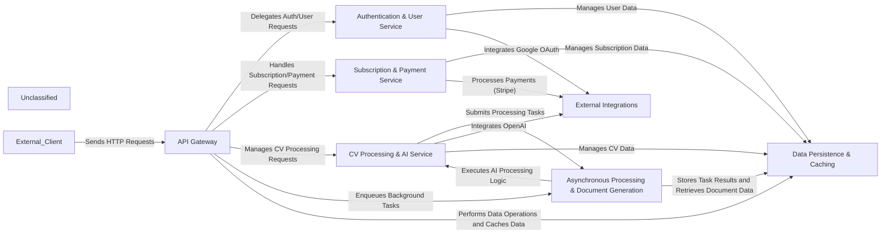

## Details

The CVImprover API operates as a robust Django REST Framework application, designed to assist users in optimizing their CVs. The External Client initiates all interactions by sending HTTP requests to the API Gateway, which acts as the central entry point, handling routing and initial request processing. The API Gateway then directs requests to specialized services: Authentication & User Service for managing user accounts and authentication (including JWT and Google OAuth), Subscription & Payment Service for handling subscription plans and secure payment processing via Stripe, and CV Processing & AI Service for the core CV enhancement logic. The CV Processing & AI Service leverages AI capabilities (specifically OpenAI) to analyze and improve CV content. Intensive tasks, such as AI processing and PDF generation, are offloaded to the Asynchronous Processing & Document Generation component, which utilizes Celery for background task management, ensuring the API remains responsive. All persistent data, including user profiles, subscription details, and CV-related information, is managed by the Data Persistence & Caching layer, which relies on PostgreSQL for storage and Redis for caching to optimize performance. Finally, the External Integrations component facilitates communication with third-party services like OpenAI for AI processing, Stripe for payment gateways, and Google for OAuth authentication, ensuring seamless external service interactions. This modular architecture promotes scalability, maintainability, and clear separation of concerns.

### API Gateway [[Expand]](./API_Gateway.md)
The central Django REST Framework application, handling all incoming HTTP requests, routing, and initial processing.

**Related Classes/Methods**:

- <a href="https://github.com/CVImprover/cvimprover-api/blob/maincvimprover/urls.py" target="_blank" rel="noopener noreferrer">`cvimprover.urls`</a>
- <a href="https://github.com/CVImprover/cvimprover-api/blob/maincore/urls.py" target="_blank" rel="noopener noreferrer">`core.urls`</a>
- <a href="https://github.com/CVImprover/cvimprover-api/blob/maincore/views.py" target="_blank" rel="noopener noreferrer">`core.views`</a>
- <a href="https://github.com/CVImprover/cvimprover-api/blob/maincore/serializers.py" target="_blank" rel="noopener noreferrer">`core.serializers`</a>

### Authentication & User Service
Manages user accounts, authentication (JWT, Google OAuth), authorization, and user profiles.

**Related Classes/Methods**:

- <a href="https://github.com/CVImprover/cvimprover-api/blob/maincore/views.py" target="_blank" rel="noopener noreferrer">`core.views.CustomUserDetailsView`</a>
- <a href="https://github.com/CVImprover/cvimprover-api/blob/maincore/views.py" target="_blank" rel="noopener noreferrer">`core.views.GoogleLogin`</a>
- <a href="https://github.com/CVImprover/cvimprover-api/blob/maincore/serializers.py" target="_blank" rel="noopener noreferrer">`core.serializers.CustomUserDetailsSerializer`</a>
- <a href="https://github.com/CVImprover/cvimprover-api/blob/maincore/models.py" target="_blank" rel="noopener noreferrer">`core.models.User`</a>

### Subscription & Payment Service
Oversees all subscription-related logic, from plan management to secure payment processing and webhook handling.

**Related Classes/Methods**:

- <a href="https://github.com/CVImprover/cvimprover-api/blob/maincore/views.py" target="_blank" rel="noopener noreferrer">`core.views.CreateCheckoutSessionView`</a>
- <a href="https://github.com/CVImprover/cvimprover-api/blob/maincore/views.py" target="_blank" rel="noopener noreferrer">`core.views.StripeWebhookView`</a>
- <a href="https://github.com/CVImprover/cvimprover-api/blob/maincore/views.py" target="_blank" rel="noopener noreferrer">`core.views.PlanListView`</a>
- <a href="https://github.com/CVImprover/cvimprover-api/blob/maincore/views.py" target="_blank" rel="noopener noreferrer">`core.views.CreateBillingPortalSessionView`</a>
- <a href="https://github.com/CVImprover/cvimprover-api/blob/maincore/views.py" target="_blank" rel="noopener noreferrer">`core.views.VerifyCheckoutSessionView`</a>
- <a href="https://github.com/CVImprover/cvimprover-api/blob/maincore/serializers.py" target="_blank" rel="noopener noreferrer">`core.serializers.PlanSerializer`</a>
- <a href="https://github.com/CVImprover/cvimprover-api/blob/maincore/models.py" target="_blank" rel="noopener noreferrer">`core.models.Plan`</a>

### CV Processing & AI Service
The core business logic for CV enhancement, leveraging AI for content analysis and improvement suggestions.

**Related Classes/Methods**:

- <a href="https://github.com/CVImprover/cvimprover-api/blob/maincv/views.py" target="_blank" rel="noopener noreferrer">`cv.views.CVQuestionnaireViewSet`</a>
- <a href="https://github.com/CVImprover/cvimprover-api/blob/maincv/views.py" target="_blank" rel="noopener noreferrer">`cv.views.AIResponseViewSet`</a>
- <a href="https://github.com/CVImprover/cvimprover-api/blob/maincv/serializers.py" target="_blank" rel="noopener noreferrer">`cv.serializers.CVQuestionnaireSerializer`</a>
- <a href="https://github.com/CVImprover/cvimprover-api/blob/maincv/serializers.py" target="_blank" rel="noopener noreferrer">`cv.serializers.AIResponseSerializer`</a>
- <a href="https://github.com/CVImprover/cvimprover-api/blob/maincv/models.py" target="_blank" rel="noopener noreferrer">`cv.models.CVQuestionnaire`</a>
- <a href="https://github.com/CVImprover/cvimprover-api/blob/maincv/models.py" target="_blank" rel="noopener noreferrer">`cv.models.AIResponse`</a>

### Asynchronous Processing & Document Generation [[Expand]](./Asynchronous_Processing_Document_Generation.md)
Ensures API responsiveness by offloading computationally intensive tasks to background workers, managing task queues, and executing document generation processes.

**Related Classes/Methods**:

- <a href="https://github.com/CVImprover/cvimprover-api/blob/maincvimprover/celery.py" target="_blank" rel="noopener noreferrer">`cvimprover.celery`</a>
- <a href="https://github.com/CVImprover/cvimprover-api/blob/maincv/views.py" target="_blank" rel="noopener noreferrer">`cv.views.AIResponseViewSet.generate_pdf`</a>

### Data Persistence & Caching [[Expand]](./Data_Persistence_Caching.md)
The foundational layer for data storage and retrieval, ensuring data integrity and optimizing read performance using PostgreSQL and Redis.

**Related Classes/Methods**:

- <a href="https://github.com/CVImprover/cvimprover-api/blob/maincore/models.py" target="_blank" rel="noopener noreferrer">`core.models`</a>
- <a href="https://github.com/CVImprover/cvimprover-api/blob/maincvimprover/settings.py" target="_blank" rel="noopener noreferrer">`cvimprover.settings`</a>

### External Integrations
Manages interactions with external services for AI capabilities (OpenAI), payment processing (Stripe), and user authentication (Google OAuth).

**Related Classes/Methods**:

- <a href="https://github.com/CVImprover/cvimprover-api/blob/maincv/views.py" target="_blank" rel="noopener noreferrer">`cv.views.AIResponseViewSet`</a>
- <a href="https://github.com/CVImprover/cvimprover-api/blob/maincore/views.py" target="_blank" rel="noopener noreferrer">`core.views.CreateCheckoutSessionView`</a>
- <a href="https://github.com/CVImprover/cvimprover-api/blob/maincore/views.py" target="_blank" rel="noopener noreferrer">`core.views.StripeWebhookView`</a>
- <a href="https://github.com/CVImprover/cvimprover-api/blob/maincore/views.py" target="_blank" rel="noopener noreferrer">`core.views.GoogleLogin`</a>

### Unclassified
Component for all unclassified files and utility functions (Utility functions/External Libraries/Dependencies)

**Related Classes/Methods**: _None_

### [FAQ](https://github.com/CodeBoarding/GeneratedOnBoardings/tree/main?tab=readme-ov-file#faq)