```mermaid
graph LR
    API_Gateway_Router["API Gateway / Router"]
    User_Subscription_Management["User & Subscription Management"]
    CV_Processing_AI_Core["CV Processing & AI Core"]
    Asynchronous_Task_System["Asynchronous Task System"]
    PDF_Generation_Service["PDF Generation Service"]
    Data_Persistence_Caching["Data Persistence & Caching"]
    External_Integrations["External Integrations"]
    Unclassified["Unclassified"]
    API_Gateway_Router -- "Routes user-related requests" --> User_Subscription_Management
    API_Gateway_Router -- "Routes CV processing requests" --> CV_Processing_AI_Core
    User_Subscription_Management -- "Stores/retrieves user, subscription, and payment data; Caches frequently accessed data" --> Data_Persistence_Caching
    User_Subscription_Management -- "Delegates social login (Google OAuth); Initiates payments (Stripe)" --> External_Integrations
    External_Integrations -- "Sends payment webhooks (Stripe)" --> User_Subscription_Management
    CV_Processing_AI_Core -- "Stores/retrieves CV and analysis data" --> Data_Persistence_Caching
    CV_Processing_AI_Core -- "Enqueues AI analysis tasks" --> Asynchronous_Task_System
    CV_Processing_AI_Core -- "Sends data for AI analysis (OpenAI)" --> External_Integrations
    External_Integrations -- "Returns AI analysis results (OpenAI)" --> CV_Processing_AI_Core
    Asynchronous_Task_System -- "Dispatches PDF generation tasks" --> PDF_Generation_Service
    Asynchronous_Task_System -- "Stores/retrieves task status and results" --> Data_Persistence_Caching
    PDF_Generation_Service -- "Retrieves processed CV data for PDF generation; Stores generated PDF files" --> Data_Persistence_Caching
    click API_Gateway_Router href "https://github.com/CodeBoarding/GeneratedOnBoardings/blob/main/cvimprover-api/API_Gateway_Router.md" "Details"
    click User_Subscription_Management href "https://github.com/CodeBoarding/GeneratedOnBoardings/blob/main/cvimprover-api/User_Subscription_Management.md" "Details"
    click CV_Processing_AI_Core href "https://github.com/CodeBoarding/GeneratedOnBoardings/blob/main/cvimprover-api/CV_Processing_AI_Core.md" "Details"
    click Asynchronous_Task_System href "https://github.com/CodeBoarding/GeneratedOnBoardings/blob/main/cvimprover-api/Asynchronous_Task_System.md" "Details"
    click PDF_Generation_Service href "https://github.com/CodeBoarding/GeneratedOnBoardings/blob/main/cvimprover-api/PDF_Generation_Service.md" "Details"
    click Data_Persistence_Caching href "https://github.com/CodeBoarding/GeneratedOnBoardings/blob/main/cvimprover-api/Data_Persistence_Caching.md" "Details"
    click External_Integrations href "https://github.com/CodeBoarding/GeneratedOnBoardings/blob/main/cvimprover-api/External_Integrations.md" "Details"
```

## Details

The `cvimprover` project is a Django-based web application designed to process and improve CVs using AI. It follows a modular architecture, separating concerns into distinct components for user management, CV processing, asynchronous task handling, PDF generation, and data persistence. The system interacts with external services like Stripe for payments, OpenAI for AI analysis, and Google for authentication. An API Gateway/Router acts as the central entry point, directing requests to the appropriate internal services. Asynchronous tasks are managed via Celery and Redis, ensuring responsiveness for long-running operations. Data is persistently stored in PostgreSQL and cached in Redis.

### API Gateway / Router [[Expand]](./API_Gateway_Router.md)
The primary entry point for all external API requests, handling request routing and initial validation.

**Related Classes/Methods**:

- <a href="https://github.com/CVImprover/cvimprover-api/blob/maincvimprover/urls.py" target="_blank" rel="noopener noreferrer">`cvimprover.urls`</a>

### User & Subscription Management [[Expand]](./User_Subscription_Management.md)
Manages user authentication (JWT, Google OAuth), user profiles, subscription plans, pricing, and integrates with Stripe for payment processing and webhooks.

**Related Classes/Methods**:

- <a href="https://github.com/CVImprover/cvimprover-api/blob/maincore/models.py" target="_blank" rel="noopener noreferrer">`core.models`</a>
- <a href="https://github.com/CVImprover/cvimprover-api/blob/maincore/views.py" target="_blank" rel="noopener noreferrer">`core.views`</a>
- <a href="https://github.com/CVImprover/cvimprover-api/blob/maincore/serializers.py" target="_blank" rel="noopener noreferrer">`core.serializers`</a>
- <a href="https://github.com/CVImprover/cvimprover-api/blob/maincore/urls.py" target="_blank" rel="noopener noreferrer">`core.urls`</a>
- <a href="https://github.com/CVImprover/cvimprover-api/blob/maincore/management/commands/seed_plans.py" target="_blank" rel="noopener noreferrer">`core.management.commands.seed_plans`</a>

### CV Processing & AI Core [[Expand]](./CV_Processing_AI_Core.md)
Orchestrates the CV improvement workflow, including receiving CVs, initiating AI analysis, and preparing data for subsequent PDF generation.

**Related Classes/Methods**:

- <a href="https://github.com/CVImprover/cvimprover-api/blob/maincv/models.py" target="_blank" rel="noopener noreferrer">`cv.models`</a>
- <a href="https://github.com/CVImprover/cvimprover-api/blob/maincv/views.py" target="_blank" rel="noopener noreferrer">`cv.views`</a>
- <a href="https://github.com/CVImprover/cvimprover-api/blob/maincv/serializers.py" target="_blank" rel="noopener noreferrer">`cv.serializers`</a>
- <a href="https://github.com/CVImprover/cvimprover-api/blob/maincv/urls.py" target="_blank" rel="noopener noreferrer">`cv.urls`</a>

### Asynchronous Task System [[Expand]](./Asynchronous_Task_System.md)
A Celery-based message broker (Redis) and worker system for offloading long-running or resource-intensive tasks (e.g., AI processing, PDF generation) to maintain API responsiveness.

**Related Classes/Methods**:

- <a href="https://github.com/CVImprover/cvimprover-api/blob/maincvimprover/celery.py" target="_blank" rel="noopener noreferrer">`cvimprover.celery`</a>
- `cv.tasks`

### PDF Generation Service [[Expand]](./PDF_Generation_Service.md)
Responsible for generating professional PDF documents from structured CV data using tools like WeasyPrint and PyPDF2.

**Related Classes/Methods**:

- `pdf.views`
- `pdf.tasks`

### Data Persistence & Caching [[Expand]](./Data_Persistence_Caching.md)
Provides persistent storage for all application data (PostgreSQL) and an in-memory cache (Redis) for frequently accessed data and session management.

**Related Classes/Methods**:

- <a href="https://github.com/CVImprover/cvimprover-api/blob/maincore/models.py" target="_blank" rel="noopener noreferrer">`core.models`</a>
- <a href="https://github.com/CVImprover/cvimprover-api/blob/maincv/models.py" target="_blank" rel="noopener noreferrer">`cv.models`</a>

### External Integrations [[Expand]](./External_Integrations.md)
Encapsulates interactions with third-party services, including Stripe for payments, OpenAI for advanced AI capabilities, and Google OAuth for social authentication.

**Related Classes/Methods**:

- `openai`
- `allauth.socialaccount.providers.google`

### Unclassified
Component for all unclassified files and utility functions (Utility functions/External Libraries/Dependencies)

**Related Classes/Methods**: _None_

### [FAQ](https://github.com/CodeBoarding/GeneratedOnBoardings/tree/main?tab=readme-ov-file#faq)