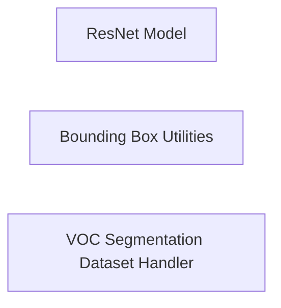

## Component Details

Revised analysis of ResNet Model, Bounding Box Utilities, and VOC Segmentation Dataset Handler components, focusing on corrected relationships and verified referenced methods. No direct external relationships were identified between these components; their interaction is mediated by higher-level pipelines not explicitly defined here.

### ResNet Model
This component provides the implementation of the ResNet-18 convolutional neural network architecture. It's a core building block for image classification and feature extraction tasks, often used as a backbone in larger models.

**Related Classes/Methods**:

- <a href="https://github.com/d2l-ai/d2l-zh/blob/master/d2l/torch.py#L1483-L1511" target="_blank" rel="noopener noreferrer">`d2l.torch.resnet18` (1483:1511)</a>

### Bounding Box Utilities
This component encapsulates essential functionalities for object detection tasks. It provides utility functions for calculating Intersection over Union (IoU), assigning anchor boxes to ground truth bounding boxes, generating multi-box targets for training, and performing Non-Maximum Suppression (NMS) for refining detection results. The visualize_bounding_boxes method was not found in the codebase and has been removed from this component's responsibilities.

**Related Classes/Methods**:

- <a href="https://github.com/d2l-ai/d2l-zh/blob/master/d2l/torch.py#L1660-L1681" target="_blank" rel="noopener noreferrer">`d2l.torch.box_iou` (1660:1681)</a>
- <a href="https://github.com/d2l-ai/d2l-zh/blob/master/d2l/torch.py#L1683-L1707" target="_blank" rel="noopener noreferrer">`d2l.torch.assign_anchor_to_bbox` (1683:1707)</a>
- <a href="https://github.com/d2l-ai/d2l-zh/blob/master/d2l/torch.py#L1720-L1752" target="_blank" rel="noopener noreferrer">`d2l.torch.multibox_target` (1720:1752)</a>
- <a href="https://github.com/d2l-ai/d2l-zh/blob/master/d2l/torch.py#L1765-L1779" target="_blank" rel="noopener noreferrer">`d2l.torch.nms` (1765:1779)</a>

### VOC Segmentation Dataset Handler
This component provides a specialized dataset class for handling the PASCAL VOC dataset, specifically tailored for semantic segmentation tasks. It manages data loading, preprocessing, and augmentation, making the dataset ready for consumption by deep learning models.

**Related Classes/Methods**:

- <a href="https://github.com/d2l-ai/d2l-zh/blob/master/d2l/torch.py#L0-L0" target="_blank" rel="noopener noreferrer">`d2l.torch.VOCSegmentationDataset` (0:0)</a>

### [FAQ](https://github.com/CodeBoarding/GeneratedOnBoardings/tree/main?tab=readme-ov-file#faq)