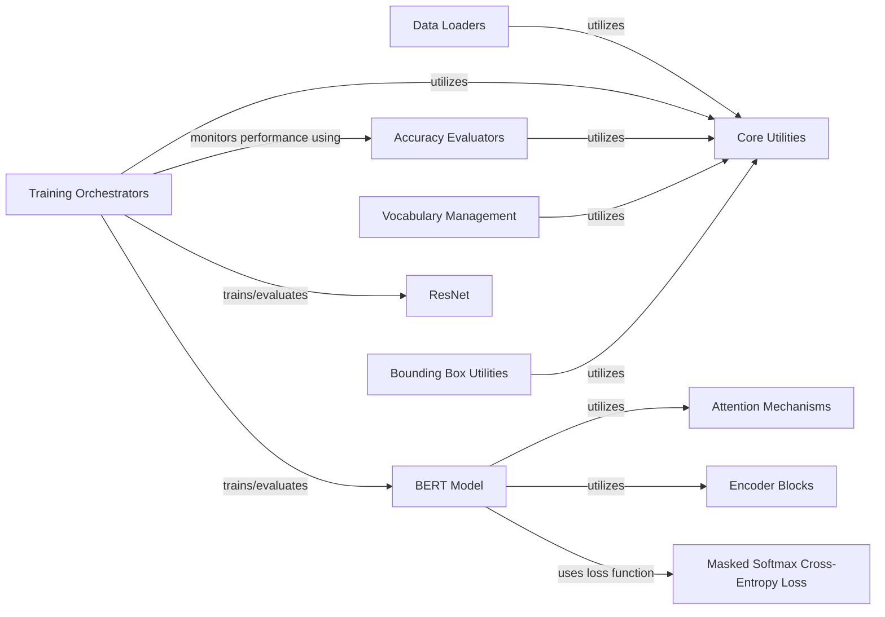

## Component Details

The project's architecture is modular, with components designed to handle specific aspects of deep learning tasks, from data preparation to model training and evaluation. The components are chosen for their fundamental role in building and operating deep learning systems, covering common utilities, data handling, training processes, and specific model architectures.

### Core Utilities
This component provides fundamental, cross-cutting helper functions essential for the entire project, adapted for different deep learning frameworks (MXNet, PaddlePaddle, TensorFlow, PyTorch). These utilities are crucial for setting up experiments, displaying results, and managing datasets, regardless of the specific deep learning task or framework.

**Related Classes/Methods**:

- `use_svg_display` (1:2)
- `set_figsize` (1:2)
- `set_axes` (1:2)
- `plot` (1:2)
- `show_images` (1:2)
- `bbox_to_rect` (1:2)
- `Timer` (1:2)
- `Benchmark` (1:2)
- `synthetic_data` (1:2)
- `linreg` (1:2)
- `squared_loss` (1:2)
- `sgd` (1:2)
- `load_array` (1:2)
- `data_iter` (1:2)
- `data_iter_consecutive` (1:2)
- `data_iter_random` (1:2)
- `download_imdb` (1:2)
- `_download_pikachu` (1:2)
- `download_voc_pascal` (1:2)
- `count_tokens` (1:2)
- `get_tokenized_imdb` (1:2)
- `get_vocab_imdb` (1:2)
- `get_fashion_mnist_labels` (1:2)
- `get_fashion_mnist_labels` (1:2)

### Data Loaders
Specializes in fetching, preprocessing (resizing, transforming), and batching specific datasets for training and evaluation. This component is fundamental as it bridges raw data with the model's input requirements.

**Related Classes/Methods**:

- <a href="https://github.com/d2l-ai/d2l-zh/blob/master/d2l/mxnet.py#L193-L207" target="_blank" rel="noopener noreferrer">`d2l.mxnet.load_data_fashion_mnist` (193:207)</a>
- <a href="https://github.com/d2l-ai/d2l-zh/blob/master/d2l/paddle.py#L697-L704" target="_blank" rel="noopener noreferrer">`d2l.paddle.load_data_time_machine` (697:704)</a>
- <a href="https://github.com/d2l-ai/d2l-zh/blob/master/d2l/tensorflow.py#L858-L872" target="_blank" rel="noopener noreferrer">`d2l.tensorflow.load_data_nmt` (858:872)</a>
- <a href="https://github.com/d2l-ai/d2l-zh/blob/master/d2l/torch.py#L2515-L2534" target="_blank" rel="noopener noreferrer">`d2l.torch.load_data_imdb` (2515:2534)</a>

### Training Orchestrators
Manages the training loop, including iterating epochs, performing forward and backward passes, and updating model parameters. This is a core component as it dictates the learning process of the models.

**Related Classes/Methods**:

- <a href="https://github.com/d2l-ai/d2l-zh/blob/master/d2l/mxnet.py#L302-L315" target="_blank" rel="noopener noreferrer">`d2l.mxnet.train_ch3` (302:315)</a>
- <a href="https://github.com/d2l-ai/d2l-zh/blob/master/d2l/paddle.py#L788-L811" target="_blank" rel="noopener noreferrer">`d2l.paddle.train_ch8` (788:811)</a>
- <a href="https://github.com/d2l-ai/d2l-zh/blob/master/d2l/tensorflow.py#L963-L989" target="_blank" rel="noopener noreferrer">`d2l.tensorflow.train_seq2seq` (963:989)</a>
- <a href="https://github.com/d2l-ai/d2l-zh/blob/master/d2l/torch.py#L1533-L1560" target="_blank" rel="noopener noreferrer">`d2l.torch.train_ch13` (1533:1560)</a>

### Accuracy Evaluators
Calculates the accuracy of a model on a given dataset. This component is fundamental for quantitatively assessing model performance and tracking progress during training.

**Related Classes/Methods**:

- <a href="https://github.com/d2l-ai/d2l-zh/blob/master/d2l/mxnet.py#L218-L225" target="_blank" rel="noopener noreferrer">`d2l.mxnet.evaluate_accuracy` (218:225)</a>
- `contrib.to_rm_mx_contrib_text.d2lzh.utils.evaluate_accuracy` (1:2)

### Vocabulary Management
Builds a vocabulary from a text corpus, mapping tokens to unique indices, and vice-versa. This is fundamental for natural language processing tasks, enabling text data to be processed by neural networks.

**Related Classes/Methods**:

- <a href="https://github.com/d2l-ai/d2l-zh/blob/master/d2l/mxnet.py#L512-L554" target="_blank" rel="noopener noreferrer">`d2l.mxnet.Vocab` (512:554)</a>
- <a href="https://github.com/d2l-ai/d2l-zh/blob/master/d2l/paddle.py#L573-L615" target="_blank" rel="noopener noreferrer">`d2l.paddle.Vocab` (573:615)</a>
- <a href="https://github.com/d2l-ai/d2l-zh/blob/master/d2l/tensorflow.py#L532-L574" target="_blank" rel="noopener noreferrer">`d2l.tensorflow.Vocab` (532:574)</a>
- <a href="https://github.com/d2l-ai/d2l-zh/blob/master/d2l/torch.py#L560-L602" target="_blank" rel="noopener noreferrer">`d2l.torch.Vocab` (560:602)</a>

### BERT Model
Implements the BERT (Bidirectional Encoder Representations from Transformers) architecture for various NLP tasks (e.g., masked language modeling, next sentence prediction). BERT is a cornerstone of modern NLP, making this component fundamental for advanced text understanding.

**Related Classes/Methods**:

- <a href="https://github.com/d2l-ai/d2l-zh/blob/master/d2l/mxnet.py#L2167-L2189" target="_blank" rel="noopener noreferrer">`d2l.mxnet.BERTModel` (2167:2189)</a>
- <a href="https://github.com/d2l-ai/d2l-zh/blob/master/d2l/paddle.py#L2300-L2328" target="_blank" rel="noopener noreferrer">`d2l.paddle.BERTModel` (2300:2328)</a>
- <a href="https://github.com/d2l-ai/d2l-zh/blob/master/d2l/tensorflow.py#L1-L2" target="_blank" rel="noopener noreferrer">`d2l.tensorflow.BERTModel` (1:2)</a>
- <a href="https://github.com/d2l-ai/d2l-zh/blob/master/d2l/torch.py#L2290-L2318" target="_blank" rel="noopener noreferrer">`d2l.torch.BERTModel` (2290:2318)</a>

### Masked Softmax Cross-Entropy Loss
Calculates the loss for sequence prediction tasks while handling variable-length sequences using masking. This specialized loss function is fundamental for training sequence models effectively, especially in NLP.

**Related Classes/Methods**:

- <a href="https://github.com/d2l-ai/d2l-zh/blob/master/d2l/mxnet.py#L910-L921" target="_blank" rel="noopener noreferrer">`d2l.mxnet.MaskedSoftmaxCELoss` (910:921)</a>
- <a href="https://github.com/d2l-ai/d2l-zh/blob/master/d2l/paddle.py#L1014-L1028" target="_blank" rel="noopener noreferrer">`d2l.paddle.MaskedSoftmaxCELoss` (1014:1028)</a>
- <a href="https://github.com/d2l-ai/d2l-zh/blob/master/d2l/tensorflow.py#L943-L961" target="_blank" rel="noopener noreferrer">`d2l.tensorflow.MaskedSoftmaxCELoss` (943:961)</a>
- <a href="https://github.com/d2l-ai/d2l-zh/blob/master/d2l/torch.py#L997-L1011" target="_blank" rel="noopener noreferrer">`d2l.torch.MaskedSoftmaxCELoss` (997:1011)</a>

### Attention Mechanisms
Implements different attention mechanisms to allow models to focus on relevant parts of the input. Attention is a fundamental concept in modern deep learning, particularly for sequence models and Transformers.

**Related Classes/Methods**: _None_

### Encoder Blocks
Building blocks for transformer-based models, typically containing multi-head attention and feed-forward networks. These blocks are fundamental for constructing powerful sequence processing architectures.

**Related Classes/Methods**: _None_

### ResNet
Implements the ResNet (Residual Network) convolutional neural network architecture for image classification or other computer vision tasks. ResNet is a landmark architecture in computer vision, making this component fundamental for image-based tasks.

**Related Classes/Methods**:

- <a href="https://github.com/d2l-ai/d2l-zh/blob/master/d2l/mxnet.py#L1371-L1394" target="_blank" rel="noopener noreferrer">`d2l.mxnet.resnet18` (1371:1394)</a>
- <a href="https://github.com/d2l-ai/d2l-zh/blob/master/d2l/paddle.py#L1486-L1514" target="_blank" rel="noopener noreferrer">`d2l.paddle.resnet18` (1486:1514)</a>
- <a href="https://github.com/d2l-ai/d2l-zh/blob/master/d2l/tensorflow.py#L1-L2" target="_blank" rel="noopener noreferrer">`d2l.tensorflow.resnet18` (1:2)</a>
- <a href="https://github.com/d2l-ai/d2l-zh/blob/master/d2l/torch.py#L1483-L1511" target="_blank" rel="noopener noreferrer">`d2l.torch.resnet18` (1483:1511)</a>

### Bounding Box Utilities
Provides functions for object detection tasks, including calculating Intersection over Union (IoU), assigning anchors, and performing non-maximum suppression. This component is fundamental for tasks involving object localization in images.

**Related Classes/Methods**: _None_

### [FAQ](https://github.com/CodeBoarding/GeneratedOnBoardings/tree/main?tab=readme-ov-file#faq)