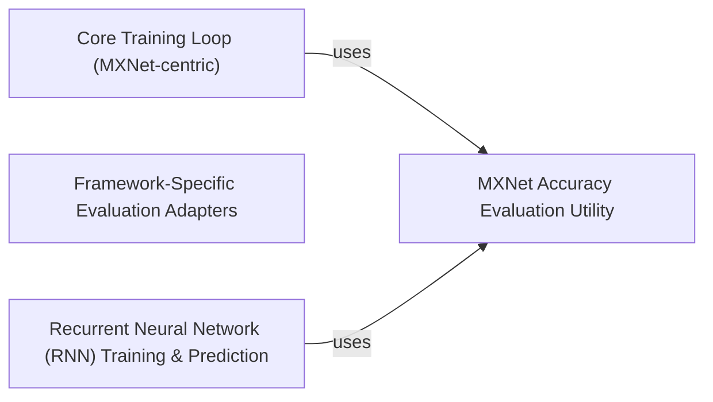

## Component Details

This component encapsulates the core logic for training and evaluating deep learning models, with a focus on both general training paradigms and specialized handling for Recurrent Neural Networks, primarily within an MXNet context, while also providing framework-specific evaluation utilities for broader applicability.

### Core Training Loop (MXNet-centric)
This component provides the high-level, iterative training orchestration for deep learning models. It manages the training process across epochs and mini-batches, handles forward and backward passes, computes loss, and updates model parameters. While designed to be general, its implementation in `d2lzh.utils.train` shows a strong dependency on MXNet's context and operations, making it primarily MXNet-centric. It is fundamental as it defines the standard workflow for training a neural network.

**Related Classes/Methods**:

- <a href="https://github.com/d2l-ai/d2l-zh/blob/master/contrib/to-rm-mx-contrib-text/d2lzh/utils.py#L532-L556" target="_blank" rel="noopener noreferrer">`d2lzh.utils.train` (532:556)</a>

### MXNet Accuracy Evaluation Utility
This component provides a utility function specifically designed for evaluating the accuracy of a model on a given dataset within an MXNet environment. It iterates through data, performs predictions, and compares them against true labels to calculate the overall accuracy. It is fundamental for assessing model performance during and after training within the `d2lzh.utils` context.

**Related Classes/Methods**:

- <a href="https://github.com/d2l-ai/d2l-zh/blob/master/contrib/to-rm-mx-contrib-text/d2lzh/utils.py#L149-L161" target="_blank" rel="noopener noreferrer">`d2lzh.utils.evaluate_accuracy` (149:161)</a>

### Framework-Specific Evaluation Adapters
This component comprises a set of `evaluate_accuracy` functions, each tailored to a specific deep learning framework (MXNet, Paddle, TensorFlow, PyTorch). These adapters interact directly with the respective framework's tensor operations and model APIs to compute accuracy. They are fundamental for enabling the `d2l` project to support and evaluate models across multiple deep learning backends.

**Related Classes/Methods**:

- <a href="https://github.com/d2l-ai/d2l-zh/blob/master/d2l/mxnet.py#L218-L225" target="_blank" rel="noopener noreferrer">`d2l.mxnet.evaluate_accuracy` (218:225)</a>
- <a href="https://github.com/d2l-ai/d2l-zh/blob/master/d2l/paddle.py#L244-L254" target="_blank" rel="noopener noreferrer">`d2l.paddle.evaluate_accuracy` (244:254)</a>
- <a href="https://github.com/d2l-ai/d2l-zh/blob/master/d2l/tensorflow.py#L213-L220" target="_blank" rel="noopener noreferrer">`d2l.tensorflow.evaluate_accuracy` (213:220)</a>
- <a href="https://github.com/d2l-ai/d2l-zh/blob/master/d2l/torch.py#L233-L243" target="_blank" rel="noopener noreferrer">`d2l.torch.evaluate_accuracy` (233:243)</a>

### Recurrent Neural Network (RNN) Training & Prediction
This component encapsulates specialized logic for training and making predictions with Recurrent Neural Networks. It addresses the unique challenges of RNNs, such as processing sequential data, managing hidden states across time steps, and potentially applying specific optimization techniques like gradient clipping. It is fundamental for handling sequential data models within the project.

**Related Classes/Methods**:

- <a href="https://github.com/d2l-ai/d2l-zh/blob/master/contrib/to-rm-mx-contrib-text/d2lzh/utils.py#L571-L613" target="_blank" rel="noopener noreferrer">`d2lzh.utils.train_and_predict_rnn` (571:613)</a>

### [FAQ](https://github.com/CodeBoarding/GeneratedOnBoardings/tree/main?tab=readme-ov-file#faq)