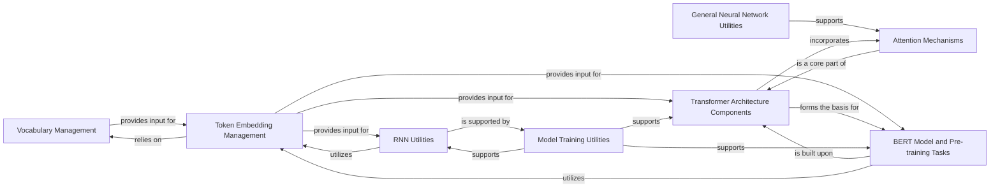

## Component Details

The Natural Language Processing (NLP) Models & Components subsystem is a critical part of the project, providing a comprehensive suite of tools and models for processing and understanding text data. Its modular design, with distinct components for vocabulary management, token embeddings, attention mechanisms, and advanced models like Transformers and BERT, allows for flexible and efficient development of NLP applications across different deep learning frameworks.

### Vocabulary Management
This foundational component is responsible for building and managing the vocabulary from raw text. It handles tokenization (breaking text into words or subword units) and mapping these tokens to unique numerical indices, which is an essential preprocessing step for any neural network-based NLP model.

**Related Classes/Methods**:

- `unknown` (0:0)
- `unknown` (0:0)
- `unknown` (0:0)
- `unknown` (0:0)
- `unknown` (0:0)

### Token Embedding Management
This component focuses on converting discrete token indices into dense, continuous vector representations (embeddings). It supports loading pre-trained embeddings (e.g., GloVe, Word2Vec) or learning them from scratch, enabling models to capture semantic relationships between words.

**Related Classes/Methods**:

- `unknown` (0:0)
- `unknown` (0:0)
- `unknown` (0:0)
- `unknown` (0:0)
- `unknown` (0:0)

### General Neural Network Utilities
This component provides common utility functions applicable across various neural network architectures, particularly those dealing with sequence data. A key utility is `masked_softmax`, which is vital for attention mechanisms to correctly handle variable-length sequences by ignoring padding tokens.

**Related Classes/Methods**:

- `unknown` (0:0)
- `unknown` (0:0)
- `unknown` (0:0)
- `unknown` (0:0)

### Attention Mechanisms
This component implements various attention mechanisms, including Additive Attention, Dot-Product Attention, and Multi-Head Attention. These mechanisms allow models to dynamically weigh the importance of different parts of the input sequence, enhancing their ability to focus on relevant information for tasks like machine translation and sequence generation.

**Related Classes/Methods**:

- `unknown` (0:0)
- `unknown` (0:0)
- `unknown` (0:0)
- `unknown` (0:0)

### Transformer Architecture Components
This component provides the core building blocks for the Transformer model, such as the Encoder Block and the full Transformer Encoder. These blocks typically combine multi-head attention, position-wise feed-forward networks, residual connections, and layer normalization, forming the basis for state-of-the-art sequence-to-sequence models.

**Related Classes/Methods**:

- `unknown` (0:0)
- `unknown` (0:0)
- `unknown` (0:0)
- `unknown` (0:0)

### BERT Model and Pre-training Tasks
This component implements the Bidirectional Encoder Representations from Transformers (BERT) model, a powerful pre-trained language model. It also includes functionalities for BERT's pre-training tasks, such as Masked Language Model (MaskLM) and Next Sentence Prediction (NextSentencePred), enabling fine-tuning for various downstream NLP tasks.

**Related Classes/Methods**:

- `unknown` (0:0)
- `unknown` (0:0)
- `unknown` (0:0)
- `unknown` (0:0)

### RNN Utilities
This component provides specific utility functions for training and prediction with Recurrent Neural Networks (RNNs). It includes functionalities tailored for sequence processing with RNNs, such as handling variable-length sequences and managing hidden states, which are crucial for tasks like language modeling and sequence generation.

**Related Classes/Methods**:

- `unknown` (0:0)

### Model Training Utilities
This component encapsulates generic training and prediction processes for deep learning models. It provides standardized functions for iterating over epochs, processing data in batches, performing forward and backward passes, and updating model parameters, making it reusable across different model architectures.

**Related Classes/Methods**:

- `unknown` (0:0)
- `unknown` (0:0)
- `unknown` (0:0)
- `unknown` (0:0)

### [FAQ](https://github.com/CodeBoarding/GeneratedOnBoardings/tree/main?tab=readme-ov-file#faq)