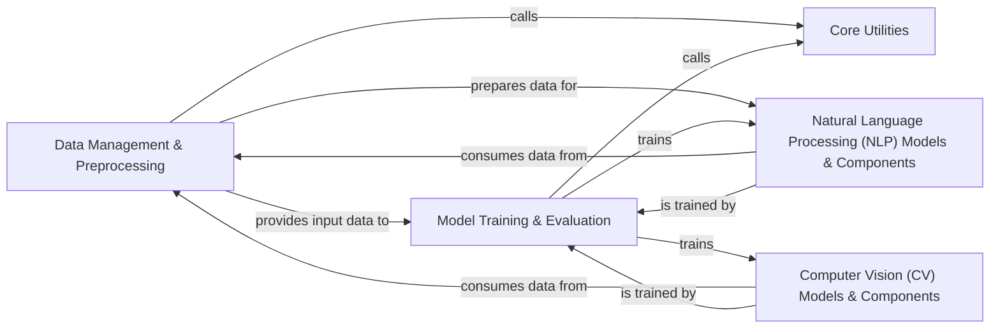

## Component Details

The `d2l-zh` project is structured to provide a comprehensive and framework-agnostic educational resource for deep learning. The architecture is designed to be modular, allowing for clear separation of concerns across different stages of a deep learning pipeline and across various deep learning frameworks (MXNet, PaddlePaddle, TensorFlow, PyTorch).

### Core Utilities
This component provides fundamental, cross-cutting helper functions essential for the entire project. These include utilities for visualization (e.g., set_figsize, plot), timing operations (Timer), and general data handling (e.g., download_extract, download_all). These utilities are crucial for setting up experiments, displaying results, and managing datasets, regardless of the specific deep learning task or framework.

**Related Classes/Methods**:

- <a href="https://github.com/d2l-ai/d2l-zh/blob/master/d2l/mxnet.py#L1-L1" target="_blank" rel="noopener noreferrer">`d2l.mxnet` (1:1)</a>
- <a href="https://github.com/d2l-ai/d2l-zh/blob/master/d2l/paddle.py#L1-L1" target="_blank" rel="noopener noreferrer">`d2l.paddle` (1:1)</a>
- <a href="https://github.com/d2l-ai/d2l-zh/blob/master/d2l/tensorflow.py#L1-L1" target="_blank" rel="noopener noreferrer">`d2l.tensorflow` (1:1)</a>
- <a href="https://github.com/d2l-ai/d2l-zh/blob/master/d2l/torch.py#L1-L1" target="_blank" rel="noopener noreferrer">`d2l.torch` (1:1)</a>
- <a href="https://github.com/d2l-ai/d2l-zh/blob/master/contrib/to-rm-mx-contrib-text/d2lzh/utils.py#L1-L1" target="_blank" rel="noopener noreferrer">`d2lzh.utils` (1:1)</a>

### Data Management & Preprocessing
This component is responsible for the entire data pipeline, from loading raw datasets to transforming them into a format suitable for deep learning models. It encompasses dataset loading for various domains (e.g., Fashion MNIST, Time Machine, IMDB, VOC), text tokenization, vocabulary creation, and handling image data for computer vision tasks. It acts as the primary data provider for all downstream model components.

**Related Classes/Methods**:

- <a href="https://github.com/d2l-ai/d2l-zh/blob/master/d2l/mxnet.py#L1-L1" target="_blank" rel="noopener noreferrer">`d2l.mxnet` (1:1)</a>
- <a href="https://github.com/d2l-ai/d2l-zh/blob/master/d2l/paddle.py#L1-L1" target="_blank" rel="noopener noreferrer">`d2l.paddle` (1:1)</a>
- <a href="https://github.com/d2l-ai/d2l-zh/blob/master/d2l/tensorflow.py#L1-L1" target="_blank" rel="noopener noreferrer">`d2l.tensorflow` (1:1)</a>
- <a href="https://github.com/d2l-ai/d2l-zh/blob/master/d2l/torch.py#L1-L1" target="_blank" rel="noopener noreferrer">`d2l.torch` (1:1)</a>
- <a href="https://github.com/d2l-ai/d2l-zh/blob/master/contrib/to-rm-mx-contrib-text/d2lzh/utils.py#L1-L1" target="_blank" rel="noopener noreferrer">`d2lzh.utils` (1:1)</a>
- <a href="https://github.com/d2l-ai/d2l-zh/blob/master/contrib/to-rm-mx-contrib-text/d2lzh/text/vocab.py#L1-L1" target="_blank" rel="noopener noreferrer">`d2lzh.text.vocab.Vocabulary` (1:1)</a>
- <a href="https://github.com/d2l-ai/d2l-zh/blob/master/contrib/to-rm-mx-contrib-text/d2lzh/utils.py#L187-L191" target="_blank" rel="noopener noreferrer">`d2lzh.utils.get_tokenized_imdb` (187:191)</a>
- <a href="https://github.com/d2l-ai/d2l-zh/blob/master/contrib/to-rm-mx-contrib-text/d2lzh/utils.py#L341-L352" target="_blank" rel="noopener noreferrer">`d2lzh.utils.preprocess_imdb` (341:352)</a>
- <a href="https://github.com/d2l-ai/d2l-zh/blob/master/d2l/mxnet.py#L1819-L1849" target="_blank" rel="noopener noreferrer">`d2l.mxnet.VOCSegDataset` (1819:1849)</a>
- <a href="https://github.com/d2l-ai/d2l-zh/blob/master/d2l/paddle.py#L1931-L1963" target="_blank" rel="noopener noreferrer">`d2l.paddle.VOCSegDataset` (1931:1963)</a>
- <a href="https://github.com/d2l-ai/d2l-zh/blob/master/d2l/tensorflow.py#L1-L1" target="_blank" rel="noopener noreferrer">`d2l.tensorflow.VOCSegDataset` (1:1)</a>
- <a href="https://github.com/d2l-ai/d2l-zh/blob/master/d2l/torch.py#L1924-L1954" target="_blank" rel="noopener noreferrer">`d2l.torch.VOCSegDataset` (1924:1954)</a>
- <a href="https://github.com/d2l-ai/d2l-zh/blob/master/contrib/to-rm-mx-contrib-text/d2lzh/utils.py#L809-L836" target="_blank" rel="noopener noreferrer">`d2lzh.utils.VOCSegDataset` (809:836)</a>

### Model Training & Evaluation
This component encapsulates the core logic for training and evaluating deep learning models across different tasks. It handles the iterative process of training, including iterating over epochs, processing mini-batches, computing loss, performing backpropagation, and updating model parameters. It also includes functionalities for calculating and reporting performance metrics (e.g., accuracy) on validation or test datasets.

**Related Classes/Methods**:

- <a href="https://github.com/d2l-ai/d2l-zh/blob/master/d2l/mxnet.py#L1-L1" target="_blank" rel="noopener noreferrer">`d2l.mxnet` (1:1)</a>
- <a href="https://github.com/d2l-ai/d2l-zh/blob/master/d2l/mxnet.py#L218-L225" target="_blank" rel="noopener noreferrer">`d2l.mxnet.evaluate_accuracy` (218:225)</a>
- <a href="https://github.com/d2l-ai/d2l-zh/blob/master/d2l/paddle.py#L1-L1" target="_blank" rel="noopener noreferrer">`d2l.paddle` (1:1)</a>
- <a href="https://github.com/d2l-ai/d2l-zh/blob/master/d2l/paddle.py#L244-L254" target="_blank" rel="noopener noreferrer">`d2l.paddle.evaluate_accuracy` (244:254)</a>
- <a href="https://github.com/d2l-ai/d2l-zh/blob/master/d2l/tensorflow.py#L1-L1" target="_blank" rel="noopener noreferrer">`d2l.tensorflow` (1:1)</a>
- <a href="https://github.com/d2l-ai/d2l-zh/blob/master/d2l/tensorflow.py#L213-L220" target="_blank" rel="noopener noreferrer">`d2l.tensorflow.evaluate_accuracy` (213:220)</a>
- <a href="https://github.com/d2l-ai/d2l-zh/blob/master/d2l/torch.py#L1-L1" target="_blank" rel="noopener noreferrer">`d2l.torch` (1:1)</a>
- <a href="https://github.com/d2l-ai/d2l-zh/blob/master/d2l/torch.py#L233-L243" target="_blank" rel="noopener noreferrer">`d2l.torch.evaluate_accuracy` (233:243)</a>
- <a href="https://github.com/d2l-ai/d2l-zh/blob/master/contrib/to-rm-mx-contrib-text/d2lzh/utils.py#L532-L556" target="_blank" rel="noopener noreferrer">`d2lzh.utils.train` (532:556)</a>
- <a href="https://github.com/d2l-ai/d2l-zh/blob/master/contrib/to-rm-mx-contrib-text/d2lzh/utils.py#L571-L613" target="_blank" rel="noopener noreferrer">`d2lzh.utils.train_and_predict_rnn` (571:613)</a>
- <a href="https://github.com/d2l-ai/d2l-zh/blob/master/contrib/to-rm-mx-contrib-text/d2lzh/utils.py#L149-L161" target="_blank" rel="noopener noreferrer">`d2lzh.utils.evaluate_accuracy` (149:161)</a>

### Natural Language Processing (NLP) Models & Components
This comprehensive component covers all aspects of text processing and modeling within the project. It includes functionalities for building vocabularies and creating/loading token embeddings (e.g., GloVe, Word2Vec) to convert text into numerical representations. Furthermore, it implements various sequence models like Recurrent Neural Networks (RNNs), the advanced Transformer architecture, and the powerful BERT model, along with their foundational Attention Mechanisms. This component provides the specialized tools and models required for language-related tasks such as language modeling, machine translation, and text classification.

**Related Classes/Methods**:

- <a href="https://github.com/d2l-ai/d2l-zh/blob/master/d2l/mxnet.py#L512-L554" target="_blank" rel="noopener noreferrer">`d2l.mxnet.Vocab` (512:554)</a>
- <a href="https://github.com/d2l-ai/d2l-zh/blob/master/d2l/mxnet.py#L501-L510" target="_blank" rel="noopener noreferrer">`d2l.mxnet.tokenize` (501:510)</a>
- <a href="https://github.com/d2l-ai/d2l-zh/blob/master/d2l/mxnet.py#L2058-L2091" target="_blank" rel="noopener noreferrer">`d2l.mxnet.TokenEmbedding` (2058:2091)</a>
- <a href="https://github.com/d2l-ai/d2l-zh/blob/master/d2l/paddle.py#L573-L615" target="_blank" rel="noopener noreferrer">`d2l.paddle.Vocab` (573:615)</a>
- <a href="https://github.com/d2l-ai/d2l-zh/blob/master/d2l/paddle.py#L562-L571" target="_blank" rel="noopener noreferrer">`d2l.paddle.tokenize` (562:571)</a>
- <a href="https://github.com/d2l-ai/d2l-zh/blob/master/d2l/paddle.py#L2188-L2221" target="_blank" rel="noopener noreferrer">`d2l.paddle.TokenEmbedding` (2188:2221)</a>
- <a href="https://github.com/d2l-ai/d2l-zh/blob/master/d2l/tensorflow.py#L532-L574" target="_blank" rel="noopener noreferrer">`d2l.tensorflow.Vocab` (532:574)</a>
- <a href="https://github.com/d2l-ai/d2l-zh/blob/master/d2l/tensorflow.py#L521-L530" target="_blank" rel="noopener noreferrer">`d2l.tensorflow.tokenize` (521:530)</a>
- <a href="https://github.com/d2l-ai/d2l-zh/blob/master/d2l/tensorflow.py#L1-L1" target="_blank" rel="noopener noreferrer">`d2l.tensorflow.TokenEmbedding` (1:1)</a>
- <a href="https://github.com/d2l-ai/d2l-zh/blob/master/d2l/torch.py#L560-L602" target="_blank" rel="noopener noreferrer">`d2l.torch.Vocab` (560:602)</a>
- <a href="https://github.com/d2l-ai/d2l-zh/blob/master/d2l/torch.py#L549-L558" target="_blank" rel="noopener noreferrer">`d2l.torch.tokenize` (549:558)</a>
- <a href="https://github.com/d2l-ai/d2l-zh/blob/master/d2l/torch.py#L2179-L2212" target="_blank" rel="noopener noreferrer">`d2l.torch.TokenEmbedding` (2179:2212)</a>
- <a href="https://github.com/d2l-ai/d2l-zh/blob/master/contrib/to-rm-mx-contrib-text/d2lzh/text/vocab.py#L1-L1" target="_blank" rel="noopener noreferrer">`d2lzh.text.vocab.Vocabulary` (1:1)</a>
- <a href="https://github.com/d2l-ai/d2l-zh/blob/master/contrib/to-rm-mx-contrib-text/d2lzh/text/embedding.py#L56-L94" target="_blank" rel="noopener noreferrer">`d2lzh.text.embedding.TokenEmbedding` (56:94)</a>
- <a href="https://github.com/d2l-ai/d2l-zh/blob/master/d2l/mxnet.py#L661-L675" target="_blank" rel="noopener noreferrer">`d2l.mxnet.predict_ch8` (661:675)</a>
- <a href="https://github.com/d2l-ai/d2l-zh/blob/master/d2l/mxnet.py#L714-L740" target="_blank" rel="noopener noreferrer">`d2l.mxnet.train_ch8` (714:740)</a>
- <a href="https://github.com/d2l-ai/d2l-zh/blob/master/d2l/paddle.py#L722-L735" target="_blank" rel="noopener noreferrer">`d2l.paddle.predict_ch8` (722:735)</a>
- <a href="https://github.com/d2l-ai/d2l-zh/blob/master/d2l/paddle.py#L788-L811" target="_blank" rel="noopener noreferrer">`d2l.paddle.train_ch8` (788:811)</a>
- <a href="https://github.com/d2l-ai/d2l-zh/blob/master/d2l/tensorflow.py#L683-L697" target="_blank" rel="noopener noreferrer">`d2l.tensorflow.predict_ch8` (683:697)</a>
- <a href="https://github.com/d2l-ai/d2l-zh/blob/master/d2l/tensorflow.py#L742-L764" target="_blank" rel="noopener noreferrer">`d2l.tensorflow.train_ch8` (742:764)</a>
- <a href="https://github.com/d2l-ai/d2l-zh/blob/master/d2l/torch.py#L709-L723" target="_blank" rel="noopener noreferrer">`d2l.torch.predict_ch8` (709:723)</a>
- <a href="https://github.com/d2l-ai/d2l-zh/blob/master/d2l/torch.py#L773-L796" target="_blank" rel="noopener noreferrer">`d2l.torch.train_ch8` (773:796)</a>
- <a href="https://github.com/d2l-ai/d2l-zh/blob/master/contrib/to-rm-mx-contrib-text/d2lzh/utils.py#L304-L316" target="_blank" rel="noopener noreferrer">`d2lzh.utils.predict_rnn` (304:316)</a>
- <a href="https://github.com/d2l-ai/d2l-zh/blob/master/contrib/to-rm-mx-contrib-text/d2lzh/utils.py#L571-L613" target="_blank" rel="noopener noreferrer">`d2lzh.utils.train_and_predict_rnn` (571:613)</a>
- <a href="https://github.com/d2l-ai/d2l-zh/blob/master/d2l/mxnet.py#L1042-L1068" target="_blank" rel="noopener noreferrer">`d2l.mxnet.AdditiveAttention` (1042:1068)</a>
- <a href="https://github.com/d2l-ai/d2l-zh/blob/master/d2l/mxnet.py#L1070-L1087" target="_blank" rel="noopener noreferrer">`d2l.mxnet.DotProductAttention` (1070:1087)</a>
- <a href="https://github.com/d2l-ai/d2l-zh/blob/master/d2l/mxnet.py#L1100-L1137" target="_blank" rel="noopener noreferrer">`d2l.mxnet.MultiHeadAttention` (1100:1137)</a>
- <a href="https://github.com/d2l-ai/d2l-zh/blob/master/d2l/paddle.py#L1150-L1174" target="_blank" rel="noopener noreferrer">`d2l.paddle.AdditiveAttention` (1150:1174)</a>
- <a href="https://github.com/d2l-ai/d2l-zh/blob/master/d2l/paddle.py#L1176-L1193" target="_blank" rel="noopener noreferrer">`d2l.paddle.DotProductAttention` (1176:1193)</a>
- <a href="https://github.com/d2l-ai/d2l-zh/blob/master/d2l/paddle.py#L1206-L1241" target="_blank" rel="noopener noreferrer">`d2l.paddle.MultiHeadAttention` (1206:1241)</a>
- <a href="https://github.com/d2l-ai/d2l-zh/blob/master/d2l/tensorflow.py#L1079-L1105" target="_blank" rel="noopener noreferrer">`d2l.tensorflow.AdditiveAttention` (1079:1105)</a>
- <a href="https://github.com/d2l-ai/d2l-zh/blob/master/d2l/tensorflow.py#L1107-L1124" target="_blank" rel="noopener noreferrer">`d2l.tensorflow.DotProductAttention` (1107:1124)</a>
- <a href="https://github.com/d2l-ai/d2l-zh/blob/master/d2l/tensorflow.py#L1137-L1174" target="_blank" rel="noopener noreferrer">`d2l.tensorflow.MultiHeadAttention` (1137:1174)</a>
- <a href="https://github.com/d2l-ai/d2l-zh/blob/master/d2l/torch.py#L1144-L1168" target="_blank" rel="noopener noreferrer">`d2l.torch.AdditiveAttention` (1144:1168)</a>
- <a href="https://github.com/d2l-ai/d2l-zh/blob/master/d2l/torch.py#L1170-L1187" target="_blank" rel="noopener noreferrer">`d2l.torch.DotProductAttention` (1170:1187)</a>
- <a href="https://github.com/d2l-ai/d2l-zh/blob/master/d2l/torch.py#L1200-L1238" target="_blank" rel="noopener noreferrer">`d2l.torch.MultiHeadAttention` (1200:1238)</a>
- <a href="https://github.com/d2l-ai/d2l-zh/blob/master/d2l/mxnet.py#L1208-L1223" target="_blank" rel="noopener noreferrer">`d2l.mxnet.EncoderBlock` (1208:1223)</a>
- <a href="https://github.com/d2l-ai/d2l-zh/blob/master/d2l/mxnet.py#L1225-L1251" target="_blank" rel="noopener noreferrer">`d2l.mxnet.TransformerEncoder` (1225:1251)</a>
- <a href="https://github.com/d2l-ai/d2l-zh/blob/master/d2l/paddle.py#L1314-L1332" target="_blank" rel="noopener noreferrer">`d2l.paddle.EncoderBlock` (1314:1332)</a>
- <a href="https://github.com/d2l-ai/d2l-zh/blob/master/d2l/paddle.py#L1334-L1362" target="_blank" rel="noopener noreferrer">`d2l.paddle.TransformerEncoder` (1334:1362)</a>
- <a href="https://github.com/d2l-ai/d2l-zh/blob/master/d2l/tensorflow.py#L1246-L1261" target="_blank" rel="noopener noreferrer">`d2l.tensorflow.EncoderBlock` (1246:1261)</a>
- <a href="https://github.com/d2l-ai/d2l-zh/blob/master/d2l/tensorflow.py#L1263-L1290" target="_blank" rel="noopener noreferrer">`d2l.tensorflow.TransformerEncoder` (1263:1290)</a>
- <a href="https://github.com/d2l-ai/d2l-zh/blob/master/d2l/torch.py#L1311-L1329" target="_blank" rel="noopener noreferrer">`d2l.torch.EncoderBlock` (1311:1329)</a>
- <a href="https://github.com/d2l-ai/d2l-zh/blob/master/d2l/torch.py#L1331-L1359" target="_blank" rel="noopener noreferrer">`d2l.torch.TransformerEncoder` (1331:1359)</a>
- <a href="https://github.com/d2l-ai/d2l-zh/blob/master/d2l/mxnet.py#L2167-L2189" target="_blank" rel="noopener noreferrer">`d2l.mxnet.BERTModel` (2167:2189)</a>
- <a href="https://github.com/d2l-ai/d2l-zh/blob/master/d2l/mxnet.py#L2130-L2153" target="_blank" rel="noopener noreferrer">`d2l.mxnet.MaskLM` (2130:2153)</a>
- <a href="https://github.com/d2l-ai/d2l-zh/blob/master/d2l/mxnet.py#L2155-L2165" target="_blank" rel="noopener noreferrer">`d2l.mxnet.NextSentencePred` (2155:2165)</a>
- <a href="https://github.com/d2l-ai/d2l-zh/blob/master/d2l/paddle.py#L2300-L2328" target="_blank" rel="noopener noreferrer">`d2l.paddle.BERTModel` (2300:2328)</a>
- <a href="https://github.com/d2l-ai/d2l-zh/blob/master/d2l/paddle.py#L2264-L2286" target="_blank" rel="noopener noreferrer">`d2l.paddle.MaskLM` (2264:2286)</a>
- <a href="https://github.com/d2l-ai/d2l-zh/blob/master/d2l/paddle.py#L2288-L2298" target="_blank" rel="noopener noreferrer">`d2l.paddle.NextSentencePred` (2288:2298)</a>
- <a href="https://github.com/d2l-ai/d2l-zh/blob/master/d2l/tensorflow.py#L1-L1" target="_blank" rel="noopener noreferrer">`d2l.tensorflow.BERTModel` (1:1)</a>
- <a href="https://github.com/d2l-ai/d2l-zh/blob/master/d2l/tensorflow.py#L1-L1" target="_blank" rel="noopener noreferrer">`d2l.tensorflow.MaskLM` (1:1)</a>
- <a href="https://github.com/d2l-ai/d2l-zh/blob/master/d2l/tensorflow.py#L1-L1" target="_blank" rel="noopener noreferrer">`d2l.tensorflow.NextSentencePred` (1:1)</a>
- <a href="https://github.com/d2l-ai/d2l-zh/blob/master/d2l/torch.py#L2290-L2318" target="_blank" rel="noopener noreferrer">`d2l.torch.BERTModel` (2290:2318)</a>
- <a href="https://github.com/d2l-ai/d2l-zh/blob/master/d2l/torch.py#L2254-L2276" target="_blank" rel="noopener noreferrer">`d2l.torch.MaskLM` (2254:2276)</a>
- <a href="https://github.com/d2l-ai/d2l-zh/blob/master/d2l/torch.py#L2278-L2288" target="_blank" rel="noopener noreferrer">`d2l.torch.NextSentencePred` (2278:2288)</a>

### Computer Vision (CV) Models & Components
This component focuses on image processing and computer vision tasks. It includes implementations of popular convolutional neural network (CNN) architectures like ResNet-18 for image classification. Additionally, it provides specialized utilities for object detection (e.g., displaying bounding boxes, IoU calculation, NMS) and image segmentation (e.g., VOC dataset handling). This component provides the necessary models and helper functions to work with visual data.

**Related Classes/Methods**:

- <a href="https://github.com/d2l-ai/d2l-zh/blob/master/d2l/mxnet.py#L1371-L1394" target="_blank" rel="noopener noreferrer">`d2l.mxnet.resnet18` (1371:1394)</a>
- <a href="https://github.com/d2l-ai/d2l-zh/blob/master/d2l/paddle.py#L1486-L1514" target="_blank" rel="noopener noreferrer">`d2l.paddle.resnet18` (1486:1514)</a>
- <a href="https://github.com/d2l-ai/d2l-zh/blob/master/d2l/tensorflow.py#L1-L1" target="_blank" rel="noopener noreferrer">`d2l.tensorflow.resnet18` (1:1)</a>
- <a href="https://github.com/d2l-ai/d2l-zh/blob/master/d2l/torch.py#L1483-L1511" target="_blank" rel="noopener noreferrer">`d2l.torch.resnet18` (1483:1511)</a>
- <a href="https://github.com/d2l-ai/d2l-zh/blob/master/contrib/to-rm-mx-contrib-text/d2lzh/utils.py#L405-L425" target="_blank" rel="noopener noreferrer">`d2lzh.utils.resnet18` (405:425)</a>
- <a href="https://github.com/d2l-ai/d2l-zh/blob/master/d2l/mxnet.py#L1535-L1556" target="_blank" rel="noopener noreferrer">`d2l.mxnet.show_bboxes` (1535:1556)</a>
- <a href="https://github.com/d2l-ai/d2l-zh/blob/master/d2l/mxnet.py#L1558-L1580" target="_blank" rel="noopener noreferrer">`d2l.mxnet.box_iou` (1558:1580)</a>
- <a href="https://github.com/d2l-ai/d2l-zh/blob/master/d2l/mxnet.py#L1582-L1605" target="_blank" rel="noopener noreferrer">`d2l.mxnet.assign_anchor_to_bbox` (1582:1605)</a>
- <a href="https://github.com/d2l-ai/d2l-zh/blob/master/d2l/mxnet.py#L1618-L1649" target="_blank" rel="noopener noreferrer">`d2l.mxnet.multibox_target` (1618:1649)</a>
- <a href="https://github.com/d2l-ai/d2l-zh/blob/master/d2l/mxnet.py#L1662-L1676" target="_blank" rel="noopener noreferrer">`d2l.mxnet.nms` (1662:1676)</a>
- <a href="https://github.com/d2l-ai/d2l-zh/blob/master/d2l/mxnet.py#L1678-L1710" target="_blank" rel="noopener noreferrer">`d2l.mxnet.multibox_detection` (1678:1710)</a>
- <a href="https://github.com/d2l-ai/d2l-zh/blob/master/d2l/paddle.py#L1641-L1662" target="_blank" rel="noopener noreferrer">`d2l.paddle.show_bboxes` (1641:1662)</a>
- <a href="https://github.com/d2l-ai/d2l-zh/blob/master/d2l/paddle.py#L1664-L1685" target="_blank" rel="noopener noreferrer">`d2l.paddle.box_iou` (1664:1685)</a>
- <a href="https://github.com/d2l-ai/d2l-zh/blob/master/d2l/paddle.py#L1687-L1711" target="_blank" rel="noopener noreferrer">`d2l.paddle.assign_anchor_to_bbox` (1687:1711)</a>
- <a href="https://github.com/d2l-ai/d2l-zh/blob/master/d2l/paddle.py#L1724-L1755" target="_blank" rel="noopener noreferrer">`d2l.paddle.multibox_target` (1724:1755)</a>
- <a href="https://github.com/d2l-ai/d2l-zh/blob/master/d2l/paddle.py#L1768-L1782" target="_blank" rel="noopener noreferrer">`d2l.paddle.nms` (1768:1782)</a>
- <a href="https://github.com/d2l-ai/d2l-zh/blob/master/d2l/paddle.py#L1784-L1817" target="_blank" rel="noopener noreferrer">`d2l.paddle.multibox_detection` (1784:1817)</a>
- <a href="https://github.com/d2l-ai/d2l-zh/blob/master/d2l/tensorflow.py#L1-L1" target="_blank" rel="noopener noreferrer">`d2l.tensorflow.show_bboxes` (1:1)</a>
- <a href="https://github.com/d2l-ai/d2l-zh/blob/master/d2l/tensorflow.py#L1-L1" target="_blank" rel="noopener noreferrer">`d2l.tensorflow.box_iou` (1:1)</a>
- <a href="https://github.com/d2l-ai/d2l-zh/blob/master/d2l/tensorflow.py#L1-L1" target="_blank" rel="noopener noreferrer">`d2l.tensorflow.assign_anchor_to_bbox` (1:1)</a>
- <a href="https://github.com/d2l-ai/d2l-zh/blob/master/d2l/tensorflow.py#L1-L1" target="_blank" rel="noopener noreferrer">`d2l.tensorflow.multibox_target` (1:1)</a>
- <a href="https://github.com/d2l-ai/d2l-zh/blob/master/d2l/tensorflow.py#L1-L1" target="_blank" rel="noopener noreferrer">`d2l.tensorflow.nms` (1:1)</a>
- <a href="https://github.com/d2l-ai/d2l-zh/blob/master/d2l/tensorflow.py#L1-L1" target="_blank" rel="noopener noreferrer">`d2l.tensorflow.multibox_detection` (1:1)</a>
- <a href="https://github.com/d2l-ai/d2l-zh/blob/master/d2l/torch.py#L1637-L1658" target="_blank" rel="noopener noreferrer">`d2l.torch.show_bboxes` (1637:1658)</a>
- <a href="https://github.com/d2l-ai/d2l-zh/blob/master/d2l/torch.py#L1660-L1681" target="_blank" rel="noopener noreferrer">`d2l.torch.box_iou` (1660:1681)</a>
- <a href="https://github.com/d2l-ai/d2l-zh/blob/master/d2l/torch.py#L1683-L1707" target="_blank" rel="noopener noreferrer">`d2l.torch.assign_anchor_to_bbox` (1683:1707)</a>
- <a href="https://github.com/d2l-ai/d2l-zh/blob/master/d2l/torch.py#L1720-L1752" target="_blank" rel="noopener noreferrer">`d2l.torch.multibox_target` (1720:1752)</a>
- <a href="https://github.com/d2l-ai/d2l-zh/blob/master/d2l/torch.py#L1765-L1779" target="_blank" rel="noopener noreferrer">`d2l.torch.nms` (1765:1779)</a>
- <a href="https://github.com/d2l-ai/d2l-zh/blob/master/d2l/torch.py#L1781-L1813" target="_blank" rel="noopener noreferrer">`d2l.torch.multibox_detection` (1781:1813)</a>
- <a href="https://github.com/d2l-ai/d2l-zh/blob/master/contrib/to-rm-mx-contrib-text/d2lzh/utils.py#L471-L483" target="_blank" rel="noopener noreferrer">`d2lzh.utils.show_bboxes` (471:483)</a>
- <a href="https://github.com/d2l-ai/d2l-zh/blob/master/d2l/mxnet.py#L1819-L1849" target="_blank" rel="noopener noreferrer">`d2l.mxnet.VOCSegDataset` (1819:1849)</a>
- <a href="https://github.com/d2l-ai/d2l-zh/blob/master/d2l/paddle.py#L1931-L1963" target="_blank" rel="noopener noreferrer">`d2l.paddle.VOCSegDataset` (1931:1963)</a>
- <a href="https://github.com/d2l-ai/d2l-zh/blob/master/d2l/tensorflow.py#L1-L1" target="_blank" rel="noopener noreferrer">`d2l.tensorflow.VOCSegDataset` (1:1)</a>
- <a href="https://github.com/d2l-ai/d2l-zh/blob/master/d2l/torch.py#L1924-L1954" target="_blank" rel="noopener noreferrer">`d2l.torch.VOCSegDataset` (1924:1954)</a>
- <a href="https://github.com/d2l-ai/d2l-zh/blob/master/contrib/to-rm-mx-contrib-text/d2lzh/utils.py#L809-L836" target="_blank" rel="noopener noreferrer">`d2lzh.utils.VOCSegDataset` (809:836)</a>

### [FAQ](https://github.com/CodeBoarding/GeneratedOnBoardings/tree/main?tab=readme-ov-file#faq)