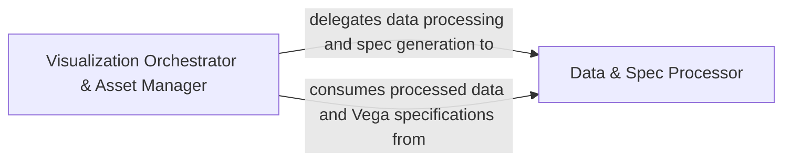

## Details

The `d3py` visualization subsystem is orchestrated by the `Visualization Orchestrator & Asset Manager`, which acts as the central control point for generating interactive data visualizations. This orchestrator delegates the crucial tasks of data transformation and declarative specification generation to the `Data & Spec Processor`. The `Data & Spec Processor` is responsible for converting raw Python data, such as Pandas DataFrames, into web-friendly JSON formats and subsequently generating the complete Vega JSON specification that defines the visual encoding and interactivity of the plot. Once these processed data and specifications are generated, the `Visualization Orchestrator & Asset Manager` consumes them, integrates all necessary assets (processed data, Vega spec, HTML, JavaScript), and manages their persistence to the file system, making the visualization ready for browser rendering. This clear separation of concerns ensures efficient data preparation and flexible visualization generation.

### Data & Spec Processor [[Expand]](./Data_Spec_Processor.md)
This component is the primary engine for preparing raw Python data for visualization and generating the necessary declarative specifications. It encompasses the ingestion of various data types (primarily Pandas DataFrames), their transformation into a web-friendly JSON format, and the subsequent generation of a complete Vega JSON specification that defines the visual encoding and interactivity of the plot. It acts as the "Data Adapters/Processors" and "Code Generators" for the visualization specification.

**Related Classes/Methods**:

- <a href="https://github.com/mikedewar/d3py/blob/master/d3py/pandas_figure.py" target="_blank" rel="noopener noreferrer">`d3py.pandas_figure.PandasFigure._data_to_json`</a>
- <a href="https://github.com/mikedewar/d3py/blob/master/d3py/vega.py" target="_blank" rel="noopener noreferrer">`d3py.vega.Vega.tabular_data`</a>
- <a href="https://github.com/mikedewar/d3py/blob/master/d3py/vega.py" target="_blank" rel="noopener noreferrer">`d3py.vega.Vega.build_vega`</a>

### Visualization Orchestrator & Asset Manager
This component serves as the central "Figure/Plotting Core" and orchestrator for the entire visualization lifecycle. It manages the overall figure object, delegates data processing and Vega specification generation to the `Data & Spec Processor`, and is responsible for integrating all generated assets (processed data, Vega spec, HTML, JavaScript) into a cohesive output. It also handles the persistence and saving of these assets to the file system, making the visualization accessible for browser rendering.

**Related Classes/Methods**:

- <a href="https://github.com/mikedewar/d3py/blob/master/d3py/figure.py" target="_blank" rel="noopener noreferrer">`d3py.figure.Figure._save_data`</a>

### [FAQ](https://github.com/CodeBoarding/GeneratedOnBoardings/tree/main?tab=readme-ov-file#faq)