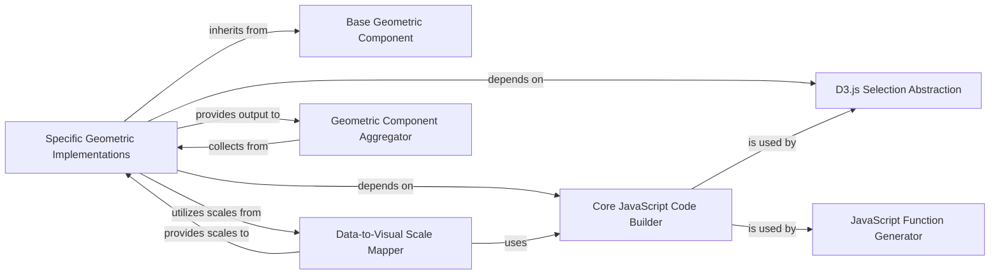

## Details

The d3py visualization subsystem is designed around a clear separation of concerns, enabling the generation of D3.js-based interactive plots from Python data structures. At its core, the system defines abstract geometric components that serve as blueprints for various visual elements. Concrete implementations of these geometries handle the specific D3.js and CSS code generation. A crucial aspect is the data-to-visual scale mapping, which intelligently translates data ranges into visual properties. All JavaScript code generation is facilitated by a dedicated utility component, ensuring consistency and reusability. Finally, a geometric component aggregator assembles all individual visual elements into a cohesive final output. This modular design allows for flexible extension and robust visualization creation.

### Base Geometric Component
Defines the abstract interface and common properties for all geometric shapes. It establishes the contract for how a geometric component should behave, including methods for generating CSS and JavaScript. This component is fundamental as it provides the blueprint for all visual elements.

**Related Classes/Methods**:

- <a href="https://github.com/mikedewar/d3py/blob/master/d3py/geoms/geom.py#L4-L14" target="_blank" rel="noopener noreferrer">`d3py.geoms.geom.Geom`:4-14</a>

### Specific Geometric Implementations
Implement concrete visual representations (e.g., bars, lines, areas). They are responsible for generating the specific D3.js and CSS code required to render their respective shapes, often through _build_css and _build_js methods. These are the actual visual building blocks of any plot.

**Related Classes/Methods**:

- <a href="https://github.com/mikedewar/d3py/blob/master/d3py/geoms/area.py#L3-L56" target="_blank" rel="noopener noreferrer">`d3py.geoms.area.Area`:3-56</a>
- <a href="https://github.com/mikedewar/d3py/blob/master/d3py/geoms/bar.py" target="_blank" rel="noopener noreferrer">`d3py.geoms.bar.Bar`</a>
- <a href="https://github.com/mikedewar/d3py/blob/master/d3py/geoms/line.py#L3-L47" target="_blank" rel="noopener noreferrer">`d3py.geoms.line.Line`:3-47</a>

### Data-to-Visual Scale Mapper
Analyzes input data (typically from a Pandas DataFrame) to determine appropriate D3.js scale types (e.g., linear, ordinal, time) and their corresponding domains (input data range) and ranges (output visual range, e.g., pixel values). It generates the D3.js code for these scales, which are fundamental for mapping data values to visual attributes like position, size, and color.

**Related Classes/Methods**:

- <a href="https://github.com/mikedewar/d3py/blob/master/d3py/pandas_figure.py" target="_blank" rel="noopener noreferrer">`d3py.pandas_figure.PandasFigure._build_scales`</a>

### Core JavaScript Code Builder
Provides core functionalities for building JavaScript code snippets, acting as a utility for other components that need to generate D3.js or general JavaScript. It abstracts the complexities of string concatenation for JavaScript output.

**Related Classes/Methods**:

- <a href="https://github.com/mikedewar/d3py/blob/master/d3py/javascript.py#L4-L75" target="_blank" rel="noopener noreferrer">`d3py.javascript.JavaScript`:4-75</a>

### D3.js Selection Abstraction
Provides abstractions for D3.js selections, used for DOM manipulation and attribute setting within the generated JavaScript. This component simplifies the interaction with the SVG/HTML elements that D3.js will render.

**Related Classes/Methods**:

- <a href="https://github.com/mikedewar/d3py/blob/master/d3py/javascript.py#L77-L129" target="_blank" rel="noopener noreferrer">`d3py.javascript.Selection`:77-129</a>

### JavaScript Function Generator
Generates D3.js function definitions within the output JavaScript, enabling dynamic behavior and data binding. This allows for more complex and interactive visualizations.

**Related Classes/Methods**:

- <a href="https://github.com/mikedewar/d3py/blob/master/d3py/javascript.py#L131-L202" target="_blank" rel="noopener noreferrer">`d3py.javascript.Function`:131-202</a>

### Geometric Component Aggregator
Collects and integrates the JavaScript and CSS generated by individual geometric implementations into the overall figure's output. It ensures that all visual components are properly assembled into a cohesive visualization.

**Related Classes/Methods**:

- <a href="https://github.com/mikedewar/d3py/blob/master/d3py/figure.py#L131-L137" target="_blank" rel="noopener noreferrer">`d3py.figure._build_geoms`:131-137</a>

### [FAQ](https://github.com/CodeBoarding/GeneratedOnBoardings/tree/main?tab=readme-ov-file#faq)