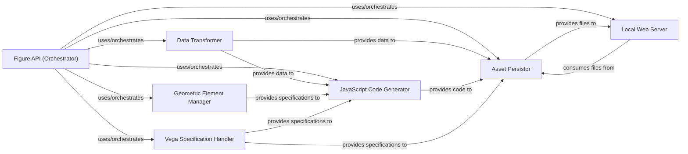

## Details

One paragraph explaining the functionality which is represented by this graph. What the main flow is and what is its purpose.

### Figure API (Orchestrator)
The primary user interface for defining, configuring, and initiating the visualization build process. It orchestrates the entire pipeline, coordinating data transformation, geometric element management, JavaScript code generation, asset persistence, and local serving.

**Related Classes/Methods**:

- <a href="https://github.com/mikedewar/d3py/blob/master/d3py/figure.py" target="_blank" rel="noopener noreferrer">`d3py.figure.Figure`</a>
- <a href="https://github.com/mikedewar/d3py/blob/master/d3py/figure.py" target="_blank" rel="noopener noreferrer">`d3py.figure.Figure:__init__`</a>
- <a href="https://github.com/mikedewar/d3py/blob/master/d3py/figure.py" target="_blank" rel="noopener noreferrer">`d3py.figure.Figure:show`</a>
- <a href="https://github.com/mikedewar/d3py/blob/master/d3py/figure.py" target="_blank" rel="noopener noreferrer">`d3py.figure.Figure:save`</a>
- <a href="https://github.com/mikedewar/d3py/blob/master/d3py/figure.py" target="_blank" rel="noopener noreferrer">`d3py.figure.Figure:_build`</a>

### Data Transformer
Responsible for converting various input data formats (e.g., pandas DataFrames, numpy arrays) into a standardized, D3.js-compatible JSON structure suitable for client-side rendering.

**Related Classes/Methods**:

- <a href="https://github.com/mikedewar/d3py/blob/master/d3py/pandas_figure.py#L8-L159" target="_blank" rel="noopener noreferrer">`d3py.pandas_figure.PandasFigure`:8-159</a>
- <a href="https://github.com/mikedewar/d3py/blob/master/d3py/networkx_figure.py#L8-L51" target="_blank" rel="noopener noreferrer">`d3py.networkx_figure.NetworkxFigure`:8-51</a>

### Geometric Element Manager
Manages the processing, validation, and inclusion of geometric shapes (e.g., lines, circles, bars) and their associated visual properties (e.g., color, size, position) into the visualization specification.

**Related Classes/Methods**:

- <a href="https://github.com/mikedewar/d3py/blob/master/d3py/geoms/geom.py#L4-L14" target="_blank" rel="noopener noreferrer">`d3py.geoms.geom.Geom`:4-14</a>
- <a href="https://github.com/mikedewar/d3py/blob/master/d3py/geoms/line.py#L3-L47" target="_blank" rel="noopener noreferrer">`d3py.geoms.line.Line`:3-47</a>
- <a href="https://github.com/mikedewar/d3py/blob/master/d3py/geoms/bar.py" target="_blank" rel="noopener noreferrer">`d3py.geoms.bar.Bar`</a>
- <a href="https://github.com/mikedewar/d3py/blob/master/d3py/geoms/point.py" target="_blank" rel="noopener noreferrer">`d3py.geoms.point.Point`</a>

### JavaScript Code Generator
Generates the necessary D3.js and supporting JavaScript code that defines the visualization logic, interactions, and data binding for the client-side browser environment.

**Related Classes/Methods**:

- <a href="https://github.com/mikedewar/d3py/blob/master/d3py/javascript.py#L4-L75" target="_blank" rel="noopener noreferrer">`d3py.javascript.JavaScript`:4-75</a>

### Vega Specification Handler
Provides an interface for integrating and processing Vega or Vega-Lite specifications, allowing for declarative visualization definitions to be incorporated into the d3py output.

**Related Classes/Methods**:

- <a href="https://github.com/mikedewar/d3py/blob/master/d3py/vega.py" target="_blank" rel="noopener noreferrer">`d3py.vega.Vega`</a>

### Asset Persistor
Coordinates the writing of all generated web assets (HTML, CSS, JavaScript, and data JSON files) to the local file system, preparing them for serving or direct distribution.

**Related Classes/Methods**:

- <a href="https://github.com/mikedewar/d3py/blob/master/d3py/figure.py" target="_blank" rel="noopener noreferrer">`d3py.figure.Figure:save`</a>

### Local Web Server
Provides a lightweight, temporary web server to serve the generated static web assets, enabling the visualization to be opened and viewed in a local web browser.

**Related Classes/Methods**:

- <a href="https://github.com/mikedewar/d3py/blob/master/d3py/HTTPHandler.py" target="_blank" rel="noopener noreferrer">`d3py.HTTPHandler.D3PyHTTPHandler`</a>

### [FAQ](https://github.com/CodeBoarding/GeneratedOnBoardings/tree/main?tab=readme-ov-file#faq)