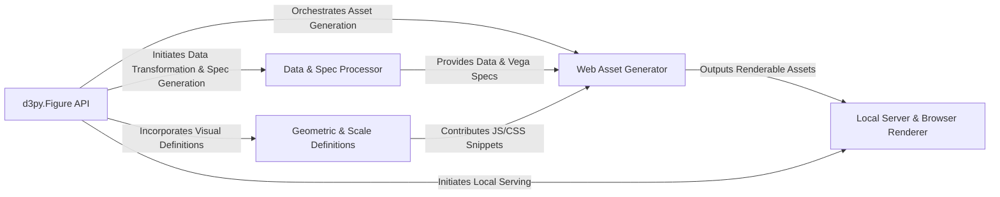

## Details

The `d3py` architecture is centered around a Python-driven pipeline for generating interactive D3.js or Vega visualizations. The **`d3py.Figure API`** serves as the user's primary interaction point, orchestrating the entire visualization creation process. It delegates data preparation to the **`Data & Spec Processor`**, which transforms Python data into JSON and can generate Vega specifications. Concurrently, the API integrates visual definitions from **`Geometric & Scale Definitions`**, which define the plot's visual elements and their scaling. All these components feed into the **`Web Asset Generator`**, responsible for compiling the final HTML, JavaScript, and CSS files. These self-contained web assets are then either saved to disk or served by the **`Local Server & Browser Renderer`**, enabling the interactive visualization to be displayed in a web browser. This architecture emphasizes a clear separation between the Python backend's data processing and code generation, and the client-side browser's rendering capabilities.

### d3py.Figure API [[Expand]](./d3py_Figure_API.md)
The primary interface for users to define, configure, and initiate the visualization build process. It acts as the central orchestrator for the entire visualization pipeline.

**Related Classes/Methods**:

- <a href="https://github.com/mikedewar/d3py/blob/master/d3py/figure.py" target="_blank" rel="noopener noreferrer">`d3py.figure.Figure.__init__`</a>
- <a href="https://github.com/mikedewar/d3py/blob/master/d3py/figure.py" target="_blank" rel="noopener noreferrer">`d3py.figure.Figure.show`</a>
- <a href="https://github.com/mikedewar/d3py/blob/master/d3py/figure.py" target="_blank" rel="noopener noreferrer">`d3py.figure.Figure.save`</a>
- <a href="https://github.com/mikedewar/d3py/blob/master/d3py/figure.py" target="_blank" rel="noopener noreferrer">`d3py.figure.Figure._build`</a>

### Data & Spec Processor [[Expand]](./Data_Spec_Processor.md)
Responsible for ingesting raw Python data (e.g., Pandas DataFrames), transforming it into JSON, and generating declarative Vega specifications.

**Related Classes/Methods**:

- <a href="https://github.com/mikedewar/d3py/blob/master/d3py/pandas_figure.py" target="_blank" rel="noopener noreferrer">`d3py.pandas_figure.PandasFigure._data_to_json`</a>
- <a href="https://github.com/mikedewar/d3py/blob/master/d3py/figure.py" target="_blank" rel="noopener noreferrer">`d3py.figure.Figure._save_data`</a>
- <a href="https://github.com/mikedewar/d3py/blob/master/d3py/vega.py" target="_blank" rel="noopener noreferrer">`d3py.vega.Vega.tabular_data`</a>
- <a href="https://github.com/mikedewar/d3py/blob/master/d3py/vega.py" target="_blank" rel="noopener noreferrer">`d3py.vega.Vega.build_vega`</a>

### Geometric & Scale Definitions [[Expand]](./Geometric_Scale_Definitions.md)
Defines the visual components (geoms like bars, lines, axes) and their associated D3.js/CSS properties, including data-to-visual scale mappings. These are the building blocks of the visualization.

**Related Classes/Methods**:

- <a href="https://github.com/mikedewar/d3py/blob/master/d3py/geoms/geom.py" target="_blank" rel="noopener noreferrer">`d3py.geoms.Geom`</a>
- <a href="https://github.com/mikedewar/d3py/blob/master/d3py/pandas_figure.py" target="_blank" rel="noopener noreferrer">`d3py.pandas_figure.PandasFigure._build_scales`</a>

### Web Asset Generator
Aggregates and formats all necessary client-side assets (JavaScript, CSS, HTML) into a self-contained web page, ready for display.

**Related Classes/Methods**:

- <a href="https://github.com/mikedewar/d3py/blob/master/d3py/figure.py" target="_blank" rel="noopener noreferrer">`d3py.figure.Figure._build_js`</a>
- <a href="https://github.com/mikedewar/d3py/blob/master/d3py/figure.py" target="_blank" rel="noopener noreferrer">`d3py.figure.Figure._build_css`</a>
- <a href="https://github.com/mikedewar/d3py/blob/master/d3py/figure.py" target="_blank" rel="noopener noreferrer">`d3py.figure.Figure._build_html`</a>

### Local Server & Browser Renderer
Provides a temporary HTTP server to serve the generated web assets and represents the external web browser environment where D3.js/Vega executes to render the interactive visualization.

**Related Classes/Methods**:

- <a href="https://github.com/mikedewar/d3py/blob/master/d3py/HTTPHandler.py#L10-L71" target="_blank" rel="noopener noreferrer">`d3py.HTTPHandler.CustomHTTPRequestHandler`:10-71</a>
- <a href="https://github.com/mikedewar/d3py/blob/master/d3py/figure.py" target="_blank" rel="noopener noreferrer">`d3py.figure.Figure._serve`</a>

### [FAQ](https://github.com/CodeBoarding/GeneratedOnBoardings/tree/main?tab=readme-ov-file#faq)