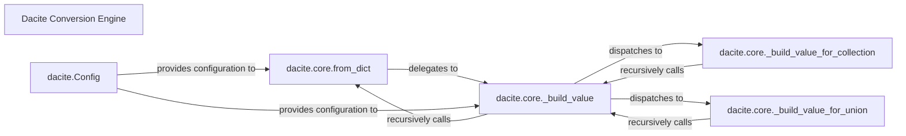

## Details

The Dacite Conversion Engine subsystem, primarily embodied by the `dacite.core` module, provides a robust mechanism for converting dictionaries into Python dataclasses. At its core, the `dacite.core.from_dict` function serves as the public entry point, orchestrating the entire conversion process. This function delegates to `dacite.core._build_value`, a central recursive component responsible for intelligently constructing values for various target types, including primitives, collections, and unions. Specialized functions like `dacite.core._build_value_for_collection` and `dacite.core._build_value_for_union` handle type-specific conversions, while the `dacite.Config` object allows users to customize conversion behavior through type hooks and strictness rules, ensuring flexible and accurate data mapping.

### Dacite Conversion Engine [[Expand]](./Dacite_Conversion_Engine.md)
The overarching conceptual component representing the entire data conversion process within the `dacite` library. It serves as the primary interface for users to convert dictionaries into dataclasses, embodying the library's core utility. Its functionality is primarily orchestrated by `dacite.core.from_dict`.

**Related Classes/Methods**:

- <a href="https://github.com/konradhalas/dacite/blob/master/dacite/core.py#L40-L92" target="_blank" rel="noopener noreferrer">`dacite.core.from_dict`:40-92</a>

### dacite.core.from_dict
The public API entry point and primary orchestrator for the conversion process. It initializes the conversion, handles initial validation, and manages the recursive calls necessary for nested dataclass structures.

**Related Classes/Methods**:

- <a href="https://github.com/konradhalas/dacite/blob/master/dacite/core.py#L40-L92" target="_blank" rel="noopener noreferrer">`dacite.core.from_dict`:40-92</a>

### dacite.core._build_value
The core recursive value builder and central dispatcher. This component is responsible for determining the appropriate strategy for constructing a value for a given target type, handling primitives, collections, unions, and nested dataclasses.

**Related Classes/Methods**:

- <a href="https://github.com/konradhalas/dacite/blob/master/dacite/core.py#L95-L115" target="_blank" rel="noopener noreferrer">`dacite.core._build_value`:95-115</a>

### dacite.core._build_value_for_collection
Specializes in converting dictionary data into Python collection types (e.g., `list`, `set`, `tuple`). It iterates through the elements of the input collection and applies the appropriate conversion strategy to each.

**Related Classes/Methods**:

- <a href="https://github.com/konradhalas/dacite/blob/master/dacite/core.py#L146-L163" target="_blank" rel="noopener noreferrer">`dacite.core._build_value_for_collection`:146-163</a>

### dacite.core._build_value_for_union
Manages the conversion process when the target type is a `Union`. It attempts to convert the input data to one of the types specified in the union, following a defined resolution order to find a compatible type.

**Related Classes/Methods**:

- <a href="https://github.com/konradhalas/dacite/blob/master/dacite/core.py#L118-L143" target="_blank" rel="noopener noreferrer">`dacite.core._build_value_for_union`:118-143</a>

### dacite.Config
A configuration object that allows users to customize the conversion behavior. This includes defining type hooks, strictness rules, and other conversion parameters, influencing how `from_dict` and `_build_value` operate.

**Related Classes/Methods**:

- <a href="https://github.com/konradhalas/dacite/blob/master/dacite/core.py" target="_blank" rel="noopener noreferrer">`dacite.Config`</a>

### [FAQ](https://github.com/CodeBoarding/GeneratedOnBoardings/tree/main?tab=readme-ov-file#faq)