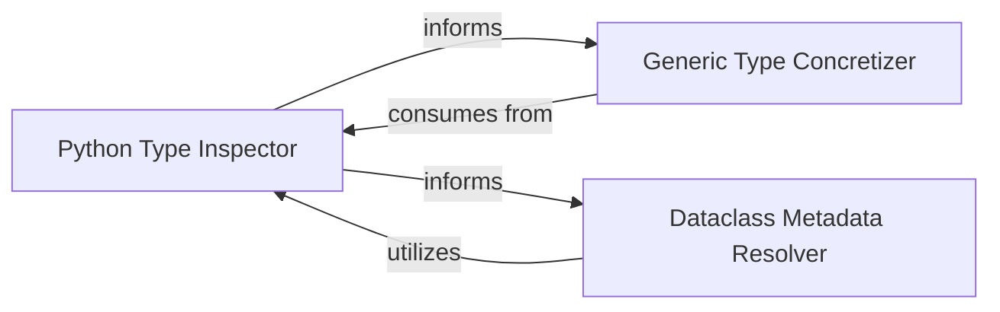

## Details

The `dacite` library's core functionality revolves around robust type introspection and data mapping, particularly for dataclasses. This subsystem is designed to accurately interpret and resolve Python type hints, including complex generics and optional types, to facilitate the population of dataclass instances from various data sources. The `Python Type Inspector` forms the foundational layer, providing granular insights into type structures. Building upon this, the `Generic Type Concretizer` dynamically resolves generic types, ensuring that parameterized types are correctly instantiated. Finally, the `Dataclass Metadata Resolver` leverages these type insights to extract crucial metadata and default values from dataclass definitions, enabling seamless data conversion and validation.

### Python Type Inspector
This component serves as the foundational layer for understanding Python's type system. It provides a comprehensive set of utilities to inspect, analyze, and dissect various Python type hints, including determining if a type is optional, a union, a generic collection, a new type, or an InitVar. It extracts constituent parts of complex types, forming the basis for deeper type resolution.

**Related Classes/Methods**:

- <a href="https://github.com/konradhalas/dacite/blob/master/dacite/types.py" target="_blank" rel="noopener noreferrer">`dacite.types`</a>

### Generic Type Concretizer
This component specializes in managing the complex process of resolving and concretizing generic type hints. It handles type parameterization, inheritance, and derives concrete types from generic definitions, ensuring that generic types are correctly interpreted and resolved for data mapping purposes.

**Related Classes/Methods**:

- <a href="https://github.com/konradhalas/dacite/blob/master/dacite/generics.py" target="_blank" rel="noopener noreferrer">`dacite.generics`</a>

### Dataclass Metadata Resolver
This component is solely responsible for extracting metadata specific to Python dataclasses. Its primary function is to retrieve default values for fields and handle related introspection capabilities provided by Python's dataclasses module. It acts as an adapter to the dataclasses module's introspection capabilities.

**Related Classes/Methods**:

- <a href="https://github.com/konradhalas/dacite/blob/master/dacite/dataclasses.py" target="_blank" rel="noopener noreferrer">`dacite.dataclasses`</a>

### [FAQ](https://github.com/CodeBoarding/GeneratedOnBoardings/tree/main?tab=readme-ov-file#faq)