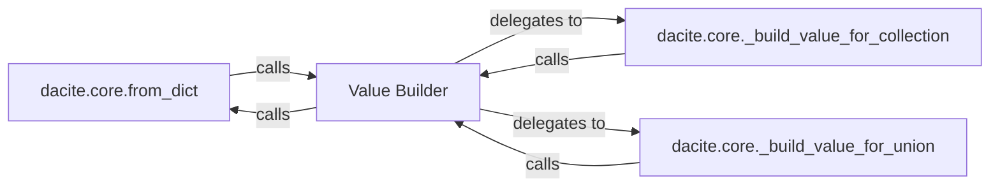

## Details

The core subsystem of `dacite` is the **Data Conversion Engine**. This subsystem is responsible for the entire process of transforming raw dictionary data into strongly-typed Python dataclass objects. It acts as the primary interface for users to convert data, handling type resolution, value construction, and recursive processing of nested structures.

### dacite.core.from_dict
This is the primary entry point for the `dacite` library's conversion process. It orchestrates the overall conversion from a dictionary to a dataclass instance. It initiates the value building process for each field of the target dataclass, leveraging the `Value Builder` for individual field construction. This component embodies the "Core Conversion Engine" pattern.

**Related Classes/Methods**:

- <a href="https://github.com/konradhalas/dacite/blob/master/dacite/core.py#L40-L92" target="_blank" rel="noopener noreferrer">`dacite.core.from_dict`:40-92</a>

### Value Builder [[Expand]](./Value_Builder.md)
This component serves as the central recursive value constructor within the `dacite` library. It is responsible for taking raw input data and a target type, then building the appropriate Python value. It directly handles basic scalar types and non-dataclass objects. For complex types like collections (lists, tuples, sets) and unions, it delegates to specialized builder components. Crucially, it can recursively invoke the `from_dict` function to handle nested dataclass conversions, ensuring the entire data structure is correctly mapped. This aligns with the "Core Conversion Engine" and "Type Resolvers/Handlers" patterns, acting as the orchestrator for individual field conversions.

**Related Classes/Methods**:

- <a href="https://github.com/konradhalas/dacite/blob/master/dacite/core.py#L95-L115" target="_blank" rel="noopener noreferrer">`dacite.core._build_value`:95-115</a>

### dacite.core._build_value_for_collection
This specialized component is responsible for constructing values for collection types (e.g., `list`, `tuple`, `set`). It iterates through the elements of the input collection and recursively calls the `Value Builder` for each element to ensure proper type conversion within the collection. This component aligns with the "Type Resolvers/Handlers" pattern.

**Related Classes/Methods**:

- <a href="https://github.com/konradhalas/dacite/blob/master/dacite/core.py#L146-L163" target="_blank" rel="noopener noreferrer">`dacite.core._build_value_for_collection`:146-163</a>

### dacite.core._build_value_for_union
This specialized component handles the construction of values for `Union` types. It attempts to build the value according to each type specified in the union, applying a specific resolution strategy (e.g., trying types in order until one succeeds). It delegates the actual value construction for each potential type to the `Value Builder`. This component aligns with the "Type Resolvers/Handlers" pattern.

**Related Classes/Methods**:

- <a href="https://github.com/konradhalas/dacite/blob/master/dacite/core.py#L118-L143" target="_blank" rel="noopener noreferrer">`dacite.core._build_value_for_union`:118-143</a>

### [FAQ](https://github.com/CodeBoarding/GeneratedOnBoardings/tree/main?tab=readme-ov-file#faq)