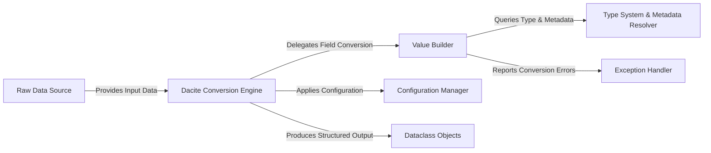

## Details

The `dacite` library facilitates the conversion of raw dictionary data into structured Python dataclass objects. At its core, the `Dacite Conversion Engine` (`dacite.core.from_dict`) orchestrates this process, consuming the `Raw Data Source` (input dictionaries) and producing `Dataclass Objects`. This engine relies heavily on the `Value Builder` (`dacite.core._build_value`) for recursively constructing individual field values, which in turn queries the `Type System & Metadata Resolver` (`dacite.types`, `dacite.generics`, `dacite.dataclasses`) to understand type hints and retrieve field metadata. The entire conversion is guided by the `Configuration Manager` (`dacite.config.Config`), allowing for customizable behavior. Any issues encountered during conversion are managed by the `Exception Handler` (`dacite.exceptions`), ensuring clear error reporting. This modular design ensures a robust and extensible data conversion pipeline.

### Raw Data Source
Represents the external input data, typically a Python dictionary, that serves as the source for the conversion process, consumed by the `Dacite Conversion Engine`.

**Related Classes/Methods**:

- <a href="https://github.com/konradhalas/dacite/blob/master/dacite/core.py#L40-L92" target="_blank" rel="noopener noreferrer">`dacite.core.from_dict`:40-92</a>

### Dacite Conversion Engine [[Expand]](./Dacite_Conversion_Engine.md)
The central orchestrator of the `dacite` library. It initiates and manages the overall conversion of raw data into dataclass instances, acting as the primary user interface.

**Related Classes/Methods**:

- <a href="https://github.com/konradhalas/dacite/blob/master/dacite/core.py#L40-L92" target="_blank" rel="noopener noreferrer">`dacite.core.from_dict`:40-92</a>

### Value Builder [[Expand]](./Value_Builder.md)
A core internal component responsible for recursively constructing individual values for dataclass fields. It handles basic types, nested structures, and delegates complex type handling.

**Related Classes/Methods**:

- <a href="https://github.com/konradhalas/dacite/blob/master/dacite/core.py#L95-L115" target="_blank" rel="noopener noreferrer">`dacite.core._build_value`:95-115</a>

### Type System & Metadata Resolver [[Expand]](./Type_System_Metadata_Resolver.md)
Provides comprehensive utilities to inspect, analyze, and resolve Python type hints (including generics, optionals, and unions) and retrieve dataclass field metadata.

**Related Classes/Methods**:

- <a href="https://github.com/konradhalas/dacite/blob/master/dacite/types.py" target="_blank" rel="noopener noreferrer">`dacite.types`</a>
- <a href="https://github.com/konradhalas/dacite/blob/master/dacite/generics.py" target="_blank" rel="noopener noreferrer">`dacite.generics`</a>
- <a href="https://github.com/konradhalas/dacite/blob/master/dacite/dataclasses.py" target="_blank" rel="noopener noreferrer">`dacite.dataclasses`</a>

### Configuration Manager
Encapsulates user-defined settings and rules that influence the conversion behavior, such as strictness, custom type hooks, and key conversion strategies.

**Related Classes/Methods**:

- <a href="https://github.com/konradhalas/dacite/blob/master/dacite/config.py#L14-L26" target="_blank" rel="noopener noreferrer">`dacite.config.Config`:14-26</a>

### Exception Handler
Defines and manages specific exceptions that can occur during the data conversion process, providing clear and informative error messages.

**Related Classes/Methods**:

- <a href="https://github.com/konradhalas/dacite/blob/master/dacite/exceptions.py" target="_blank" rel="noopener noreferrer">`dacite.exceptions`</a>

### Dataclass Objects
The strongly-typed Python objects (dataclass instances) that are the structured output of the conversion process, generated by the `Dacite Conversion Engine`. The `dacite` library interacts with these objects using utilities from its `dataclasses` module.

**Related Classes/Methods**:

- <a href="https://github.com/konradhalas/dacite/blob/master/dacite/dataclasses.py" target="_blank" rel="noopener noreferrer">`dacite.dataclasses`</a>

### [FAQ](https://github.com/CodeBoarding/GeneratedOnBoardings/tree/main?tab=readme-ov-file#faq)