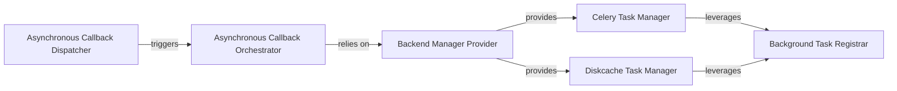

## Details

The `Asynchronous Task Queue (Backend - Optional/Enterprise)` subsystem in Dash provides a mechanism to offload long-running or resource-intensive callback tasks to a separate background process, enhancing application responsiveness and scalability, particularly in enterprise deployments.

### Asynchronous Callback Orchestrator
This is the central component responsible for defining, setting up, monitoring, and updating the status of background callbacks. It exposes the `background_callback` decorator as the primary API for users to mark functions for asynchronous execution. It manages the overall lifecycle of a background task, from initial submission to result retrieval and progress updates.

**Related Classes/Methods**:

- <a href="https://github.com/plotly/dash/blob/dev/dash/_callback.py" target="_blank" rel="noopener noreferrer">`dash._callback.background_callback`</a>
- <a href="https://github.com/plotly/dash/blob/dev/dash/_callback.py#L371-L417" target="_blank" rel="noopener noreferrer">`dash._callback._setup_background_callback`:371-417</a>
- <a href="https://github.com/plotly/dash/blob/dev/dash/_callback.py#L433-L448" target="_blank" rel="noopener noreferrer">`dash._callback._update_background_callback`:433-448</a>

### Backend Manager Provider
Acts as an abstraction layer to dynamically retrieve the appropriate background task manager instance (e.g., Celery or Diskcache) based on the application's configuration. This component decouples the core callback orchestration logic from the specific backend implementation, allowing for flexible backend switching without altering the orchestrator.

**Related Classes/Methods**:

- <a href="https://github.com/plotly/dash/blob/dev/dash/_callback.py#L344-L368" target="_blank" rel="noopener noreferrer">`dash._callback._get_callback_manager`:344-368</a>

### Celery Task Manager
Implements the concrete backend logic for managing asynchronous tasks using the Celery distributed task queue. It handles the submission of tasks to Celery workers, monitors their execution status, retrieves results upon completion, and manages task termination and cleanup within a distributed environment.

**Related Classes/Methods**:

- <a href="https://github.com/plotly/dash/blob/dev/dash/background_callback/managers/celery_manager.py" target="_blank" rel="noopener noreferrer">`dash.background_callback.managers.celery_manager`</a>

### Diskcache Task Manager
Implements the concrete backend logic for managing asynchronous tasks using Diskcache. This manager provides similar functionalities to the Celery manager but is typically used for simpler, local background processing and for storing task state and results on disk, suitable for single-node deployments or development.

**Related Classes/Methods**:

- <a href="https://github.com/plotly/dash/blob/dev/dash/background_callback/managers/diskcache_manager.py" target="_blank" rel="noopener noreferrer">`dash.background_callback.managers.diskcache_manager`</a>

### Background Task Registrar
Provides a common registration point for background job functions. It is utilized by both the Celery and Diskcache managers to prepare user-defined callback functions for execution by their respective backends, ensuring they are properly callable and their results can be managed within the asynchronous context.

**Related Classes/Methods**:

- <a href="https://github.com/plotly/dash/blob/dev/dash/background_callback/managers/__init__.py" target="_blank" rel="noopener noreferrer">`dash.background_callback.managers.register`</a>

### Asynchronous Callback Dispatcher
This is the high-level entry point within the main `dash.Dash` application that initiates the processing of asynchronous callbacks. It acts as the bridge between the core Dash application's request handling and the background callback subsystem, triggering the execution of background tasks when a relevant event occurs.

**Related Classes/Methods**:

- <a href="https://github.com/plotly/dash/blob/dev/dash/dash.py#L1467-L1484" target="_blank" rel="noopener noreferrer">`dash.dash.async_dispatch`:1467-1484</a>

### [FAQ](https://github.com/CodeBoarding/GeneratedOnBoardings/tree/main?tab=readme-ov-file#faq)