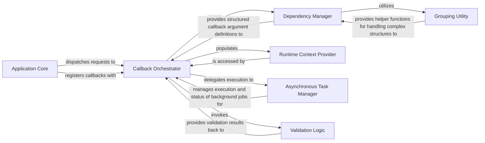

## Details

The `Callback Execution Engine (Backend)` subsystem is the internal Dash system responsible for managing, validating, and executing Python callback functions. It handles the mapping of frontend events to specific backend functions and orchestrates the data flow for updates.

### Application Core
Serves as the primary entry point for the Dash application. It registers user-defined callbacks, sets up the necessary HTTP routes to receive callback requests from the frontend, and dispatches these requests to the Callback Orchestrator. It also handles sending updated component properties back to the frontend after callback execution. As a Web Framework component, it acts as the main "Controller" or "Dispatcher," handling incoming requests and orchestrating the flow to the appropriate backend logic.

**Related Classes/Methods**:

- <a href="https://github.com/plotly/dash/blob/dev/dash/dash.py#L230-L2543" target="_blank" rel="noopener noreferrer">`dash.dash`:230-2543</a>

### Callback Orchestrator
The core component of the engine. It manages the lifecycle of backend callback execution. It receives callback triggers, interprets their dependencies, prepares the execution environment, invokes the user-defined Python function, and handles the results. It also integrates with other components for validation and asynchronous processing. As a Web Framework component, it is the central "Event Processor" or "Business Logic Coordinator" for reactive updates, embodying the core of the event-driven architecture.

**Related Classes/Methods**:

- <a href="https://github.com/plotly/dash/blob/dev/dash/_callback.py" target="_blank" rel="noopener noreferrer">`dash._callback`</a>

### Dependency Manager
Defines and parses the structure of callback inputs, outputs, and states. It provides a structured representation of these dependencies, which is crucial for the Callback Orchestrator to correctly map frontend events to backend function arguments and manage data flow. As a Web Framework component, it manages the "Data Binding" or "Input/Output Mapping" for the reactive system, ensuring correct data flow between UI components and backend logic.

**Related Classes/Methods**:

- <a href="https://github.com/plotly/dash/blob/dev/dash/dash.py#L1259-L1263" target="_blank" rel="noopener noreferrer">`dash.dependencies`:1259-1263</a>

### Runtime Context Provider
Provides a dynamic context during callback execution, allowing the user-defined Python callback function to access information about the event that triggered it (e.g., `dash.callback_context.triggered`) and the current state of inputs. As a Web Framework component, it offers "Execution Context" or "Request Scope" information, vital for callbacks to perform context-aware operations.

**Related Classes/Methods**:

- <a href="https://github.com/plotly/dash/blob/dev/dash/_callback_context.py" target="_blank" rel="noopener noreferrer">`dash._callback_context`</a>

### Asynchronous Task Manager
Handles the execution of long-running or asynchronous callbacks, offloading them from the main application thread. This improves application responsiveness and scalability, especially for data-intensive operations. As a Web Framework component, it implements "Asynchronous Processing" or "Job Queue Management," crucial for enterprise-grade scalability and user experience.

**Related Classes/Methods**:

- <a href="https://github.com/plotly/dash/blob/dev/dash/background_callback/managers" target="_blank" rel="noopener noreferrer">`dash.background_callback.managers`</a>

### Validation Logic
Ensures the correctness and integrity of callback definitions, including the proper structure of inputs, outputs, and states. It prevents common errors and maintains the robustness of the callback system. As a Web Framework component, it provides "Input Validation" and "Configuration Validation," ensuring the reliability and stability of the application.

**Related Classes/Methods**:

- <a href="https://github.com/plotly/dash/blob/dev/dash/_validate.py" target="_blank" rel="noopener noreferrer">`dash._validate`</a>

### Grouping Utility
Supports the handling and validation of complex, grouped callback inputs and outputs, providing helper functions to simplify the management of such structures. As a Web Framework component, it offers "Utility Functions" for complex data structures, enhancing the flexibility and expressiveness of callback definitions.

**Related Classes/Methods**:

- <a href="https://github.com/plotly/dash/blob/dev/dash/_grouping.py" target="_blank" rel="noopener noreferrer">`dash._grouping`</a>

### [FAQ](https://github.com/CodeBoarding/GeneratedOnBoardings/tree/main?tab=readme-ov-file#faq)