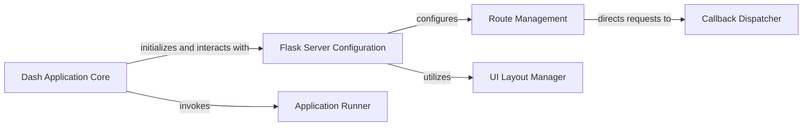

## Details

The Dash Application Server (Backend) subsystem is primarily encapsulated within the dash.dash module, specifically centered around the dash.dash.Dash class and its associated methods. This subsystem is responsible for initializing the Flask web server, defining application routes, managing the UI layout's backend representation, and processing frontend-triggered callbacks. It operates as a cohesive unit, with dash.dash.Dash acting as the central orchestrator.

### Dash Application Core
The central orchestrator of the Dash application, responsible for its overall lifecycle, initialization, and coordination of backend functionalities. It acts as the primary entry point for creating and configuring a Dash app.

**Related Classes/Methods**:

- <a href="https://github.com/plotly/dash/blob/dev/dash/dash.py#L230-L2543" target="_blank" rel="noopener noreferrer">`dash.dash.Dash`:230-2543</a>

### Flask Server Configuration
Configures the underlying Flask application instance, including registering routes, setting up static file serving, and enabling multi-page functionality. It prepares the Flask environment for the Dash application.

**Related Classes/Methods**:

- <a href="https://github.com/plotly/dash/blob/dev/dash/dash.py#L672-L742" target="_blank" rel="noopener noreferrer">`dash.dash.init_app`:672-742</a>

### Route Management
Establishes and manages the various HTTP endpoints (routes) that the Dash application responds to. This includes routes for serving the main HTML page, component assets, and handling callback requests from the frontend.

**Related Classes/Methods**:

- <a href="https://github.com/plotly/dash/blob/dev/dash/dash.py#L755-L779" target="_blank" rel="noopener noreferrer">`dash.dash._setup_routes`:755-779</a>

### Callback Dispatcher
The core component responsible for processing and executing Python callbacks triggered by frontend interactions. It handles both synchronous and asynchronous callback execution, forming the reactive backbone of the Dash application.

**Related Classes/Methods**:

- <a href="https://github.com/plotly/dash/blob/dev/dash/dash.py#L1486-L1504" target="_blank" rel="noopener noreferrer">`dash.dash.dispatch`:1486-1504</a>
- <a href="https://github.com/plotly/dash/blob/dev/dash/dash.py#L1467-L1484" target="_blank" rel="noopener noreferrer">`dash.dash.async_dispatch`:1467-1484</a>

### Application Runner
Responsible for starting the development web server (typically Flask's built-in server), making the Dash application accessible via HTTP. This is the final step to bring the application online.

**Related Classes/Methods**:

- <a href="https://github.com/plotly/dash/blob/dev/dash/dash.py#L2158-L2373" target="_blank" rel="noopener noreferrer">`dash.dash.run`:2158-2373</a>

### UI Layout Manager
Manages and provides access to the application's component tree, which declaratively defines the user interface structure in Python. While the rendering happens on the frontend, this component maintains the backend representation of the UI.

**Related Classes/Methods**:

- <a href="https://github.com/plotly/dash/blob/dev/dash/dash.py" target="_blank" rel="noopener noreferrer">`dash.dash.layout`</a>

### [FAQ](https://github.com/CodeBoarding/GeneratedOnBoardings/tree/main?tab=readme-ov-file#faq)