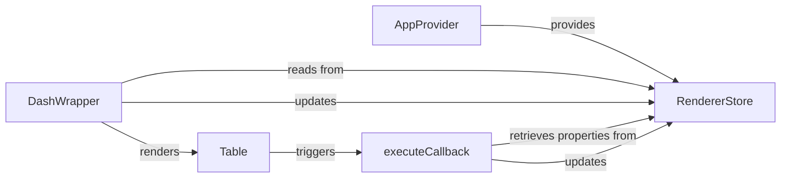

## Details

The Dash client-side architecture is centered around a reactive Redux pattern, with AppProvider initializing the global RendererStore to manage the application's state. DashWrapper dynamically renders and updates UI components based on this state, ensuring efficient re-renders. The executeCallback component is crucial for handling both client-side and server-side interactions, processing inputs, triggering callback logic, and updating the RendererStore with results. Complex UI elements like Table integrate within this framework, demonstrating how Dash's component-based approach supports rich, interactive user interfaces.

### AppProvider
The root React component that initializes and provides the central Redux store (RendererStore) to the entire client-side application. It acts as the foundational context provider, ensuring global state availability.

**Related Classes/Methods**:

- <a href="https://github.com/plotly/dash/blob/dev/dash/dash-renderer/src/AppProvider.react.tsx#L8-L22" target="_blank" rel="noopener noreferrer">`AppProvider`:8-22</a>

### RendererStore
The central Redux store that maintains the client-side state of the Dash application. This includes the application layout, component properties, callback dependencies, and the status of ongoing callback jobs. It serves as the single source of truth for the frontend state, enabling reactive updates.

**Related Classes/Methods**:

- <a href="https://github.com/plotly/dash/blob/dev/dash/dash-renderer/src/store.ts#L30-L117" target="_blank" rel="noopener noreferrer">`RendererStore`:30-117</a>

### DashWrapper
A core rendering component responsible for dynamically rendering and managing the lifecycle of individual Dash UI components. It handles property updates (setProps) received from the backend or internal state changes, ensuring efficient re-renders by comparing component properties.

**Related Classes/Methods**:

- <a href="https://github.com/plotly/dash/blob/dev/dash/dash-renderer/src/wrapper/DashWrapper.tsx#L58-L167" target="_blank" rel="noopener noreferrer">`DashWrapper`:58-167</a>

### executeCallback
Manages the execution flow of both client-side and server-side callbacks. It processes input properties, determines the callback type, triggers the appropriate execution logic (either locally or via a backend request), and updates the RendererStore with the results.

**Related Classes/Methods**:

- <a href="https://github.com/plotly/dash/blob/dev/dash/dash-renderer/src/actions/callbacks.ts#L717-L960" target="_blank" rel="noopener noreferrer">`executeCallback`:717-960</a>

### Table
Represents a complex, interactive UI component (the Dash DataTable) within the frontend. Table is the top-level container, demonstrating how Dash's component-based architecture allows for rich, interactive UI elements.

**Related Classes/Methods**:

- <a href="https://github.com/plotly/dash/blob/dev/components/dash-table/src/dash-table/components/FilterFactory.tsx" target="_blank" rel="noopener noreferrer">`Table`</a>

### [FAQ](https://github.com/CodeBoarding/GeneratedOnBoardings/tree/main?tab=readme-ov-file#faq)