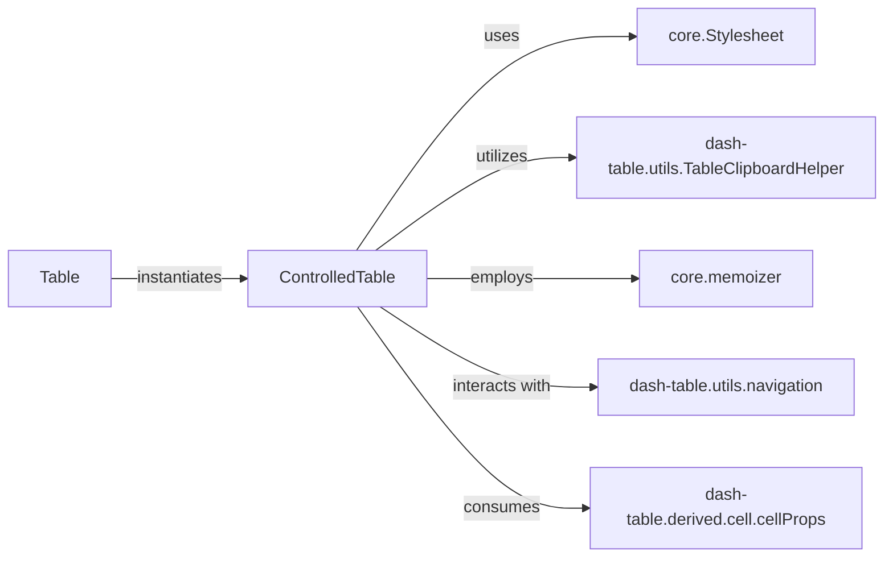

## Details

The `dash-table` subsystem is centered around the `ControlledTable` component, which serves as the primary interactive UI for rendering and managing the table's state and user interactions. The `Table` component acts as a high-level entry point, instantiating and configuring `ControlledTable`. `ControlledTable` relies on several utility and derived components to manage its complex functionality. `core.Stylesheet` dynamically applies and updates CSS, ensuring proper visual presentation. `dash-table.utils.TableClipboardHelper` facilitates clipboard operations, while `core.memoizer` optimizes performance through caching. `dash-table.utils.navigation` assists with cell navigation and selection, and `dash-table.derived.cell.cellProps` provides processed cell data for rendering and interaction. This architecture promotes a clear separation of concerns, with `ControlledTable` orchestrating various specialized components to deliver a rich and performant table experience.

### ControlledTable
The core interactive UI component responsible for rendering the table, managing user interactions (keyboard, mouse, clipboard), handling component lifecycle, state updates, UI viewport management, and dynamic styling application. It acts as the primary "View" in an MVVM-like pattern for the table.

**Related Classes/Methods**:

- <a href="https://github.com/plotly/dash/blob/dev/components/dash-table/src/dash-table/components/ControlledTable/index.tsx" target="_blank" rel="noopener noreferrer">`dash/components/dash-table/src/dash-table/components/ControlledTable/index.tsx:ControlledTable`</a>

### Table
A higher-level container or wrapper for `ControlledTable`, primarily responsible for its instantiation and initial property passing. It acts as the entry point for defining a Dash table in the application layout.

**Related Classes/Methods**:

### core.Stylesheet
Manages the dynamic application and updating of CSS rules for the table's visual presentation, ensuring styles are correctly applied and updated based on component state.

**Related Classes/Methods**:

### dash-table.utils.TableClipboardHelper
Provides utility functions to facilitate data transfer to and from the clipboard, supporting copy and paste operations within the table.

**Related Classes/Methods**:

### core.memoizer
Offers memoization utilities (`memoizeOne`, `memoizeOneFactory`) to optimize rendering performance by caching computed values, reducing redundant calculations.

**Related Classes/Methods**:

### dash-table.utils.navigation
Assists `ControlledTable` in managing cell navigation and selection logic, handling keyboard events and focus management within the table grid.

**Related Classes/Methods**:

### dash-table.derived.cell.cellProps
Responsible for creating and managing cell properties and selections, providing derived data necessary for `ControlledTable`'s rendering and interaction logic. This component likely processes raw data into a format suitable for the UI.

**Related Classes/Methods**:

### [FAQ](https://github.com/CodeBoarding/GeneratedOnBoardings/tree/main?tab=readme-ov-file#faq)