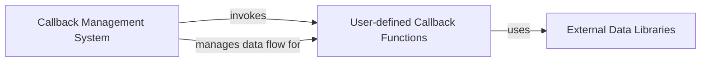

## Details

The Dash application's interactivity is driven by the Callback Management System, which serves as the central orchestrator. It receives triggers from the frontend and, based on registered callbacks, invokes the appropriate User-defined Callback Functions. These user-defined functions encapsulate the application's specific business logic, often interacting with External Data Libraries to fetch, process, and transform data. The Callback Management System then manages the flow of this processed data back to the frontend, enabling dynamic updates to the user interface. This architecture clearly separates the core callback handling logic from the application-specific data processing, allowing for flexible and scalable Dash applications.

### Callback Management System
This is a core internal Dash component that acts as the crucial bridge between frontend interactions and backend data processing. It receives callback triggers from the frontend, identifies and executes the corresponding user-defined Python functions, and manages the flow of data required for UI updates. It orchestrates the invocation of data-related logic.

**Related Classes/Methods**:

- <a href="https://github.com/plotly/dash/blob/dev/dash/_callback.py#L1-L300" target="_blank" rel="noopener noreferrer">`dash._callback`:1-300</a>

### User-defined Callback Functions
These are the custom Python functions written by the Dash application developer. They encapsulate the specific business logic for connecting to, querying, transforming, and processing data from various external sources (databases, APIs, data lakes, etc.). These functions leverage external data libraries to perform their tasks. While not directly part of the Dash framework's source code, their integration and execution are managed by the Callback Management System through mechanisms defined in dash._callback.

**Related Classes/Methods**:

- <a href="https://github.com/plotly/dash/blob/dev/dash/_callback.py#L68-L220" target="_blank" rel="noopener noreferrer">`dash._callback.callback`:68-220</a>
- <a href="https://github.com/plotly/dash/blob/dev/dash/_callback.py" target="_blank" rel="noopener noreferrer">`dash._callback.no_update`</a>

### External Data Libraries
These are third-party Python libraries and drivers (e.g., Pandas, Dask, SQLAlchemy, Psycopg2, Snowflake Connector, Vaex) that provide the low-level functionality for establishing connections, executing queries, and performing initial data manipulation with external data sources. They are fundamental tools used by the user-defined logic. Dash itself does not contain these libraries, but provides the framework for user-defined functions to utilize them.

**Related Classes/Methods**:

- <a href="https://github.com/plotly/dash/blob/dev/dash/_callback.py" target="_blank" rel="noopener noreferrer">`dash._callback.Output`</a>
- <a href="https://github.com/plotly/dash/blob/dev/dash/_callback.py" target="_blank" rel="noopener noreferrer">`dash._callback.Input`</a>
- <a href="https://github.com/plotly/dash/blob/dev/dash/_callback.py" target="_blank" rel="noopener noreferrer">`dash._callback.State`</a>

### [FAQ](https://github.com/CodeBoarding/GeneratedOnBoardings/tree/main?tab=readme-ov-file#faq)