```mermaid
graph LR
    User["User"]
    Dash_Frontend_Client_side_["Dash Frontend (Client-side)"]
    Dash_UI_Components["Dash UI Components"]
    Dash_Application_Server_Backend_["Dash Application Server (Backend)"]
    Callback_Execution_Engine_Backend_["Callback Execution Engine (Backend)"]
    Application_Logic_Data_Processing_Backend_User_Defined_["Application Logic & Data Processing (Backend - User Defined)"]
    Data_Connectors_Backend_["Data Connectors (Backend)"]
    Asynchronous_Task_Queue_Backend_Optional_Enterprise_["Asynchronous Task Queue (Backend - Optional/Enterprise)"]
    User -- "interacts with" --> Dash_Frontend_Client_side_
    Dash_Frontend_Client_side_ -- "renders" --> Dash_UI_Components
    Dash_Frontend_Client_side_ -- "dispatches requests to" --> Dash_Application_Server_Backend_
    Dash_Application_Server_Backend_ -- "forwards requests to" --> Callback_Execution_Engine_Backend_
    Callback_Execution_Engine_Backend_ -- "invokes functions in" --> Application_Logic_Data_Processing_Backend_User_Defined_
    Application_Logic_Data_Processing_Backend_User_Defined_ -- "interacts with" --> Data_Connectors_Backend_
    Application_Logic_Data_Processing_Backend_User_Defined_ -- "offloads tasks to" --> Asynchronous_Task_Queue_Backend_Optional_Enterprise_
    Application_Logic_Data_Processing_Backend_User_Defined_ -- "sends results to" --> Callback_Execution_Engine_Backend_
    Asynchronous_Task_Queue_Backend_Optional_Enterprise_ -- "sends results to" --> Callback_Execution_Engine_Backend_
    Callback_Execution_Engine_Backend_ -- "returns response to" --> Dash_Application_Server_Backend_
    Dash_Application_Server_Backend_ -- "sends updated properties to" --> Dash_Frontend_Client_side_
    Dash_Frontend_Client_side_ -- "updates" --> Dash_UI_Components
    click Dash_Frontend_Client_side_ href "https://github.com/CodeBoarding/GeneratedOnBoardings/blob/main/dash/Dash_Frontend_Client_side_.md" "Details"
    click Dash_UI_Components href "https://github.com/CodeBoarding/GeneratedOnBoardings/blob/main/dash/Dash_UI_Components.md" "Details"
    click Dash_Application_Server_Backend_ href "https://github.com/CodeBoarding/GeneratedOnBoardings/blob/main/dash/Dash_Application_Server_Backend_.md" "Details"
    click Callback_Execution_Engine_Backend_ href "https://github.com/CodeBoarding/GeneratedOnBoardings/blob/main/dash/Callback_Execution_Engine_Backend_.md" "Details"
    click Data_Connectors_Backend_ href "https://github.com/CodeBoarding/GeneratedOnBoardings/blob/main/dash/Data_Connectors_Backend_.md" "Details"
    click Asynchronous_Task_Queue_Backend_Optional_Enterprise_ href "https://github.com/CodeBoarding/GeneratedOnBoardings/blob/main/dash/Asynchronous_Task_Queue_Backend_Optional_Enterprise_.md" "Details"
```

## Details

The Dash application architecture is structured around a client-server model, facilitating interactive data visualization and web application development. The User interacts with the Dash Frontend (Client-side) through a web browser, which renders Dash UI Components. User interactions trigger events that are dispatched to the Dash Application Server (Backend). This Flask-based server acts as the central hub, forwarding requests to the Callback Execution Engine (Backend). The engine then invokes user-defined Application Logic & Data Processing (Backend - User Defined) within Python callbacks. This logic can interact with Data Connectors (Backend) to access external data sources and optionally offload intensive tasks to an Asynchronous Task Queue (Backend - Optional/Enterprise). Results are returned through the Callback Execution Engine to the Dash Application Server, which updates the Dash Frontend to reflect changes in the Dash UI Components. This flow ensures a dynamic and responsive user experience, with clear separation between frontend rendering, backend application logic, and data management.

### User
The external human actor interacting with the Dash application through a web browser. This component does not have source code within the Dash project as it represents an external entity.

**Related Classes/Methods**: _None_

### Dash Frontend (Client-side) [[Expand]](./Dash_Frontend_Client_side_.md)
The entire client-side application running in the user's web browser, encompassing the Dash Renderer (a React application) and all Dash UI Components. It manages the browser's state and facilitates communication with the backend.

**Related Classes/Methods**:

- <a href="https://github.com/plotly/dash/blob/dev/dash/dash-renderer/src/AppProvider.react.tsx" target="_blank" rel="noopener noreferrer">`/home/ubuntu/CodeBoarding/repo/dash/dash/dash-renderer/src/AppProvider.react.tsx`</a>
- <a href="https://github.com/plotly/dash/blob/dev/dash/dash-renderer/src/wrapper/DashWrapper.tsx#L58-L167" target="_blank" rel="noopener noreferrer">`/home/ubuntu/CodeBoarding/repo/dash/dash/dash-renderer/src/wrapper/DashWrapper.tsx`:58-167</a>

### Dash UI Components [[Expand]](./Dash_UI_Components.md)
Individual interactive elements (e.g., buttons, graphs, tables) provided by Dash or custom components, rendered by the Dash Frontend.

**Related Classes/Methods**:

- <a href="https://github.com/plotly/dash/blob/dev/components/dash-table/src/dash-table/components/ControlledTable/index.tsx#L79-L1069" target="_blank" rel="noopener noreferrer">`ControlledTable`:79-1069</a>

### Dash Application Server (Backend) [[Expand]](./Dash_Application_Server_Backend_.md)
The central Python Flask web server that hosts the Dash application. It initializes the Dash app, defines the application layout, serves static assets, and acts as the primary communication hub between the frontend and the backend callback system.

**Related Classes/Methods**:

- <a href="https://github.com/plotly/dash/blob/dev/dash/__init__.py" target="_blank" rel="noopener noreferrer">`dash`</a>

### Callback Execution Engine (Backend) [[Expand]](./Callback_Execution_Engine_Backend_.md)
The internal Dash system responsible for managing, validating, and executing Python callback functions. It handles the mapping of frontend events to specific backend functions and orchestrates the data flow for updates.

**Related Classes/Methods**:

- <a href="https://github.com/plotly/dash/blob/dev/dash/_callback.py#L48-L55" target="_blank" rel="noopener noreferrer">`_callback`:48-55</a>
- <a href="https://github.com/plotly/dash/blob/dev/dash/_dash_renderer.py" target="_blank" rel="noopener noreferrer">`dependencies`</a>

### Application Logic & Data Processing (Backend - User Defined)
This component represents the user-written Python code within callback functions. It contains the core business logic, data analysis, and transformations specific to the application's domain (e.g., AI/ML models, data manipulation with Pandas/Dask). The source code for this component is defined by the end-user of the Dash framework, not within the Dash project itself.

**Related Classes/Methods**: _None_

### Data Connectors (Backend) [[Expand]](./Data_Connectors_Backend_.md)
Modules or libraries used by the Application Logic & Data Processing component to interact with external data sources such as databases, data lakes, or other APIs. The source code for this component typically resides in external libraries or user-defined modules, not within the Dash project.

**Related Classes/Methods**: _None_

### Asynchronous Task Queue (Backend - Optional/Enterprise) [[Expand]](./Asynchronous_Task_Queue_Backend_Optional_Enterprise_.md)
An optional component for enterprise-grade Dash applications, enabling the offloading of long-running or resource-intensive callback tasks to a separate background process.

**Related Classes/Methods**:

- <a href="https://github.com/plotly/dash/blob/dev/dash/_callback.py#L371-L417" target="_blank" rel="noopener noreferrer">`background_callback`:371-417</a>

### [FAQ](https://github.com/CodeBoarding/GeneratedOnBoardings/tree/main?tab=readme-ov-file#faq)