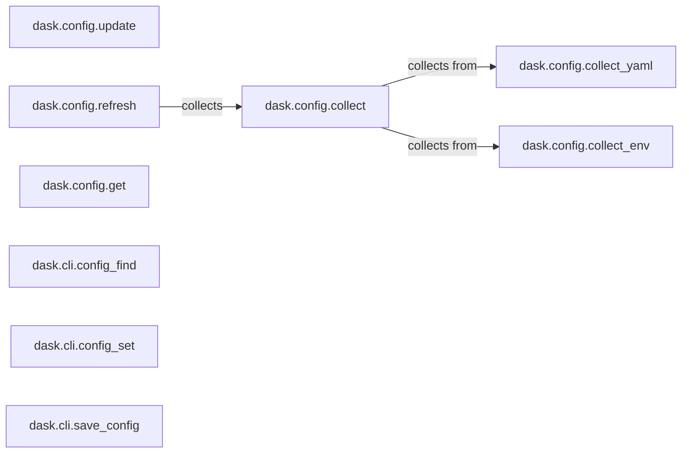

## Component Details

The Dask configuration system provides a centralized way to manage and customize Dask's behavior. It collects settings from various sources like YAML files and environment variables, allowing users to configure aspects such as the default scheduler, number of threads, and other operational parameters. The configuration can be updated, merged, and refreshed, ensuring that Dask operates according to the desired settings. Command-line tools are also available to find, set, and save configuration values.

### dask.config.update
Updates the global configuration settings with new values, modifying the current configuration. This function allows for dynamic modification of Dask's settings during runtime.
- **Related Classes/Methods**: `dask.config`

### dask.config.collect_yaml
Collects configuration settings from YAML files by reading and extracting configuration parameters. This function parses YAML files to load configuration values into Dask.
- **Related Classes/Methods**: `dask.config`

### dask.config.collect_env
Collects configuration settings from environment variables by reading and extracting configuration parameters. This function retrieves configuration values from the system's environment variables.
- **Related Classes/Methods**: `dask.config`

### dask.config.collect
Orchestrates the collection of configuration settings from various sources, including YAML files and environment variables, by calling `collect_yaml` and `collect_env`. This function acts as a central point for gathering configuration from different sources.
- **Related Classes/Methods**: `dask.config`

### dask.config.refresh
Refreshes the configuration by re-collecting settings from all sources, ensuring the configuration is up-to-date. This function reloads the configuration to reflect any changes in the environment or YAML files.
- **Related Classes/Methods**: `dask.config`

### dask.config.get
Retrieves a configuration setting by its key, providing access to the configuration values. This function allows users to access specific configuration values stored within Dask.
- **Related Classes/Methods**: `dask.config`

### dask.cli.config_find
Finds the configuration file using the command line interface. This command-line tool helps users locate the Dask configuration file.
- **Related Classes/Methods**: `dask.cli`

### dask.cli.config_set
Sets a configuration value via the command line interface. This command-line tool allows users to modify Dask's configuration settings.
- **Related Classes/Methods**: `dask.cli`

### dask.cli.save_config
Saves the current configuration to a file using the command line interface. This command-line tool allows users to persist the current Dask configuration to a file.
- **Related Classes/Methods**: `dask.cli`
