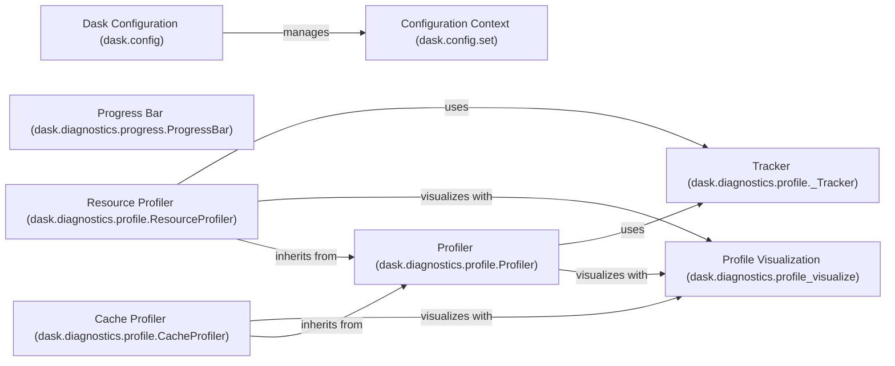

## Component Details

### Dask Configuration (dask.config)
The `dask.config` module provides a way to manage Dask's configuration settings. It allows users to set and retrieve configuration options from various sources, including YAML files, environment variables, and command-line arguments. The configuration system provides a consistent interface for accessing these settings and handles merging configurations from different sources. It is central to customizing Dask's behavior.
- **Related Classes/Methods**: `dask.config`

### Configuration Context (dask.config.set)
The `dask.config.set` function is a context manager that allows users to temporarily set configuration values within a defined scope. This is useful for modifying Dask's configuration for a specific block of code without affecting the global configuration. It ensures that the original settings are restored when the context is exited. It also provides a way to set configuration values globally.
- **Related Classes/Methods**: `dask.config`

### Progress Bar (dask.diagnostics.progress.ProgressBar)
The `ProgressBar` class provides a text-based progress bar for monitoring the execution of Dask computations. It updates the progress bar in the console, showing the completion status and estimated time remaining. This provides visual feedback on the progress of long-running tasks, allowing users to track the progress of their computations.
- **Related Classes/Methods**: `dask.diagnostics.progress.ProgressBar`

### Profiler (dask.diagnostics.profile.Profiler)
The `Profiler` class is a context manager that profiles the execution of Dask code. It records the execution time of tasks and provides methods for visualizing the profile data. This helps users identify performance bottlenecks and understand where their computations are spending the most time. It is a fundamental tool for performance analysis.
- **Related Classes/Methods**: `dask.diagnostics.profile.Profiler`

### Resource Profiler (dask.diagnostics.profile.ResourceProfiler)
The `ResourceProfiler` class extends the `Profiler` to track resource usage (CPU, memory) during Dask computations. It provides insights into resource consumption patterns, helping to optimize resource allocation and identify potential memory leaks. This allows users to understand the resource demands of their computations and optimize them accordingly.
- **Related Classes/Methods**: `dask.diagnostics.profile.ResourceProfiler`

### Cache Profiler (dask.diagnostics.profile.CacheProfiler)
The `CacheProfiler` class profiles the Dask cache, tracking cache hits and misses. It helps identify opportunities to improve cache efficiency and reduce redundant computations. This allows users to optimize their code for better performance by understanding how the cache is being used.
- **Related Classes/Methods**: `dask.diagnostics.profile.CacheProfiler`

### Tracker (dask.diagnostics.profile._Tracker)
The `_Tracker` class is a utility class used by the profilers to track task execution times and resource usage. It provides a mechanism for recording and aggregating profiling data. It serves as a base class for the `Profiler`, `ResourceProfiler`, and `CacheProfiler`.
- **Related Classes/Methods**: `dask.diagnostics.profile._Tracker`

### Profile Visualization (dask.diagnostics.profile_visualize)
The `dask.diagnostics.profile_visualize` module offers functions for visualizing Dask profiles using Bokeh. It generates interactive plots that display task execution times, resource utilization, and cache usage. This aids in performance analysis and optimization by providing a visual representation of the profiling data collected by the profilers.
- **Related Classes/Methods**: `dask.diagnostics.profile_visualize`
