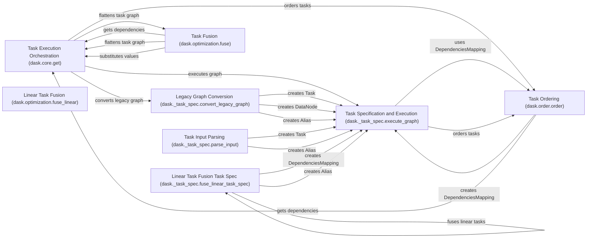

## Component Details

### Task Execution Orchestration (dask.core.get)
This component is the central orchestrator for executing Dask graphs. It receives a task graph and a target key, then drives the computation by fetching dependencies, executing tasks, and managing the overall execution flow. It relies on helper functions like `get_dependencies`, `flatten`, and `subs` to manage task dependencies and data substitution.
- **Related Classes/Methods**: `dask.core.get`, `dask.core.get_dependencies`, `dask.core.flatten`, `dask.core.subs`

### Task Specification and Execution (dask._task_spec.execute_graph)
This component focuses on executing graphs defined using the `_task_spec` module. It handles the actual execution of tasks, traversing the graph in topological order, executing tasks, and storing results in the cache. It uses `DependenciesMapping` to efficiently manage task dependencies and relies on `Task`, `DataNode`, and `Alias` to represent different types of nodes in the graph.
- **Related Classes/Methods**: `dask._task_spec.execute_graph`, `dask._task_spec.DependenciesMapping`, `dask._task_spec.Task`, `dask._task_spec.DataNode`, `dask._task_spec.Alias`

### Legacy Graph Conversion (dask._task_spec.convert_legacy_graph)
This component is responsible for converting legacy task graphs (typically dictionary-based) into the new `_task_spec` representation. This ensures backward compatibility and allows older Dask graphs to be executed using the new task specification. It creates `Task`, `DataNode`, and `Alias` objects to represent the converted graph.
- **Related Classes/Methods**: `dask._task_spec.convert_legacy_graph`

### Task Ordering (dask.order.order)
This component determines the order in which tasks should be executed to satisfy dependencies. It performs topological sorting and other ordering optimizations to improve performance. It creates a `DependenciesMapping` to represent dependencies and uses `get_dependencies` to extract task dependencies.
- **Related Classes/Methods**: `dask.order.order`

### Task Fusion (dask.optimization.fuse)
This component optimizes task graphs by fusing together linear chains of tasks into a single task. This reduces overhead and improves performance. It uses `get_dependencies`, `flatten`, and `subs` to analyze and manipulate the task graph.
- **Related Classes/Methods**: `dask.optimization.fuse`

### Linear Task Fusion (dask.optimization.fuse_linear)
This component optimizes task graphs by fusing together linear chains of tasks into a single task. This reduces overhead and improves performance. It is similar to `dask.optimization.fuse` but specifically targets linear dependencies.
- **Related Classes/Methods**: `dask.optimization.fuse_linear`

### Linear Task Fusion Task Spec (dask._task_spec.fuse_linear_task_spec)
This component optimizes task graphs by fusing together linear chains of tasks into a single task. This reduces overhead and improves performance. It operates on the `_task_spec` representation of the graph. It creates `DependenciesMapping` and `Alias` objects to represent the fused graph.
- **Related Classes/Methods**: `dask._task_spec.fuse_linear_task_spec`

### Task Input Parsing (dask._task_spec.parse_input)
This component parses the input to a task and converts it into a GraphNode representation. It handles different types of input, such as dictionaries, lists, tuples, and TaskRefs, and converts them into corresponding GraphNode objects. It creates `Task` and `Alias` objects to represent the parsed input.
- **Related Classes/Methods**: `dask._task_spec.parse_input`
