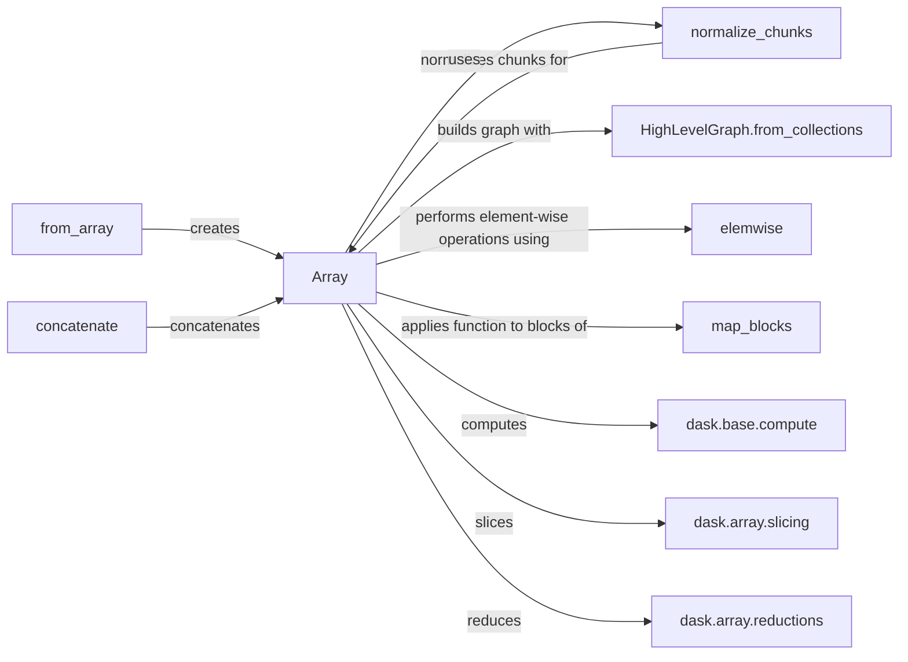

## Component Details

### Array
The Array class is the fundamental building block for dask arrays, mirroring the NumPy ndarray interface but operating on a graph of computations. It represents a potentially large, multi-dimensional array divided into chunks, each of which can be processed independently. The Array class handles various array operations, including slicing, element-wise operations, reductions, and reshaping, by constructing a dask graph that describes these operations.
- **Related Classes/Methods**: `dask.array.core.Array`

### normalize_chunks
The `normalize_chunks` function is responsible for validating and standardizing the chunk sizes specified when creating dask arrays. It ensures that the provided chunks are compatible with the array's shape and can automatically determine appropriate chunk sizes if not explicitly provided. This function plays a crucial role in optimizing the performance of dask array computations by ensuring that the data is divided into manageable chunks.
- **Related Classes/Methods**: `dask.array.core.normalize_chunks`

### from_array
The `from_array` function facilitates the creation of dask arrays from existing array-like objects, such as NumPy arrays or lists. It divides the input array into chunks and constructs a dask graph representing the array's data. This function allows users to seamlessly integrate existing data into the dask ecosystem for distributed computation.
- **Related Classes/Methods**: `dask.array.core.from_array`

### concatenate
The `concatenate` function enables the joining of multiple dask arrays along a specified axis. It creates a new dask array with the combined data and updates the underlying graph to reflect the concatenation operation. This function is essential for building larger arrays from smaller components.
- **Related Classes/Methods**: `dask.array.core.concatenate`

### elemwise
The `elemwise` function performs element-wise operations on dask arrays, supporting a wide range of arithmetic, logical, and comparison operations. It creates a new dask array containing the results of the operation, with each element computed independently. This function is a core component for performing computations on dask arrays in a distributed manner.
- **Related Classes/Methods**: `dask.array.core.elemwise`

### HighLevelGraph.from_collections
The `HighLevelGraph.from_collections` method constructs a HighLevelGraph from collections of dask graphs and dependencies. It's used to build the dask graph representation of array operations. This method is a key part of how dask represents and optimizes computations.
- **Related Classes/Methods**: `dask.highlevelgraph.HighLevelGraph.from_collections`

### map_blocks
The `map_blocks` function applies a given function to each block (chunk) of a dask array. It's a fundamental operation for performing computations on dask arrays in a distributed manner, allowing users to apply custom functions to individual chunks of data.
- **Related Classes/Methods**: `dask.array.core.map_blocks`

### dask.base.compute
The `dask.base.compute` function triggers the execution of a dask graph, computing the results of the operations defined in the graph. It orchestrates the execution of tasks across available resources and returns the computed results. This function is the entry point for initiating dask computations.
- **Related Classes/Methods**: `dask.base.compute`

### dask.array.slicing
The `dask.array.slicing` module provides functions for slicing dask arrays, enabling users to extract portions of the array based on specified indices. It includes logic for normalizing indices and performing the slicing operation efficiently, taking into account the chunk structure of the array.
- **Related Classes/Methods**: `dask.array.slicing`

### dask.array.reductions
The `dask.array.reductions` module contains functions for performing reductions on dask arrays, such as sum, min, and max. These functions compute aggregate statistics over the array's data in a distributed manner, leveraging the chunk structure to parallelize the computation.
- **Related Classes/Methods**: `dask.array.reductions`
