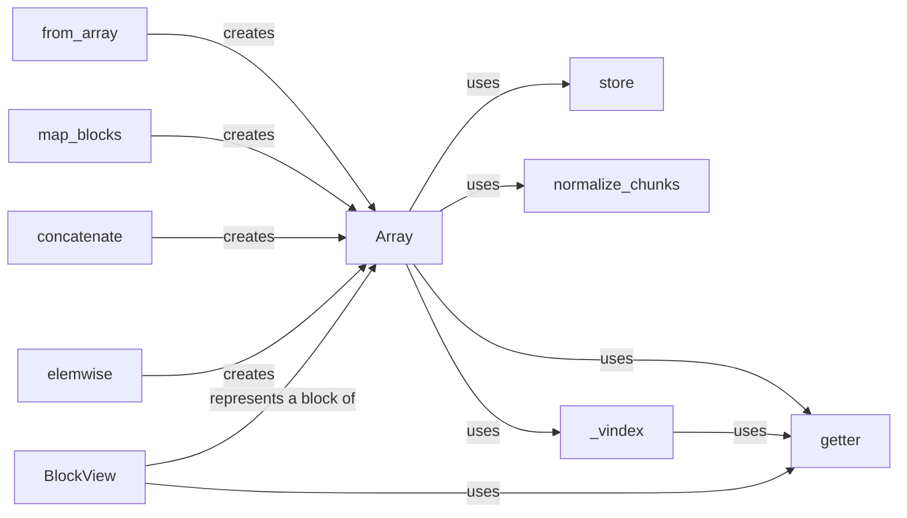

## Component Details

The Dask Array module provides a high-level interface for working with large, chunked arrays that can be computed in parallel. It abstracts away the complexities of data partitioning and task scheduling, allowing users to perform array operations using a familiar NumPy-like API. The core of the module revolves around the `Array` class, which represents a Dask array and holds the task graph, chunk shape, and dtype information. Functions like `from_array`, `map_blocks`, `concatenate`, and `elemwise` are used to create and manipulate Dask arrays, building the task graph that defines the computations to be performed. The `getter` function and `BlockView` class provide mechanisms for accessing individual chunks of the array, while `store` handles writing the array to persistent storage.

### Array
The core class representing a dask array. It holds the task graph, chunk shape, and dtype information. It provides methods for various array operations, including arithmetic, indexing, reshaping, and reductions. It interacts with other functions in the module to build the task graph and execute computations.
- **Related Classes/Methods**: `dask.array.core.Array`

### from_array
A function to create a dask array from an existing NumPy array or array-like object. It handles chunking the input array and creating the corresponding task graph. It interacts with the Array class to create the dask array.
- **Related Classes/Methods**: `dask.array.core.from_array`

### map_blocks
Applies a function to each block (chunk) of the dask array. It's a fundamental operation for performing block-wise computations. It interacts with the Array class to create a new dask array with the transformed blocks.
- **Related Classes/Methods**: `dask.array.core.map_blocks`, `dask.array.core.Array.map_blocks`

### concatenate
A function to concatenate multiple dask arrays along a given axis. It handles adjusting the chunk structure and creating the task graph for the concatenated array. It interacts with the Array class to create the new dask array.
- **Related Classes/Methods**: `dask.array.core.concatenate`

### elemwise
A function to perform element-wise operations on dask arrays. It handles broadcasting, dtype enforcement, and task graph creation for the element-wise operation. It interacts with the Array class to create the resulting dask array.
- **Related Classes/Methods**: `dask.array.core.elemwise`

### getter
A function used to retrieve elements from underlying chunks, handling different indexing scenarios (fancy indexing, inline indexing, etc.). It's a low-level function used within the task graph to access data.
- **Related Classes/Methods**: `dask.array.core.getter`, `dask.array.core.getter_nofancy`, `dask.array.core.getter_inline`

### store
A function to store dask arrays to persistent storage. It handles the creation of tasks to write the array chunks to disk. It interacts with the Array class and storage backends like Zarr and HDF5.
- **Related Classes/Methods**: `dask.array.core.store`, `dask.array.core.Array.store`

### normalize_chunks
A function to normalize the chunks argument, ensuring it's in a consistent format (tuple of tuples). It's used during array creation and rechunking. It interacts with other functions that handle chunking.
- **Related Classes/Methods**: `dask.array.core.normalize_chunks`, `dask.array.core.normalize_chunks_cached`

### _vindex
A function to perform advanced indexing (fancy indexing) on dask arrays. It handles creating the task graph for the indexing operation. It interacts with the Array class and the getter function to access the data.
- **Related Classes/Methods**: `dask.array.core._vindex`, `dask.array.core.Array._vindex`

### BlockView
A class representing a view of a single block within a dask array. It's used for indexing and accessing individual blocks. It interacts with the Array class and the getter function.
- **Related Classes/Methods**: `dask.array.core.BlockView`
