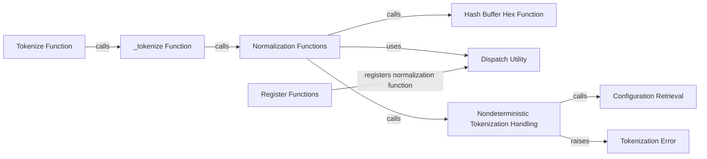

## Component Details

### Tokenize Function
The `tokenize` function is the main entry point for generating a unique hash (token) for a Python object. It normalizes the input and dispatches to type-specific hashing functions. It serves as the user-facing API for the tokenization process.
- **Related Classes/Methods**: `repos.dask.dask.tokenize:tokenize`

### _tokenize Function
The `_tokenize` function performs the core tokenization logic. It normalizes the input and calls the appropriate hashing functions based on the object's type. It's a central part of the tokenization process, handling the dispatch to different normalization methods.
- **Related Classes/Methods**: `repos.dask.dask.tokenize:_tokenize`

### Normalization Functions
Normalization functions such as `_normalize_seq_func`, `normalize_object`, `_normalize_pure_object`, `_normalize_pickle`, and `_normalize_dataclass` are responsible for converting Python objects into a standard form suitable for hashing. They handle different object types, including sequences, dataclasses, and pickled objects, ensuring consistent tokenization.
- **Related Classes/Methods**: `repos.dask.dask.tokenize:_normalize_seq_func`, `repos.dask.dask.tokenize:normalize_object`, `repos.dask.dask.tokenize:_normalize_pure_object`, `repos.dask.dask.tokenize:_normalize_pickle`, `repos.dask.dask.tokenize:_normalize_dataclass`

### Hash Buffer Hex Function
The `hash_buffer_hex` function hashes a buffer of bytes and returns the hexadecimal representation of the hash. It's used for generating unique identifiers from binary data, particularly when pickling is involved in the normalization process.
- **Related Classes/Methods**: `repos.dask.dask.hashing:hash_buffer_hex`

### Dispatch Utility
The `Dispatch` utility class is used for dispatching functions based on the type of the first argument. It's extensively used in `dask.tokenize` to register normalization functions for different types, enabling type-specific tokenization logic.
- **Related Classes/Methods**: `dask.utils.Dispatch`

### Nondeterministic Tokenization Handling
The `_maybe_raise_nondeterministic` function checks if tokenization is allowed to be non-deterministic based on the `tokenize.allow-nondeterministic` config option. If not allowed, it raises a `TokenizationError`. It enforces deterministic behavior when required, ensuring reproducibility.
- **Related Classes/Methods**: `repos.dask.dask.tokenize:_maybe_raise_nondeterministic`

### Configuration Retrieval
The `dask.config.get` function retrieves configuration values from the Dask configuration system. It's used to determine if non-deterministic tokenization is allowed, providing a way to control the tokenization behavior through configuration.
- **Related Classes/Methods**: `dask.config.get`

### Tokenization Error
The `TokenizationError` exception is raised when non-deterministic tokenization is not allowed. It signals a violation of the deterministic tokenization requirement, indicating a problem with the input data or the tokenization process.
- **Related Classes/Methods**: `repos.dask.dask.tokenize.TokenizationError`

### Register Functions
The register functions (`register_pandas`, `register_numpy`, `register_pyarrow`, `register_numba`) register normalization functions for various data structures using `dask.utils.Dispatch`. They enable tokenization of data structures from popular libraries like pandas, numpy, pyarrow and numba.
- **Related Classes/Methods**: `repos.dask.dask.tokenize:register_pandas`, `repos.dask.dask.tokenize:register_numpy`, `repos.dask.dask.tokenize:register_pyarrow`, `repos.dask.dask.tokenize:register_numba`
