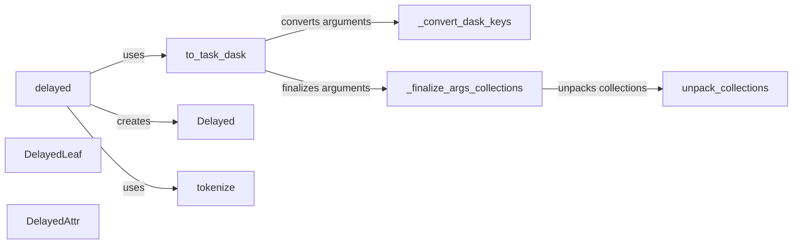

## Component Details

The Delayed Execution Interface in Dask provides a mechanism to defer the execution of Python functions, enabling the construction of task graphs for parallel computation. The core idea is to wrap a function and its arguments into a `Delayed` object, which represents a computation that will be executed later. This allows users to build complex workflows by composing delayed objects, which can then be executed in parallel using a Dask scheduler. The `delayed` function serves as the primary entry point, converting function calls into `Delayed` objects and constructing the underlying Dask graph. The system handles various input types, including other `Delayed` objects and Dask collections, ensuring seamless integration with existing Dask workflows. The `tokenize` function generates unique identifiers for delayed objects, facilitating efficient caching and task management.

### delayed
The `delayed` function is the main entry point for creating delayed computations. It wraps a function and its arguments, creating a `Delayed` object that represents the computation. It uses `to_task_dask` to convert the inputs into a dask graph and `tokenize` to generate a unique hash for the delayed object.
- **Related Classes/Methods**: `dask.dask.delayed:delayed`

### to_task_dask
The `to_task_dask` function converts the arguments passed to `delayed` into a dask graph representation. It handles various types of inputs, including other `Delayed` objects, dask collections, and regular Python objects. It uses `_convert_dask_keys` and `_finalize_args_collections` to finalize the arguments.
- **Related Classes/Methods**: `dask.dask.delayed:to_task_dask`

### _convert_dask_keys
The `_convert_dask_keys` function converts dask keys in the arguments to their corresponding values.
- **Related Classes/Methods**: `dask.dask.delayed:_convert_dask_keys`

### _finalize_args_collections
The `_finalize_args_collections` function finalizes dask collections in the arguments by unpacking them using `unpack_collections`.
- **Related Classes/Methods**: `dask.dask.delayed:_finalize_args_collections`

### unpack_collections
The `unpack_collections` function unpacks dask collections into their underlying dask graphs.
- **Related Classes/Methods**: `dask.dask.delayed:unpack_collections`

### Delayed
The `Delayed` class represents a delayed computation. It stores the function and arguments to be executed, as well as the dask graph representation of the computation. It has methods for triggering the computation (`__call__`) and accessing attributes (`__getattr__`).
- **Related Classes/Methods**: `dask.dask.delayed.Delayed:__getattr__`, `dask.dask.delayed.Delayed:__call__`, `dask.dask.delayed.Delayed:_rebuild`

### DelayedLeaf
The `DelayedLeaf` class represents a leaf node in the delayed computation graph. It is used when the delayed object is a simple value.
- **Related Classes/Methods**: `dask.dask.delayed.DelayedLeaf:__init__`, `dask.dask.delayed.DelayedLeaf:dask`, `dask.dask.delayed.DelayedLeaf:__call__`

### DelayedAttr
The `DelayedAttr` class represents a delayed attribute access. It is used when accessing an attribute of a delayed object.
- **Related Classes/Methods**: `dask.dask.delayed.DelayedAttr:__init__`, `dask.dask.delayed.DelayedAttr:__getattr__`, `dask.dask.delayed.DelayedAttr:dask`, `dask.dask.delayed.DelayedAttr:__call__`

### tokenize
The `tokenize` function generates a unique hash for the delayed object based on its function and arguments.
- **Related Classes/Methods**: `dask.dask.delayed:tokenize`
