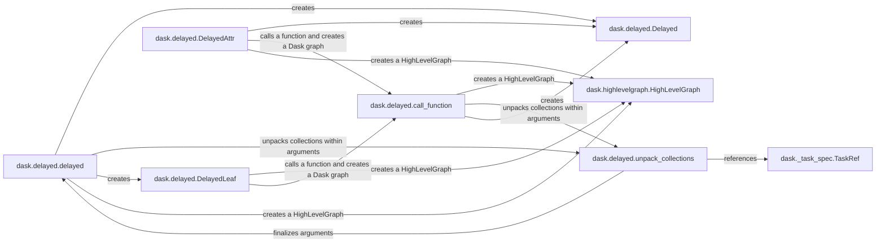

## Component Details

### dask.delayed.delayed
The `dask.delayed` function is the primary interface for creating lazy Dask computations. It wraps a Python function and its arguments, deferring execution until the result is needed. It handles unpacking Dask collections within the arguments, ensuring dependencies are correctly tracked and managed within the Dask graph. This function serves as the entry point for integrating existing Python code into a Dask workflow.
- **Related Classes/Methods**: `dask.delayed.delayed`

### dask.delayed.Delayed
The `dask.delayed.Delayed` class represents a deferred computation. It encapsulates a key (name), a Dask graph (`dask`) representing the computation, and optionally a length if the result is a collection. It provides methods for interacting with other Dask collections and triggering the computation. This class is the core representation of a delayed object within the Dask framework.
- **Related Classes/Methods**: `dask.delayed.Delayed`

### dask.delayed.unpack_collections
The `dask.delayed.unpack_collections` function recursively unpacks Dask collections within a Python object. It replaces `Delayed` objects with `TaskRef` objects referencing their keys in the Dask graph. It also converts literals to forms suitable for Dask schedulers and extracts Dask graphs from nested values. This function is crucial for managing dependencies and constructing the Dask graph from delayed objects.
- **Related Classes/Methods**: `dask.delayed.unpack_collections`

### dask.highlevelgraph.HighLevelGraph
The `dask.highlevelgraph.HighLevelGraph` class represents a high-level graph of Dask computations. It is used to represent the dependencies between different Dask collections. It is constructed from layers, which are collections of tasks, and dependencies, which specify the relationships between layers. This class provides an efficient way to represent and manipulate complex Dask computations.
- **Related Classes/Methods**: `dask.highlevelgraph.HighLevelGraph`

### dask._task_spec.TaskRef
The `dask._task_spec.TaskRef` class represents a reference to a task within a Dask graph. It is used by `unpack_collections` to replace `Delayed` objects with references to their keys. This class allows Dask to efficiently manage dependencies between tasks in the graph.
- **Related Classes/Methods**: `dask._task_spec.TaskRef`

### dask.delayed.DelayedLeaf
The `dask.delayed.DelayedLeaf` class represents a leaf node in a Dask graph, typically a `Delayed` object that wraps a concrete value rather than a computation. It holds the object and its key and provides a `dask` property that constructs a `HighLevelGraph` for the object. This class is used to represent delayed values that are not the result of a computation.
- **Related Classes/Methods**: `dask.delayed.DelayedLeaf`

### dask.delayed.DelayedAttr
The `dask.delayed.DelayedAttr` class represents an attribute of a `Delayed` object. It allows accessing attributes of Dask collections in a lazy manner. When an attribute is accessed, a new `DelayedAttr` object is created, which holds the original object and the attribute name. This class enables lazy access to attributes of Dask collections.
- **Related Classes/Methods**: `dask.delayed.DelayedAttr`

### dask.delayed.call_function
The `dask.delayed.call_function` function is used to call a function with the given arguments and create a Dask graph for the computation. It is used by `DelayedLeaf` and `DelayedAttr` to create Dask graphs for function calls and method calls. This function is a key component in constructing Dask graphs from delayed objects.
- **Related Classes/Methods**: `dask.delayed.call_function`
