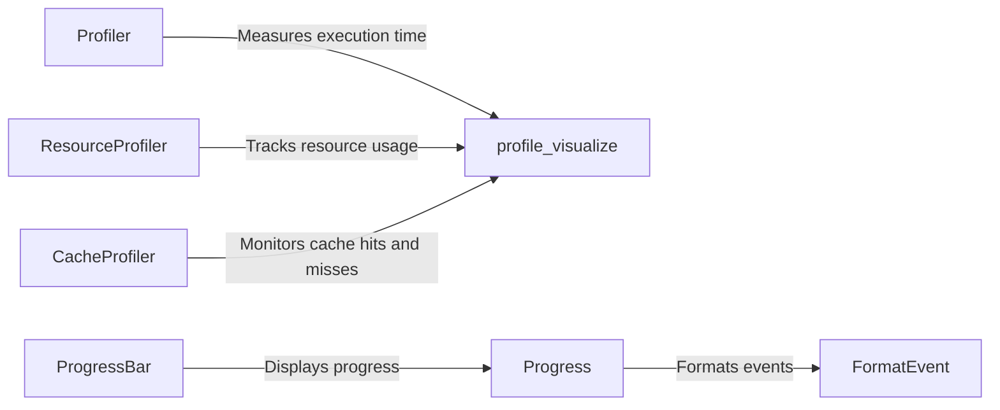

## Component Details

The Diagnostics and Monitoring Tools component in Dask provides a suite of utilities for gaining insights into the execution of Dask computations. These tools enable users to track task progress, visualize task graphs, profile performance, and monitor resource usage. By leveraging these diagnostic capabilities, users can identify bottlenecks, optimize workflows, and ensure efficient resource allocation during Dask execution.

### ProgressBar
The ProgressBar component provides a visual representation of the progress of Dask computations in the console. It displays a progress bar that updates as tasks are completed, providing users with real-time feedback on the overall progress of their workflows. It inherits from the `Progress` class.
- **Related Classes/Methods**: `dask.diagnostics.progress.ProgressBar`

### Profiler
The Profiler component measures the execution time of individual tasks within a Dask graph. By tracking the time spent on each task, the Profiler helps users identify performance bottlenecks and optimize their code for faster execution. It can be used as a context manager.
- **Related Classes/Methods**: `dask.diagnostics.profile.Profiler`

### ResourceProfiler
The ResourceProfiler component monitors the CPU and memory usage of Dask workers during computation. By tracking resource consumption, users can gain insights into the resource requirements of their workflows and identify potential resource bottlenecks. It inherits from the `Profiler` class.
- **Related Classes/Methods**: `dask.diagnostics.profile.ResourceProfiler`

### CacheProfiler
The CacheProfiler component tracks cache hits and misses during Dask computations. By monitoring cache performance, users can evaluate the effectiveness of caching strategies and optimize their code for improved performance. It inherits from the `Profiler` class.
- **Related Classes/Methods**: `dask.diagnostics.profile.CacheProfiler`

### profile_visualize
The profile_visualize component provides functions for visualizing profiling data collected by the Profiler, ResourceProfiler, and CacheProfiler. It uses Bokeh to create interactive plots that allow users to explore performance data and identify areas for optimization.
- **Related Classes/Methods**: `dask.diagnostics.profile_visualize`

### Progress
The Progress component serves as a base class for progress-related diagnostic tools, such as ProgressBar. It provides a common interface for updating and displaying progress information during Dask computations.
- **Related Classes/Methods**: `dask.diagnostics.progress.Progress`

### FormatEvent
The FormatEvent component formats events for display in progress bars or other diagnostic tools. It converts raw event data into human-readable strings, making it easier for users to understand the progress of their Dask computations.
- **Related Classes/Methods**: `dask.diagnostics.progress.FormatEvent`
