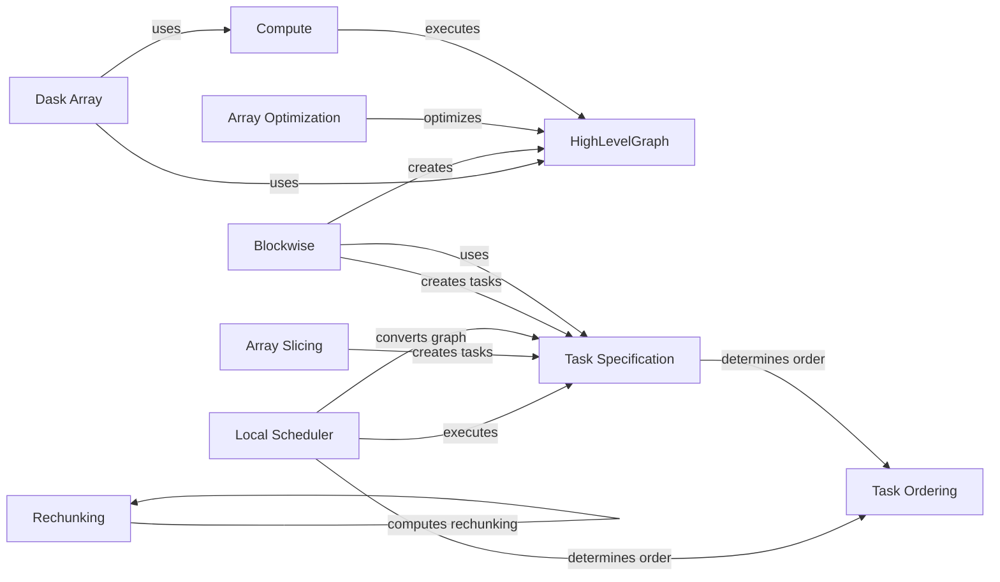

## Component Details

### Dask Array
The Dask Array component represents a distributed, NumPy-like array. It is built upon a graph of tasks that define how to compute the array's chunks. It serves as a high-level interface for users to interact with distributed data, abstracting away the complexities of task scheduling and data management.
- **Related Classes/Methods**: `repos.dask.dask.array.core:Array`

### HighLevelGraph
The HighLevelGraph component represents the task graph in Dask. It is an optimized representation of the computation, enabling efficient execution and manipulation of the graph. It provides a way to organize and optimize the tasks that make up a Dask computation.
- **Related Classes/Methods**: `repos.dask.dask.highlevelgraph:HighLevelGraph`

### Blockwise
The Blockwise component is responsible for performing blockwise operations on Dask arrays. It constructs a HighLevelGraph representing the blockwise computation, enabling operations to be applied to blocks of data in parallel. It is a core component for many array operations in Dask.
- **Related Classes/Methods**: `repos.dask.dask.array.blockwise:blockwise`, `repos.dask.dask.blockwise:Blockwise`

### Task Specification
The Task Specification component defines the structure of tasks within the Dask graph. It includes classes like GraphNode and Task, which represent individual tasks and their dependencies. It provides a standardized way to represent tasks, enabling efficient scheduling and execution.
- **Related Classes/Methods**: `repos.dask.dask._task_spec:GraphNode`, `repos.dask.dask._task_spec:Task`, `repos.dask.dask._task_spec:convert_legacy_graph`

### Local Scheduler
The Local Scheduler component executes the Dask graph using a local, asynchronous scheduler. It manages task execution and dependencies, enabling parallel computation on a single machine. It is a simple and efficient way to execute Dask computations for smaller datasets.
- **Related Classes/Methods**: `repos.dask.dask.local:get_async`

### Compute
The Compute component triggers the computation of Dask objects. It retrieves the appropriate scheduler and executes the task graph, producing the final result. It serves as the entry point for users to initiate Dask computations.
- **Related Classes/Methods**: `repos.dask.dask.base:compute`

### Array Optimization
The Array Optimization component applies various optimizations to the Dask graph for array computations. These optimizations include fusing operations and culling unnecessary tasks, improving the efficiency of the computation. It helps to reduce the memory footprint and execution time of Dask computations.
- **Related Classes/Methods**: `repos.dask.dask.array.optimization:optimize`

### Rechunking
The Rechunking component handles the process of changing the chunk sizes of a Dask array. It plans the rechunking operation and generates a new task graph to perform the rechunking. It is essential for optimizing computations that require different chunk sizes.
- **Related Classes/Methods**: `repos.dask.dask.array.rechunk:rechunk`

### Array Slicing
The Array Slicing component handles slicing operations on Dask arrays. It creates new tasks to extract the desired portions of the array, enabling users to access specific subsets of the data. It is a fundamental operation for data analysis and manipulation.
- **Related Classes/Methods**: `repos.dask.dask.array.slicing:slice_array`

### Task Ordering
The Task Ordering component determines the order in which tasks should be executed to minimize memory usage. It analyzes task dependencies and arranges the tasks in an optimal order. It is crucial for managing memory usage and preventing out-of-memory errors.
- **Related Classes/Methods**: `repos.dask.dask.order:order`
