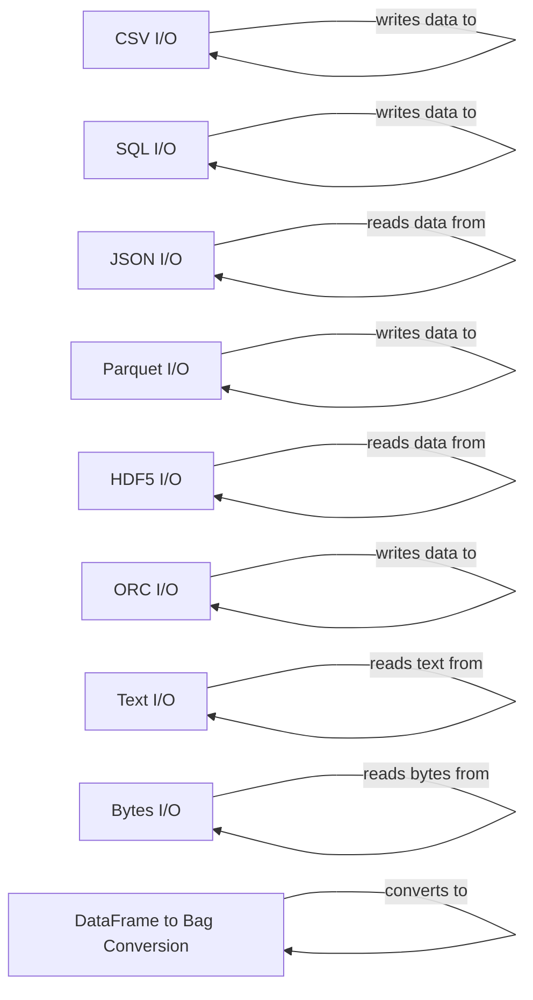

## Component Details

The I/O operations subsystem in Dask provides a unified interface for reading and writing data in various formats, abstracting away the complexities of different storage systems. It enables users to work with data stored in diverse locations and formats consistently, facilitating parallel data processing. The core functionality revolves around reading data into Dask collections (DataFrames, Bags, Arrays) and writing data from these collections to various storage formats.

### CSV I/O
Handles reading and writing CSV files to and from dask DataFrames. It parses CSV data and creates dask graphs for parallel processing.
- **Related Classes/Methods**: `dask.dataframe.io.csv:read_csv`, `dask.dataframe.io.csv:to_csv`

### SQL I/O
Enables reading and writing data between dask DataFrames and SQL databases. It supports executing SQL queries and transferring data between tables.
- **Related Classes/Methods**: `dask.dataframe.io.sql:read_sql_query`, `dask.dataframe.io.sql:read_sql_table`, `dask.dataframe.io.sql:read_sql`, `dask.dataframe.io.sql:to_sql`

### JSON I/O
Handles reading and writing JSON data to and from dask DataFrames. It converts between JSON format and dask DataFrame structures.
- **Related Classes/Methods**: `dask.dataframe.io.json:to_json`, `dask.dataframe.io.json:read_json`

### Parquet I/O
Provides optimized functions for reading and writing Parquet files to and from dask DataFrames, leveraging different engines like Arrow and dask_expr for efficient data handling.
- **Related Classes/Methods**: `dask.dataframe.io.parquet.core:read_parquet_part`, `dask.dataframe.io.parquet.core:create_metadata_file`, `dask.dataframe.io.parquet.arrow.ArrowDatasetEngine:read_partition`, `dask.dataframe.io.parquet.arrow.ArrowDatasetEngine:write_partition`, `dask.dataframe.dask_expr.io.parquet:to_parquet`, `dask.dataframe.dask_expr.io.parquet:read_parquet`

### HDF5 I/O
Provides functions for reading and writing HDF5 files to and from dask DataFrames, enabling efficient storage and retrieval of large datasets.
- **Related Classes/Methods**: `dask.dataframe.io.hdf:to_hdf`, `dask.dataframe.io.hdf:read_hdf`

### ORC I/O
Handles reading and writing ORC files to and from dask DataFrames, supporting the optimized row columnar (ORC) file format.
- **Related Classes/Methods**: `dask.dataframe.io.orc.core:read_orc`, `dask.dataframe.io.orc.core:to_orc`

### Text I/O
Provides functions for reading text files into dask Bags, useful for processing line-oriented data in parallel.
- **Related Classes/Methods**: `dask.bag.text:read_text`

### Bytes I/O
Provides functions for reading binary files into dask arrays, useful for processing binary data in parallel.
- **Related Classes/Methods**: `dask.bytes.core:read_bytes`

### DataFrame to Bag Conversion
Provides functionality to convert a dask DataFrame to a dask Bag, useful for row-wise operations.
- **Related Classes/Methods**: `dask.dataframe.dask_expr.io.bag:to_bag`
