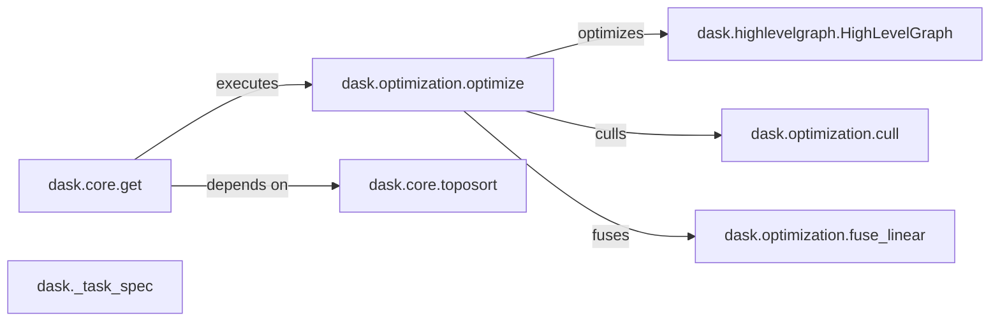

## Component Details

The Task Graph Management component in Dask is responsible for defining, optimizing, and executing computational workflows represented as directed acyclic graphs (DAGs). It encompasses the creation of task graphs, their optimization through various rewrite rules and techniques, and the scheduling and execution of tasks in the correct order, considering dependencies. The core purpose is to efficiently manage and execute complex computations by breaking them down into smaller, manageable tasks and orchestrating their execution across available resources.

### dask.core.get
The `dask.core.get` function is the central execution engine for Dask graphs. It takes a graph and a set of keys to compute and orchestrates the execution of the graph by calling the appropriate execution backend. It handles task submission, result retrieval, and overall execution flow.
- **Related Classes/Methods**: `dask.core.get`

### dask.optimization.optimize
The `dask.optimization.optimize` function optimizes the Dask graph before execution. It applies a series of rewrite rules and other optimization techniques to improve the graph's performance, including task fusion, common subexpression elimination, and other graph transformations.
- **Related Classes/Methods**: `dask.optimization.optimize`

### dask.highlevelgraph.HighLevelGraph
The `HighLevelGraph` class represents a Dask graph as a collection of layers, where each layer is a mapping from keys to tasks. This allows for more efficient graph manipulation and optimization. It provides a higher-level abstraction for representing Dask graphs, making it easier to reason about and optimize complex workflows.
- **Related Classes/Methods**: `dask.highlevelgraph.HighLevelGraph`

### dask.optimization.cull
The `dask.optimization.cull` function removes unnecessary tasks from the Dask graph based on the desired outputs. It analyzes the graph and identifies tasks that are not needed to compute the desired outputs, and then removes them from the graph to reduce computational overhead.
- **Related Classes/Methods**: `dask.optimization.cull`

### dask.optimization.fuse_linear
The `dask.optimization.fuse_linear` function fuses together linear chains of tasks in the Dask graph to reduce overhead. It identifies sequences of tasks where the output of one task is directly used as the input of the next task, and then fuses them into a single task to reduce the overhead of task scheduling and data transfer.
- **Related Classes/Methods**: `dask.optimization.fuse_linear`

### dask.core.toposort
The `dask.core.toposort` function sorts the Dask graph topologically, ensuring that tasks are executed in the correct order based on their dependencies. It determines the execution order of tasks by analyzing the graph's dependencies and ensuring that all dependencies of a task are executed before the task itself.
- **Related Classes/Methods**: `dask.core.toposort`

### dask._task_spec
The `dask._task_spec` module defines the data structures and functions for representing task specifications in Dask. It provides a way to define the inputs, outputs, and function to be executed for each task in the graph.
- **Related Classes/Methods**: `dask._task_spec`
