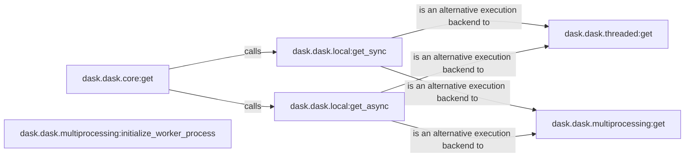

## Component Details

The Task Scheduling component in Dask is responsible for orchestrating the execution of tasks within a Dask graph. It provides various execution backends, including synchronous, asynchronous, threaded, and multiprocessing options, to suit different workloads and environments. The central `dask.dask.core:get` function determines which backend to use based on the graph and available resources. Local backends (`dask.dask.local:get_sync`, `dask.dask.local:get_async`) are suitable for single-machine execution, while threaded and multiprocessing backends (`dask.dask.threaded:get`, `dask.dask.multiprocessing:get`) enable parallel execution on multi-core machines. The `dask.dask.multiprocessing:initialize_worker_process` function sets up worker processes for the multiprocessing backend.

### dask.dask.core:get
The core function for computing Dask graphs. It takes a Dask graph and keys to compute, and orchestrates the execution of the graph to produce the results. It determines which execution backend to use.
- **Related Classes/Methods**: `dask.dask.core:get`

### dask.dask.local:get_sync
A synchronous execution backend for Dask graphs. It executes tasks in the current thread, making it suitable for debugging and single-machine workloads where concurrency is not required.
- **Related Classes/Methods**: `dask.dask.local:get_sync`

### dask.dask.local:get_async
An asynchronous execution backend for Dask graphs. It uses asyncio to execute tasks concurrently, improving performance for I/O-bound workloads on a single machine.
- **Related Classes/Methods**: `dask.dask.local:get_async`

### dask.dask.threaded:get
A threaded execution backend for Dask graphs. It uses a thread pool to execute tasks concurrently, suitable for CPU-bound workloads on a single machine.
- **Related Classes/Methods**: `dask.dask.threaded:get`

### dask.dask.multiprocessing:get
A multiprocessing execution backend for Dask graphs. It uses multiple processes to execute tasks in parallel, enabling efficient use of multi-core machines. It is suitable for CPU-bound workloads where true parallelism is needed.
- **Related Classes/Methods**: `dask.dask.multiprocessing:get`

### dask.dask.multiprocessing:initialize_worker_process
Initializes a worker process for the multiprocessing backend. This includes setting up the necessary environment and signal handling to ensure proper execution of tasks within the worker process.
- **Related Classes/Methods**: `dask.dask.multiprocessing:initialize_worker_process`
