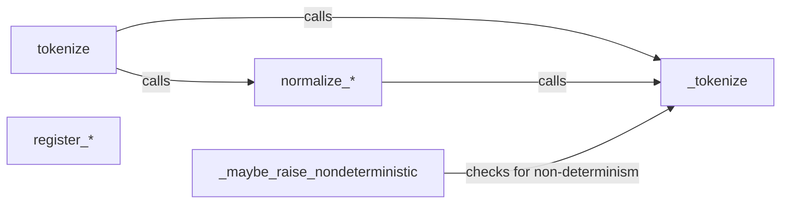

## Component Details

The Tokenization and Hashing Utilities component in Dask is responsible for generating unique, deterministic tokens for Python objects. This is crucial for Dask's task scheduling and caching mechanisms, ensuring that identical tasks are recognized and reused efficiently. The component normalizes various Python data types into hashable representations, handles potential non-deterministic objects, and provides a mechanism for extending tokenization to custom types and libraries. The core functionality revolves around the `tokenize` function, which orchestrates the normalization and hashing process.

### tokenize
The main function that generates a unique token for a given Python object. It acts as a dispatcher, directing the tokenization process based on the object's type. It calls normalization functions and the core hashing function `_tokenize`.
- **Related Classes/Methods**: `dask.base.tokenize`

### _tokenize
A helper function that computes the actual hash of a normalized Python object. It's the final step in the tokenization process, taking the output of the normalization functions and producing a unique token.
- **Related Classes/Methods**: `dask.base.tokenize`

### normalize_*
A family of functions (e.g., `normalize_dict`, `normalize_seq`) that convert different Python object types into a standard, hashable representation. These functions handle dictionaries, lists, sets, and other common data structures, ensuring consistency before hashing.
- **Related Classes/Methods**: `dask.base.tokenize`

### _maybe_raise_nondeterministic
This function checks if a non-deterministic object is being tokenized and raises a warning or error if necessary. This is used to prevent unexpected behavior when tokenizing objects that may change between calls, ensuring that Dask's caching mechanism remains reliable.
- **Related Classes/Methods**: `dask.base.tokenize`

### register_*
A family of functions (e.g., `register_pandas`, `register_numpy`) used to register custom tokenization functions for specific libraries like Pandas and NumPy. This allows Dask to handle these objects efficiently by providing specialized normalization logic.
- **Related Classes/Methods**: `dask.base.tokenize`
