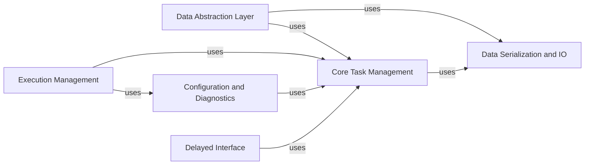

## Component Details

### Core Task Management
This component forms the heart of Dask, responsible for building, optimizing, and executing task graphs. It encompasses task definition, dependency resolution, graph optimization techniques, and scheduling algorithms. It provides the foundation for all higher-level computations and abstractions within Dask.
- **Related Classes/Methods**: `dask.core`, `dask._task_spec`, `dask.optimization`, `dask.order`, `dask.highlevelgraph`, `dask.layers`

### Data Abstraction Layer
This component provides high-level abstractions for representing and manipulating various data structures, including arrays, bags, and dataframes. It offers a consistent interface for performing computations on these data structures, regardless of their size or underlying storage format. It simplifies the process of working with large datasets by abstracting away the complexities of distributed data management.
- **Related Classes/Methods**: `dask.array.core`, `dask.array.creation`, `dask.array.routines`, `dask.array.reductions`, `dask.array.slicing`, `dask.array._array_expr._expr`, `dask.array._array_expr._collection`, `dask.array._array_expr._creation`, `dask.array._array_expr._reductions`, `dask.array._array_expr._slicing`, `dask.bag.core`, `dask.bag.text`, `dask.dataframe.core`, `dask.dataframe.io`, `dask.dataframe.groupby`, `dask.dataframe.methods`, `dask.dataframe.dask_expr._expr`, `dask.dataframe.dask_expr._collection`, `dask.dataframe.dask_expr._groupby`, `dask.dataframe.dask_expr._reductions`, `dask.dataframe.dask_expr._shuffle`

### Execution Management
This component is responsible for managing the execution of Dask graphs, including task distribution, data transfer, and fault tolerance. It provides the infrastructure for parallelizing computations across multiple machines, enabling users to scale their computations to large clusters. It handles the complexities of distributed execution, allowing users to focus on defining their computations rather than managing the underlying infrastructure.
- **Related Classes/Methods**: `dask.distributed`

### Configuration and Diagnostics
This component provides tools for configuring Dask's behavior and monitoring its performance. It allows users to customize various aspects of Dask, such as the scheduler, the number of workers, and the memory limits. It also provides tools for monitoring and profiling Dask computations, enabling users to identify and resolve performance bottlenecks.
- **Related Classes/Methods**: `dask.config`, `dask.diagnostics`, `dask.diagnostics.profile`, `dask.diagnostics.progress`

### Data Serialization and IO
This component handles the serialization and deserialization of data for Dask tasks, as well as the reading and writing of data in various formats. It ensures that data can be efficiently transferred between tasks and that data can be loaded and saved in a variety of formats. It plays a crucial role in the performance and interoperability of Dask computations.
- **Related Classes/Methods**: `dask.hashing`, `dask.sizeof`, `dask.tokenize`, `dask.bytes.core`

### Delayed Interface
This component provides a simple and intuitive interface for creating Dask graphs from existing Python code. It allows users to defer the execution of functions and their arguments, creating tasks that can be added to a Dask graph. It simplifies the process of parallelizing existing code by allowing users to lazily define computations.
- **Related Classes/Methods**: `dask.delayed`