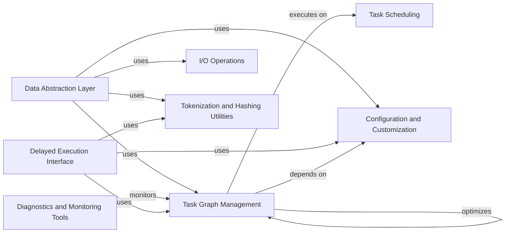

## Component Details

Dask is a parallel computing library that provides high-level interfaces for working with large datasets. It enables users to scale their computations from single-machine prototypes to distributed clusters. The core of Dask is a task graph representation that captures the dependencies between computations. Dask provides abstractions for arrays, dataframes, and bags, which allow users to perform parallel computations on these data structures using familiar APIs. Dask also includes a distributed scheduler that can execute task graphs on a cluster of machines.

### Task Graph Management
This component is responsible for creating, optimizing, and executing task graphs. It includes the core data structures for representing task graphs, as well as optimization routines and rewrite rules. It manages the dependencies between tasks and ensures that they are executed in the correct order.
- **Related Classes/Methods**: `dask.core`, `dask._task_spec`, `dask.highlevelgraph`, `dask.optimization`, `dask.order`, `dask.rewrite`

### Data Abstraction Layer
This component provides high-level interfaces for working with large datasets. It includes abstractions for arrays, dataframes, and bags, which allow users to perform parallel computations on these data structures using familiar APIs. It handles the partitioning and distribution of data across multiple machines.
- **Related Classes/Methods**: `dask.array.core`, `dask.dataframe.core`, `dask.bag.core`

### Task Scheduling
This component is responsible for scheduling and executing tasks on a variety of platforms. It includes a distributed scheduler for cluster environments and local schedulers (threaded and multiprocessing) for single-machine parallelism. It manages resources and ensures that tasks are executed efficiently.
- **Related Classes/Methods**: `dask.distributed`, `dask.threaded`, `dask.local`, `dask.multiprocessing`

### Configuration and Customization
This component manages the configuration settings for Dask. It allows users to customize the behavior of Dask, such as the default scheduler and the number of threads to use. It provides a centralized way to configure Dask's behavior.
- **Related Classes/Methods**: `dask.config`

### I/O Operations
This component provides a set of tools for reading and writing data in various formats. It abstracts away the details of the underlying storage system, allowing users to work with data stored in different locations and formats in a consistent way. It handles data input and output operations.
- **Related Classes/Methods**: `dask.bytes`, `dask.dataframe.io`, `dask.bag.text`

### Diagnostics and Monitoring Tools
This component provides tools for monitoring and profiling Dask computations. It includes functions for tracking the progress of tasks, visualizing task graphs, and profiling the performance of Dask code. It provides insights into Dask's performance and behavior.
- **Related Classes/Methods**: `dask.diagnostics`, `dask.diagnostics.profile`, `dask.diagnostics.progress`

### Delayed Execution Interface
This component provides a simple way to wrap Python functions and create delayed objects that represent computations to be executed later. It allows users to build task graphs by composing delayed objects, which can then be executed in parallel using a Dask scheduler. It enables fine-grained control over task scheduling and graph construction.
- **Related Classes/Methods**: `dask.delayed`

### Tokenization and Hashing Utilities
This component provides functions for generating unique tokens for Python objects. It is used to ensure that Dask tasks are deterministic and can be cached efficiently. It generates unique identifiers for tasks and data.
- **Related Classes/Methods**: `dask.tokenize`