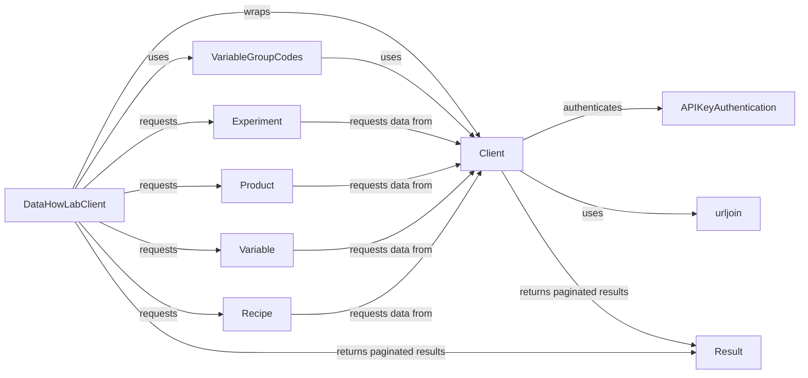

## Component Details

The API Client component facilitates communication with the DataHowLab API. It manages authentication using API keys, constructs and sends HTTP requests, handles responses, and provides a unified interface for interacting with API endpoints. The client abstracts away the complexities of HTTP requests and response handling, offering a simplified way to access data and functionality from the DataHowLab API.

### APIKeyAuthentication
Handles API key authentication for the DataHowLab API. It retrieves the API key from either a provided argument or an environment variable and generates authorization headers for requests.

**Related Classes/Methods**:

- <a href="https://github.com/DataHow/datahowlab-sdk-python/blob/master/dhl_sdk/authentication.py#L30-L85" target="_blank" rel="noopener noreferrer">`dhl_sdk.authentication.APIKeyAuthentication` (30:85)</a>
- <a href="https://github.com/DataHow/datahowlab-sdk-python/blob/master/dhl_sdk/authentication.py#L39-L51" target="_blank" rel="noopener noreferrer">`dhl_sdk.authentication.APIKeyAuthentication.__init__` (39:51)</a>
- <a href="https://github.com/DataHow/datahowlab-sdk-python/blob/master/dhl_sdk/authentication.py#L53-L62" target="_blank" rel="noopener noreferrer">`dhl_sdk.authentication.APIKeyAuthentication.get_headers` (53:62)</a>
- <a href="https://github.com/DataHow/datahowlab-sdk-python/blob/master/dhl_sdk/authentication.py#L64-L85" target="_blank" rel="noopener noreferrer">`dhl_sdk.authentication.APIKeyAuthentication._get_api_key` (64:85)</a>

### Client
A base client for interacting with the DataHowLab API. It handles HTTP requests (GET, POST, PUT) with retry logic and authentication headers. It also provides a method to retrieve projects.

**Related Classes/Methods**:

- <a href="https://github.com/DataHow/datahowlab-sdk-python/blob/master/dhl_sdk/client.py#L38-L250" target="_blank" rel="noopener noreferrer">`dhl_sdk.client.Client` (38:250)</a>
- <a href="https://github.com/DataHow/datahowlab-sdk-python/blob/master/dhl_sdk/client.py#L43-L63" target="_blank" rel="noopener noreferrer">`dhl_sdk.client.Client.__init__` (43:63)</a>
- <a href="https://github.com/DataHow/datahowlab-sdk-python/blob/master/dhl_sdk/client.py#L88-L116" target="_blank" rel="noopener noreferrer">`dhl_sdk.client.Client.post` (88:116)</a>
- <a href="https://github.com/DataHow/datahowlab-sdk-python/blob/master/dhl_sdk/client.py#L118-L150" target="_blank" rel="noopener noreferrer">`dhl_sdk.client.Client.get` (118:150)</a>
- <a href="https://github.com/DataHow/datahowlab-sdk-python/blob/master/dhl_sdk/client.py#L152-L197" target="_blank" rel="noopener noreferrer">`dhl_sdk.client.Client.put` (152:197)</a>
- <a href="https://github.com/DataHow/datahowlab-sdk-python/blob/master/dhl_sdk/client.py#L199-L250" target="_blank" rel="noopener noreferrer">`dhl_sdk.client.Client.get_projects` (199:250)</a>
- <a href="https://github.com/DataHow/datahowlab-sdk-python/blob/master/dhl_sdk/client.py#L66-L86" target="_blank" rel="noopener noreferrer">`dhl_sdk.client.Client._get_retry_requester` (66:86)</a>

### DataHowLabClient
The main client for interacting with the DataHowLab API. It extends the base Client and provides methods for retrieving experiments, products, variables and recipes.

**Related Classes/Methods**:

- <a href="https://github.com/DataHow/datahowlab-sdk-python/blob/master/dhl_sdk/client.py#L253-L533" target="_blank" rel="noopener noreferrer">`dhl_sdk.client.DataHowLabClient` (253:533)</a>
- <a href="https://github.com/DataHow/datahowlab-sdk-python/blob/master/dhl_sdk/client.py#L260-L288" target="_blank" rel="noopener noreferrer">`dhl_sdk.client.DataHowLabClient.__init__` (260:288)</a>
- <a href="https://github.com/DataHow/datahowlab-sdk-python/blob/master/dhl_sdk/client.py#L290-L338" target="_blank" rel="noopener noreferrer">`dhl_sdk.client.DataHowLabClient.get_projects` (290:338)</a>
- <a href="https://github.com/DataHow/datahowlab-sdk-python/blob/master/dhl_sdk/client.py#L340-L379" target="_blank" rel="noopener noreferrer">`dhl_sdk.client.DataHowLabClient.get_experiments` (340:379)</a>
- <a href="https://github.com/DataHow/datahowlab-sdk-python/blob/master/dhl_sdk/client.py#L381-L405" target="_blank" rel="noopener noreferrer">`dhl_sdk.client.DataHowLabClient.get_products` (381:405)</a>
- <a href="https://github.com/DataHow/datahowlab-sdk-python/blob/master/dhl_sdk/client.py#L407-L474" target="_blank" rel="noopener noreferrer">`dhl_sdk.client.DataHowLabClient.get_variables` (407:474)</a>
- <a href="https://github.com/DataHow/datahowlab-sdk-python/blob/master/dhl_sdk/client.py#L476-L513" target="_blank" rel="noopener noreferrer">`dhl_sdk.client.DataHowLabClient.get_recipes` (476:513)</a>

### urljoin
A utility function that joins URL elements together into a single URL.

**Related Classes/Methods**:

- <a href="https://github.com/DataHow/datahowlab-sdk-python/blob/master/dhl_sdk/_utils.py#L151-L157" target="_blank" rel="noopener noreferrer">`dhl_sdk._utils.urljoin` (151:157)</a>

### VariableGroupCodes
A singleton class that stores variable group codes retrieved from the API. It is used to validate and retrieve variable group information.

**Related Classes/Methods**:

- <a href="https://github.com/DataHow/datahowlab-sdk-python/blob/master/dhl_sdk/_utils.py#L19-L42" target="_blank" rel="noopener noreferrer">`dhl_sdk._utils.VariableGroupCodes` (19:42)</a>
- <a href="https://github.com/DataHow/datahowlab-sdk-python/blob/master/dhl_sdk/_utils.py#L25-L29" target="_blank" rel="noopener noreferrer">`dhl_sdk._utils.VariableGroupCodes.__new__` (25:29)</a>
- <a href="https://github.com/DataHow/datahowlab-sdk-python/blob/master/dhl_sdk/_utils.py#L31-L38" target="_blank" rel="noopener noreferrer">`dhl_sdk._utils.VariableGroupCodes._initialize` (31:38)</a>
- <a href="https://github.com/DataHow/datahowlab-sdk-python/blob/master/dhl_sdk/_utils.py#L40-L42" target="_blank" rel="noopener noreferrer">`dhl_sdk._utils.VariableGroupCodes.get_variable_group_codes` (40:42)</a>

### Experiment
A Pydantic model representing an experiment, including its metadata, variables, and associated data file. It provides methods for validating and creating experiments.

**Related Classes/Methods**:

- <a href="https://github.com/DataHow/datahowlab-sdk-python/blob/master/dhl_sdk/db_entities.py#L781-L1011" target="_blank" rel="noopener noreferrer">`dhl_sdk.db_entities.Experiment` (781:1011)</a>

### Product
A Pydantic model representing a product, including its code, name, and description. It provides methods for validating and creating products.

**Related Classes/Methods**:

- <a href="https://github.com/DataHow/datahowlab-sdk-python/blob/master/dhl_sdk/db_entities.py#L502-L576" target="_blank" rel="noopener noreferrer">`dhl_sdk.db_entities.Product` (502:576)</a>

### Variable
A Pydantic model representing a variable, including its code, name, description, and variant details. It provides methods for validating and creating variables.

**Related Classes/Methods**:

- <a href="https://github.com/DataHow/datahowlab-sdk-python/blob/master/dhl_sdk/db_entities.py#L302-L499" target="_blank" rel="noopener noreferrer">`dhl_sdk.db_entities.Variable` (302:499)</a>

### Recipe
A Pydantic model representing a recipe, including its metadata, variables, and associated data file. It provides methods for validating and creating recipes.

**Related Classes/Methods**:

- <a href="https://github.com/DataHow/datahowlab-sdk-python/blob/master/dhl_sdk/db_entities.py#L665-L778" target="_blank" rel="noopener noreferrer">`dhl_sdk.db_entities.Recipe` (665:778)</a>

### Result
A utility class for handling paginated API results and iterating through them. It fetches data in chunks and provides a convenient way to access the entire result set.

**Related Classes/Methods**:

- <a href="https://github.com/DataHow/datahowlab-sdk-python/blob/master/dhl_sdk/crud.py#L93-L144" target="_blank" rel="noopener noreferrer">`dhl_sdk.crud.Result` (93:144)</a>