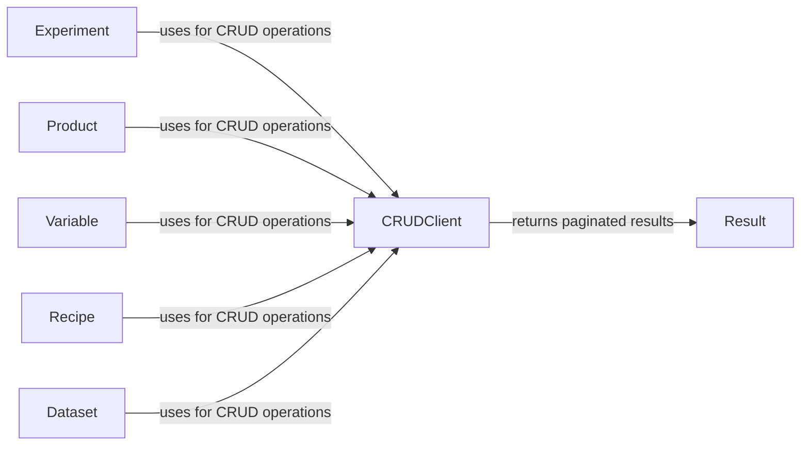

## Component Details

The DataHowLab SDK provides a set of tools for interacting with the DataHowLab API. The core functionality revolves around performing CRUD (Create, Read, Update, Delete) operations on various entities such as Experiments, Products, Variables, Recipes, Datasets, and Models. The `CRUDClient` handles the communication with the API, while the `Result` class facilitates the retrieval of paginated results. Specific entity classes like `Experiment`, `Product`, and `Dataset` define the structure and validation logic for the data being exchanged with the API. These entities leverage the `CRUDClient` to perform operations and the `Result` class to handle paginated responses.

### CRUDClient
A utility class for handling CRUD (Create, Read, Update, Delete) requests for API entities. It encapsulates the HTTP requests and object construction logic, providing a consistent interface for interacting with the DataHowLab API.

**Related Classes/Methods**:

- <a href="https://github.com/DataHow/datahowlab-sdk-python/blob/master/dhl_sdk/crud.py#L48-L90" target="_blank" rel="noopener noreferrer">`dhl_sdk.crud.CRUDClient` (48:90)</a>

### Result
A utility class for handling paginated API results and iterating through them. It fetches data in chunks and provides an iterator interface, simplifying the process of retrieving large datasets from the DataHowLab API.

**Related Classes/Methods**:

- <a href="https://github.com/DataHow/datahowlab-sdk-python/blob/master/dhl_sdk/crud.py#L93-L144" target="_blank" rel="noopener noreferrer">`dhl_sdk.crud.Result` (93:144)</a>
- <a href="https://github.com/DataHow/datahowlab-sdk-python/blob/master/dhl_sdk/crud.py#L113-L116" target="_blank" rel="noopener noreferrer">`dhl_sdk.crud.Result:__next__` (113:116)</a>
- <a href="https://github.com/DataHow/datahowlab-sdk-python/blob/master/dhl_sdk/crud.py#L128-L140" target="_blank" rel="noopener noreferrer">`dhl_sdk.crud.Result:_fetch_next` (128:140)</a>

### Experiment
Pydantic model representing an experiment, including its properties, associated files, and validation logic. It interacts with the CRUDClient for data retrieval and creation, ensuring data integrity and consistency.

**Related Classes/Methods**:

- <a href="https://github.com/DataHow/datahowlab-sdk-python/blob/master/dhl_sdk/db_entities.py#L781-L1011" target="_blank" rel="noopener noreferrer">`dhl_sdk.db_entities.Experiment` (781:1011)</a>
- <a href="https://github.com/DataHow/datahowlab-sdk-python/blob/master/dhl_sdk/db_entities.py#L1009-L1011" target="_blank" rel="noopener noreferrer">`dhl_sdk.db_entities.Experiment:requests` (1009:1011)</a>

### Product
Pydantic model representing a product, including its properties and validation logic. It interacts with the CRUDClient for data retrieval and creation, ensuring data integrity and consistency.

**Related Classes/Methods**:

- <a href="https://github.com/DataHow/datahowlab-sdk-python/blob/master/dhl_sdk/db_entities.py#L502-L576" target="_blank" rel="noopener noreferrer">`dhl_sdk.db_entities.Product` (502:576)</a>
- <a href="https://github.com/DataHow/datahowlab-sdk-python/blob/master/dhl_sdk/db_entities.py#L574-L576" target="_blank" rel="noopener noreferrer">`dhl_sdk.db_entities.Product:requests` (574:576)</a>

### Variable
Pydantic model representing a variable, including its properties, validation logic and variant details. It interacts with the CRUDClient for data retrieval and creation, ensuring data integrity and consistency.

**Related Classes/Methods**:

- <a href="https://github.com/DataHow/datahowlab-sdk-python/blob/master/dhl_sdk/db_entities.py#L302-L499" target="_blank" rel="noopener noreferrer">`dhl_sdk.db_entities.Variable` (302:499)</a>
- <a href="https://github.com/DataHow/datahowlab-sdk-python/blob/master/dhl_sdk/db_entities.py#L497-L499" target="_blank" rel="noopener noreferrer">`dhl_sdk.db_entities.Variable:requests` (497:499)</a>

### Recipe
Pydantic model representing a recipe, including its properties, associated files, and validation logic. It interacts with the CRUDClient for data retrieval and creation, ensuring data integrity and consistency.

**Related Classes/Methods**:

- <a href="https://github.com/DataHow/datahowlab-sdk-python/blob/master/dhl_sdk/db_entities.py#L665-L778" target="_blank" rel="noopener noreferrer">`dhl_sdk.db_entities.Recipe` (665:778)</a>
- <a href="https://github.com/DataHow/datahowlab-sdk-python/blob/master/dhl_sdk/db_entities.py#L776-L778" target="_blank" rel="noopener noreferrer">`dhl_sdk.db_entities.Recipe:requests` (776:778)</a>

### Dataset
Pydantic model representing a dataset, including its variables and experiments. It interacts with the CRUDClient for data retrieval, ensuring data integrity and consistency.

**Related Classes/Methods**:

- <a href="https://github.com/DataHow/datahowlab-sdk-python/blob/master/dhl_sdk/entities.py#L53-L120" target="_blank" rel="noopener noreferrer">`dhl_sdk.entities.Dataset` (53:120)</a>
- <a href="https://github.com/DataHow/datahowlab-sdk-python/blob/master/dhl_sdk/entities.py#L118-L120" target="_blank" rel="noopener noreferrer">`dhl_sdk.entities.Dataset:requests` (118:120)</a>