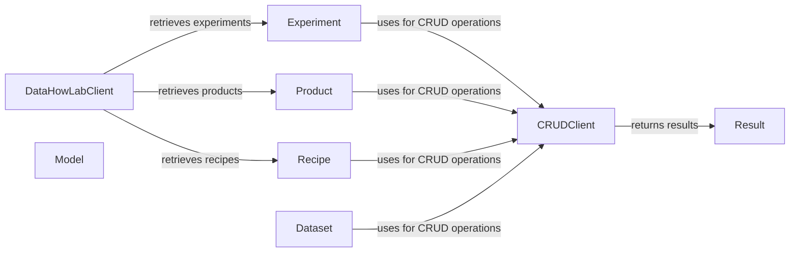

## Component Details

The Data Management component in the DataHowLab SDK is responsible for defining, creating, validating, and retrieving data entities such as Experiments, Products, Recipes, Datasets, and Models. It ensures data integrity and consistency by providing a structured way to interact with the DataHowLab API for CRUD operations on these entities. The component leverages a client to communicate with the API and encapsulates responses in a standardized result format.

### DataHowLabClient
The main entry point for interacting with the DataHowLab platform, providing methods to retrieve experiments, products, and recipes.

**Related Classes/Methods**:

- <a href="https://github.com/DataHow/datahowlab-sdk-python/blob/master/dhl_sdk/client.py#L340-L379" target="_blank" rel="noopener noreferrer">`dhl_sdk.client.DataHowLabClient:get_experiments` (340:379)</a>
- <a href="https://github.com/DataHow/datahowlab-sdk-python/blob/master/dhl_sdk/client.py#L381-L405" target="_blank" rel="noopener noreferrer">`dhl_sdk.client.DataHowLabClient:get_products` (381:405)</a>
- <a href="https://github.com/DataHow/datahowlab-sdk-python/blob/master/dhl_sdk/client.py#L476-L513" target="_blank" rel="noopener noreferrer">`dhl_sdk.client.DataHowLabClient:get_recipes` (476:513)</a>

### Experiment
Represents an experiment in the DataHowLab platform, providing methods to create, validate, and retrieve data associated with an experiment.

**Related Classes/Methods**:

- <a href="https://github.com/DataHow/datahowlab-sdk-python/blob/master/dhl_sdk/db_entities.py#L825-L849" target="_blank" rel="noopener noreferrer">`dhl_sdk.db_entities.Experiment:validate_import` (825:849)</a>
- <a href="https://github.com/DataHow/datahowlab-sdk-python/blob/master/dhl_sdk/db_entities.py#L851-L909" target="_blank" rel="noopener noreferrer">`dhl_sdk.db_entities.Experiment:get_data` (851:909)</a>
- <a href="https://github.com/DataHow/datahowlab-sdk-python/blob/master/dhl_sdk/db_entities.py#L912-L1006" target="_blank" rel="noopener noreferrer">`dhl_sdk.db_entities.Experiment:new` (912:1006)</a>
- <a href="https://github.com/DataHow/datahowlab-sdk-python/blob/master/dhl_sdk/db_entities.py#L1009-L1011" target="_blank" rel="noopener noreferrer">`dhl_sdk.db_entities.Experiment:requests` (1009:1011)</a>
- <a href="https://github.com/DataHow/datahowlab-sdk-python/blob/master/dhl_sdk/db_entities.py#L781-L1011" target="_blank" rel="noopener noreferrer">`dhl_sdk.db_entities.Experiment` (781:1011)</a>

### Product
Represents a product in the DataHowLab platform, providing methods to create new products.

**Related Classes/Methods**:

- <a href="https://github.com/DataHow/datahowlab-sdk-python/blob/master/dhl_sdk/db_entities.py#L524-L571" target="_blank" rel="noopener noreferrer">`dhl_sdk.db_entities.Product:new` (524:571)</a>
- <a href="https://github.com/DataHow/datahowlab-sdk-python/blob/master/dhl_sdk/db_entities.py#L574-L576" target="_blank" rel="noopener noreferrer">`dhl_sdk.db_entities.Product:requests` (574:576)</a>
- <a href="https://github.com/DataHow/datahowlab-sdk-python/blob/master/dhl_sdk/db_entities.py#L502-L576" target="_blank" rel="noopener noreferrer">`dhl_sdk.db_entities.Product` (502:576)</a>

### Recipe
Represents a recipe in the DataHowLab platform, providing methods to create and validate recipes.

**Related Classes/Methods**:

- <a href="https://github.com/DataHow/datahowlab-sdk-python/blob/master/dhl_sdk/db_entities.py#L698-L714" target="_blank" rel="noopener noreferrer">`dhl_sdk.db_entities.Recipe:validate_import` (698:714)</a>
- <a href="https://github.com/DataHow/datahowlab-sdk-python/blob/master/dhl_sdk/db_entities.py#L717-L773" target="_blank" rel="noopener noreferrer">`dhl_sdk.db_entities.Recipe:new` (717:773)</a>
- <a href="https://github.com/DataHow/datahowlab-sdk-python/blob/master/dhl_sdk/db_entities.py#L776-L778" target="_blank" rel="noopener noreferrer">`dhl_sdk.db_entities.Recipe:requests` (776:778)</a>
- <a href="https://github.com/DataHow/datahowlab-sdk-python/blob/master/dhl_sdk/db_entities.py#L665-L778" target="_blank" rel="noopener noreferrer">`dhl_sdk.db_entities.Recipe` (665:778)</a>

### CRUDClient
Handles the communication with the DataHowLab API for performing CRUD (Create, Read, Update, Delete) operations on entities.

**Related Classes/Methods**:

- <a href="https://github.com/DataHow/datahowlab-sdk-python/blob/master/dhl_sdk/crud.py#L48-L90" target="_blank" rel="noopener noreferrer">`dhl_sdk.crud.CRUDClient` (48:90)</a>

### Result
Encapsulates the response from the CRUDClient, providing a standardized way to access the data and any error information.

**Related Classes/Methods**:

- <a href="https://github.com/DataHow/datahowlab-sdk-python/blob/master/dhl_sdk/crud.py#L93-L144" target="_blank" rel="noopener noreferrer">`dhl_sdk.crud.Result` (93:144)</a>

### Dataset
Represents a dataset in the DataHowLab platform.

**Related Classes/Methods**:

- <a href="https://github.com/DataHow/datahowlab-sdk-python/blob/master/dhl_sdk/entities.py#L118-L120" target="_blank" rel="noopener noreferrer">`dhl_sdk.entities.Dataset:requests` (118:120)</a>
- <a href="https://github.com/DataHow/datahowlab-sdk-python/blob/master/dhl_sdk/entities.py#L53-L120" target="_blank" rel="noopener noreferrer">`dhl_sdk.entities.Dataset` (53:120)</a>

### Model
Base class for different types of models (SpectraModel, CultivationModel, etc.). Provides a method to get predictions from the model.

**Related Classes/Methods**:

- <a href="https://github.com/DataHow/datahowlab-sdk-python/blob/master/dhl_sdk/entities.py#L173-L198" target="_blank" rel="noopener noreferrer">`dhl_sdk.entities.Model:get_predictions` (173:198)</a>
- <a href="https://github.com/DataHow/datahowlab-sdk-python/blob/master/dhl_sdk/entities.py#L152-L230" target="_blank" rel="noopener noreferrer">`dhl_sdk.entities.Model` (152:230)</a>